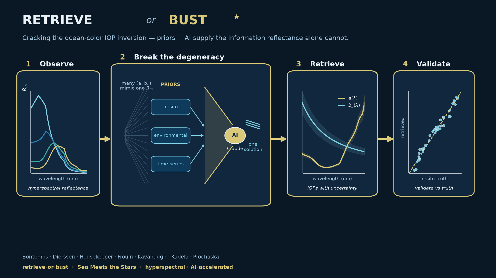

  

<h1 align="center">retrieve-or-bust</h1>

<em>Our last, best effort at solving the ocean-color IOP inversion — with AI as the accelerant.</em>

  

---

## Overview

**retrieve-or-bust** is a genuine, no-hedging attempt to finally crack the
ocean-color **inherent optical property (IOP) inversion**: recovering the
absorption `a(λ)`, backscattering `bb(λ)`, and their constituent components from
remote-sensing reflectance `Rrs(λ)`. If it works, we retrieve IOPs from reflectance
better than we ever have. If it doesn't, we will have learned that the problem
waits for a better idea, better machines, or is simply intractable. Either way, the
attempt is made in the open.

Success is defined as an outcome, not a number: **retrieving more independent,
physically meaningful IOP components from hyperspectral reflectance than current
methods manage** — absorption, backscattering, and their constituents — **with
credible uncertainties, validated against in-situ truth.**

## Why this is hard

The inversion is fundamentally **degenerate**. Reflectance constrains a *ratio*
(`u = bb/(a+bb)`), not the pieces, so many distinct optical states masquerade as one
another. Worse, the quantities we are trying to retrieve live in a nearly infinite
space of candidate spectral shapes. No amount of clever fitting removes that
ambiguity — the only thing that can is **external information**.

## The bet

Earlier methods either fixed the spectral shapes by hand or lacked systematic access
to information beyond the reflectance itself. retrieve-or-bust intends to supply
exactly what has been missing:

- **Priors** from in-situ observations, environmental context, and the history a
  location carries in its **time series**.
- A far wider exploration of candidate methods — Bayesian inference, deep learning,
  or hybrids — than hand-design has ever allowed, with **modern AI as the accelerant**.

The science stays firmly in human hands: the problem, the physics, the data, and the
judgment of what counts as a real retrieval. AI is the tireless collaborator that
proposes approaches, writes and runs the code, and stress-tests results at a pace no
human team could match — always under scientific direction. In the near term the
engine is **Claude**, supported by Anthropic's *AI for Science* program.

## Point of departure: BING

Our starting line is **BING** (*Bayesian INferences with Gordon coefficients*;
Prochaska & Frouin 2025) — an open-source framework that casts the inversion as
Bayesian inference on the Gordon reflectance model, and laid the machinery out
honestly enough to show just how badly the degeneracy bites. BING is a starting
line, not a destination; the final solution may look nothing like it. The real aim
is simple to state and hard to do: **milk the most we possibly can out of
hyperspectral reflectance** (PACE / OCI and beyond).

## Related work

- **IOPtics** — companion documentation and tooling: <https://ioptics.readthedocs.io>
- **BING** — Prochaska, J. X., & Frouin, R. (2025). *On the challenges of retrieving
  phytoplankton properties from remote sensing.* Biogeosciences 22, 4705.

## Team

- Paula Bontemps (URI)
- Heidi Dierssen (UConn)
- Henry Housekeeper (WHOI)
- Robert Frouin (SIO)
- Mariah Kavanaugh (OSU)
- Raphe Kudela (UCSC)
- J. Xavier Prochaska (UCSC)

## Package layout

- `robust/` — the Python package source (**R**etrieve **O**r **BUST**).
- `context/` — project synthesis and the radiative-transfer reference material.
- `docs/` — documentation and figure scripts (Read the Docs site, forthcoming).

## License

See [LICENSE](LICENSE).
