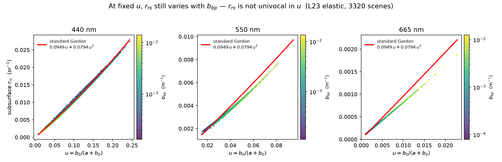
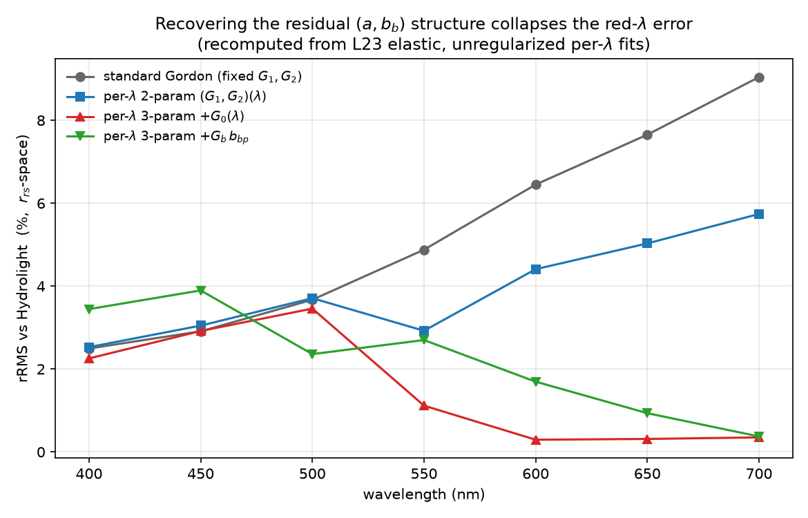
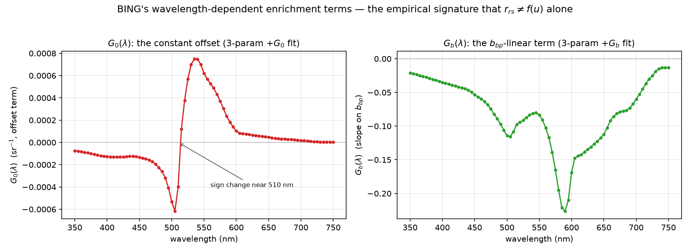

# Elastic Radiative Transfer for Ocean-Color IOP Retrieval

*A synthesis of the elastic forward model — Gordon → Park & Ruddick → Lee/Pitarch,
with ZTT and a full-RT (HydroLight) reference — alongside the BING wavelength-dependent
Gordon deep-dive, and a starting roadmap for retrieve-or-bust.*

Scope: **elastic** radiative transfer only — the map from inherent optical
properties (IOPs), the **particle phase-function shape**, and Sun–sensor geometry to
remote-sensing reflectance, `Rrs(λ; a, bb, phase function, geometry)`, with no
inelastic processes (Raman scattering, CDOM or chlorophyll fluorescence). Inelastic
terms are a later layer and are noted here only as a boundary. This document is a
synthesis plus roadmap; it does not document the BING package wiring.

> **Advisory input (R. Frouin, incorporated 2026-07-31).** This revision elevates the
> particle **phase function** as an explicit, independently-adjustable input (§2, §3.5),
> adds **ZTT** (Twardowski & Tonizzo 2018) as the principal analytical benchmark, and
> reframes the target architecture (§6–§7) around a **full-RT (HydroLight) reference
> forward model with phase-function parameters varied**, a **fast differentiable
> emulator** for retrieval, and a **hybrid** `Rrs = Rrs(ZTT) + ΔRrs(emulator)`. O25 is
> retained as a BRDF/retrieval *comparison* model, not the final physical reference.

---

## 1. Why the forward model is the whole game

retrieve-or-bust inverts `Rrs(λ)` for IOPs, and ultimately for the *components*
`a_ph`, `a_dg`, `bb_p`. Every inversion — Bayesian, learned, or hybrid — is only
as good as the forward operator it inverts. Two facts set the stakes:

1. **The inverse problem is ill-posed.** `Rrs` couples `a` and `bb` mainly through
   their ratio, so many `(a, bb)` pairs give nearly identical spectra
   (`context_summary.md`). External information (priors, ancillary data) is what
   breaks the degeneracy — *not* a better fit.
2. **Forward-model error is not neutral.** A biased forward operator injects
   *structured* error into the retrieval that priors cannot remove, because the
   inversion will faithfully reproduce the operator's bias. So the elastic RT map
   must be both accurate and — for a learned/Bayesian engine — differentiable and
   fast.

The community's workhorse is the **Gordon approximation**: a low-order polynomial
in the single quantity

```
u(λ) = bb(λ) / [a(λ) + bb(λ)]          rrs ≈ Σ_i  G_i · u(λ)^i
```

Everything below is the story of what that single-variable form gets right, where
it breaks, and how each successive scheme repairs it.

---

## 2. The one physical fact that organizes everything

**`rrs` is not a univocal function of `u`.** The Gordon form makes `rrs` depend on
`u` alone, but the true (Hydrolight) reflectance depends on `a` and `bb`
*separately* — equivalently, on how the backscatter is split between molecular
(`bb_w`) and particulate (`bb_p`) sources, because those have different volume
scattering functions. At fixed `u`, `rrs` still moves with `bb_p`.



*L23 elastic (3320 Hydrolight scenes). At each wavelength the standard Gordon curve
(red) is a single line in `u`, but the simulations scatter around it and the
scatter is organized by `bb_p` (color). In the blue (440 nm) the spread at fixed
`u` is a genuine `bb_p` fan; in the red (665 nm) the standard curve carries a
near-constant positive bias — a wavelength-dependent offset. These are the two
residual structures that every enrichment below is built to capture.*

The physics behind the two branches (Pitarch 2025): at single scattering, `rrs` is
proportional to the backscatter VSF `β(π)/bb`, which is **0.23 sr⁻¹ for pure water**
vs **0.12–0.16 sr⁻¹ for particles** (Zhang 2009; Twardowski & Tonizzo 2018). So for
a given `u`, clearer (higher molecular-fraction) water yields a different `rrs` than
turbid water — the relationship genuinely has (at least) two dimensions, not one.

**The deeper axis is the particle phase-function *shape*, and most models hide it.**
The water-vs-particle split is really a special case of a more general truth: the
angular distribution of water-leaving radiance is set by the *volume scattering
function*, and in the backward direction `β(π)/bb` is a property of the phase-function
shape, not of `bb`. Nearly all analytical models (Gordon, PR05, O25) do **not** expose
the phase function or shape parameters as explicit, independently-adjustable inputs;
instead they bake phase-function effects into coefficients or LUTs derived from RT runs
with a *prescribed* phase function (typically Fournier–Forand). Consequently they
**cannot represent independent variability in phase-function shape**, and — because the
phase function primarily governs the angular (bidirectional) distribution of `Rrs` —
this omission introduces **geometry-dependent forward-model errors and associated
biases in retrieved IOPs**. The exception is **ZTT** (§3.5), which introduces the
backward VSF and related phase-function parameters explicitly into the analytical
forward model. This is the single most important structural gap for a project whose
goal is unbiased component IOPs across geometry.

---

## 3. The elastic lineage

### 3.1 Gordon et al. (1988) — the origin, and its limits

The canonical result expands the irradiance reflectance / Q as a quadratic in `u`:

```
R/Q = l1·u + l2·u²        l1 = 0.0949,  l2 = 0.0794
```

derived from Monte-Carlo RT (Gordon, Brown & Jacobs 1975; Gordon 1986). Key
caveats that the modern literature spends its effort on:

- **The `l_i` are treated wavelength-independent.** All λ-dependence is parked in
  `a`, `bb`, and the `Q` factor (≈ 4–5, "somewhat wavelength dependent").
- **Validity: `θ₀ > 20°` and `u ≲ 0.2`.** Below 20° the backward VSF governs `R/Q`;
  the `i>1` term becomes important at high radiance / high backscatter.
- **Geometry lives in `Q` and the surface factors**, not in the `l_i`. Converting
  subsurface `R/Q` to above-water `Rrs` needs the interface terms
  `(1−ρ)/m² ≈ 0.54`, `(1−rR)`, `r = 0.48`. The whole scheme's stated max error is
  **~±20%**.

Everything after 1988 is an attempt to put back the structure that the constant,
single-variable form throws away: **wavelength, geometry, and the phase-function /
water-vs-particle split.**

### 3.2 Park & Ruddick (2005) — the named baseline (PR05)

PR05 is the project's chosen baseline. It generalizes Gordon to a **fourth-order**
polynomial whose coefficients are tabulated over geometry *and* a phase-function
parameter:

```
Rrs(θo, θv, Δφ) = Σ_{i=1..4} g_i(θo, θv, Δφ, γb) · ωb^i
ωb = bb/(a+bb)   ("backscattering albedo")
γb = bbp/bb   (particle fraction of backscatter, ~0.2–1)
```

- Built from **Hydrolight 4.2**, **Fournier–Forand** phase functions, case-1 + case-2
  IOPs, 412–780 nm; coefficients on a grid of 7 solar × 10 sensor zenith × 13
  relative-azimuth angles × 8 `γb` values.
- **Model uncertainty ~2%** (rms ~1%), dominated by residual phase-function
  variability after `γb` is fixed.
- **`γb` is the price of admission.** It is not observed; PR05 estimates it
  iteratively (their §5C). A `γb` error of 0.05 (needed for ~2% `Rrs`) corresponds
  to a **20–30% `bbp` error at low `γb`**, worse at high `γb` — a real weakness for
  a component-retrieval target.

PR05 is a strong, physically-motivated baseline and correctly identifies the
phase-function (`γb`) axis as the missing degree of freedom. Its two liabilities
for us are the LUT dimensionality (a full 4-D angle×`γb` grid) and the lack of an
`Rrs → γb` inversion path.

### 3.3 Tan et al. (2018) — what PR05 does and does not deliver

Tan evaluated PR05 (as used in POLYMER) against Hydrolight (IOCCG/L23 IOPs) and
9824 AERONET-OC spectra. The verdict is nuanced and directly relevant:

- **`Rrs` reconstruction is good** — RMS < 15%, and **band ratios excellent**
  (bias < 5%). Two parameters suffice; the third barely helps and hurts convergence.
- **But the retrieved parameters are not physical.** Fitted Chl is badly biased,
  and — the load-bearing result — **PR05-reconstructed `Rrs` fed to QAA produces
  significantly biased IOPs** (`a_ph`, `a_dg`, `bb_p`).
- Their recommendation: *use the reconstructed reflectance, not the retrieved
  model parameters.*

Implication for retrieve-or-bust: a scheme can reproduce `Rrs` beautifully and
still be a poor *inversion* engine for components. Forward-model rRMS is necessary
but not sufficient; the retrieval-impact test is the one that matters (and is the
one BING's own logs repeatedly flag as unclosed).

### 3.4 Lee (2011) / Pitarch et al. (2025, "O25") — the modern semi-analytical benchmark

The current state of the art in the elastic Gordon→QAA lineage replaces PR05's
`γb`-indexed 4th-order polynomial with a **bivariate quadratic** that splits the
backscatter albedo into water and particle parts:

```
Rrs = (Gw0 + Gw1·ωbw)·ωbw + (Gp0 + Gp1·ωbp)·ωbp
ωbw = bbw/(a+bb)     ωbp = bbp/(a+bb)     (ωb = ωbw + ωbp)
```

The design choice that matters: **the four coefficients depend on geometry ONLY** —
they are IOP- and wavelength-agnostic by construction. This directly encodes the
"two-branch" physics of §2 (water and particle backscatter contribute through
different VSFs). O25 is calibrated on **PB24** (Pitarch & Brando 2025): a synthetic,
multi-angular, hyperspectral set — 5000 IOP realizations × 1300 geometries, with
Fournier–Forand phase functions chosen over the older Petzold average.

- In independent inter-comparison (D'Alimonte 2025; Pitarch 2025) the ranking is
  **L11 > Morel-2002 > PR05**. O25 refines L11's empirical steps and validates as a
  BRDF corrector (normalizing `Rrs` to nadir/zenith) *and* as a semi-analytical IOP
  retriever.
- Practical: open-source (`github.com/jaipipor/O25`), integrated in NASA HyperCP
  and EUMETSAT ThoMaS, operational in **OLCI Collection 4**.

Because retrieve-or-bust already models `bb_w` (a known constant of pure water) and
`bb_p` separately, **the O25 water/particle split is essentially free for us** — no
`γb` iteration is required, which is why O25/L11 is the natural semi-analytical
*benchmark* to beat. **But O25 is not a physical reference.** Its geometry-only
coefficients are calibrated on PB24's *prescribed* Fournier–Forand phase functions, so
phase-function-shape variability is implicit in the fit, not an adjustable input
(§2) — exactly the limitation R. Frouin flags. We therefore keep O25/L11 as a
**BRDF/retrieval comparison model**, not as the elastic project's physical reference.

### 3.5 Twardowski & Tonizzo (2018, "ZTT") — the phase function made explicit

ZTT is the outlier that addresses §2's structural gap: it introduces the **backward
volume scattering function and related phase-function shape parameters explicitly**
into the analytical forward model, rather than absorbing them into coefficients fit to
a prescribed phase function. Backscatter is decomposed into its molecular and particle
contributions with the particle backward VSF as an adjustable input, so ZTT can
represent independent variability in phase-function shape and its bidirectional
signature — the degree of freedom that Gordon, PR05, and O25 cannot expose. That makes
ZTT the natural **analytical benchmark**, and a candidate **physical backbone** for a
hybrid forward model (§6): it carries interpretable physical scaling and geometry,
onto which a learned term can add the residual multiple-scattering effects.

### 3.6 Hansen (1971) — background

Hansen's planetary-atmosphere work is the multiple-scattering / **doubling-method**
lineage that underpins how reflectance relates to single-scattering albedo in a
scattering medium — the conceptual ancestor of the `u`-polynomial. (The PDF in
`context/RT/` is a scanned image with no extractable text layer; it is cited here
as background, not mined for specifics.)

---

## 4. The BING deep-dive: `rrs ≠ f(u)`, quantified

JXP's BING work fit the Gordon coefficients directly to the **L23 elastic** dataset
(3320 Hydrolight scenes, 350–750 nm) and found exactly the residual structure of
§2. Two enrichment terms, both wavelength-dependent, capture it:

- **`G0(λ)`** — a constant offset: `rrs = G0 + G1·u + G2·u²`.
- **`Gb(λ)`** — a slope on particulate backscatter: `rrs = G1·u + G2·u² + Gb·bbp`.

The recipe ladder — recomputed here from L23 rather than quoted — shows what each
term buys:



*Per-wavelength rRMS vs Hydrolight (`rrs`-space), recomputed from L23 elastic with
unregularized per-λ fits. Standard Gordon degrades monotonically to ~9% at 700 nm.
Adding `G0(λ)` (red) collapses the red-λ error by ~10× (700 nm: 9.0% → 0.35%),
because at red `u` is narrow and almost everything is set by water absorption, so a
constant offset is the right correction. Adding `Gb·bbp` (green) wins in the
blue/green instead (400 nm: 2.5% → 1.8%), where the residual is a `bb_p` fan. The
two are complementary; a joint 4-parameter fit `G0 + G1·u + G2·u² + Gb·bbp` wins or
ties everywhere (550 nm reaches 0.76% — from the BING logs).*

The fitted enrichment terms have clear wavelength structure:



*`G0(λ)` changes sign near 510 nm — the one wavelength where neither a pure offset
nor a pure `bb_p` slope is clean, and where trophic state (the water-vs-particle
mix) matters most. In the joint 4-parameter fit, `Gb` absorbs that trophic-state
component and `G0` stops crossing zero — direct evidence the two terms are the
*right* enrichment, not just extra degrees of freedom.*

**The convergence worth underlining:** BING's `G0`/`Gb` terms and O25's `ωbw`/`ωbp`
split are two routes to the same destination — representing that `rrs` depends on
`(a, bb)` / the water-vs-particle mix, not on `u` alone. BING discovered it
empirically at fixed geometry; O25 built it in structurally with geometry-only
coefficients. They should be read as the same physics.

(Two implementation notes from the BING logs that a re-implementation must respect:
the `Rrs↔rrs` convention is Lee-2002 `A=0.52, B=1.7`; and the per-λ quadratic must
be relatively weighted, or `G2` runs away at red wavelengths.)

---

## 5. Synthesis: one picture

| Scheme | Form | Extra structure beyond `u` | Phase function | Geometry | For component IOPs |
|---|---|---|---|---|---|
| Gordon 1988 | `l1·u + l2·u²` | none | prescribed (implicit) | in `Q`, fixed `l_i` | crude; ±20% |
| **PR05 (baseline)** | 4th-order in `ωb` | `γb = bbp/bb` | prescribed FF (implicit) | full LUT (θo,θv,Δφ) | needs `γb` iter; Tan: biased |
| BING G0/Gb | `+G0(λ)`, `+Gb·bbp` | offset + `bb_p` slope | prescribed (implicit) | fixed | best fwd rRMS; retrieval untested |
| L11 / O25 (benchmark) | bivariate `(ωbw, ωbp)` | water/particle split | prescribed FF (implicit) | geometry-only coeffs | strong benchmark; split free for us |
| **ZTT 2018** | analytic w/ backward VSF | **explicit phase-fn shape** | **explicit, adjustable** | analytic | interpretable backbone |
| **HydroLight (reference)** | full RT solve | full (all orders) | **explicit input** | full | reference truth; slow → emulate |

The through-line: **each advance re-introduces a dimension the constant
single-variable Gordon form discarded** — first wavelength (BING), then the
water-vs-particle axis (PR05's `γb`, BING's `Gb`, O25's split), then geometry (PR05
LUT, O25's geometry-only coefficients) — but only **ZTT and a full RT solve** expose
the **particle phase-function shape** itself as an explicit, adjustable input. That is
the axis this project must control to deliver unbiased IOPs across geometry.

---

## 6. Recommendation: reference, benchmarks, and the forward-model architecture

The revised recommendation (incorporating R. Frouin's advisory input) separates three
distinct roles that earlier drafts conflated — the *physical reference*, the
*benchmarks*, and the *retrieval-time operator*.

- **Physical reference forward model: a full RT solver (HydroLight),** run with the
  particle **phase-function parameters explicitly varied** (not a single prescribed
  Fournier–Forand). This is the ground truth against which every fast model is scored,
  and the only way to sample the phase-function-shape axis of §2 honestly. It is too
  slow for inversion, hence the emulator below.
- **Analytical benchmark / candidate backbone: ZTT.** The one analytical model that
  makes the backward VSF explicit; use it as the principal analytical benchmark and as
  the physical backbone of the hybrid.
- **Comparison models (not the reference): PR05 and L11/O25.** PR05 remains the named
  literature baseline; O25/L11 is the modern semi-analytical benchmark and BRDF
  comparison. Both bury the phase function in prescribed-PF coefficients, so neither is
  the physical reference.

- **Retrieval-time operator — our own approach (Q10 left this open; three options,
  with (c) now the advisor-recommended concrete instantiation):**

  - **(a) Analytic / physically-structured.** Extend the BING-`G0/Gb` ↔ O25-split
    family. *Pro:* interpretable, closed-form differentiable. *Con:* a polynomial
    ceiling (the ~2% blue residual, the 510 nm behavior), and no explicit phase
    function.
  - **(b) Learned forward model.** A neural emulator of the HydroLight reference,
    `(IOPs, phase-function params, geometry) → Rrs`. *Pro:* highest accuracy,
    BRDF-aware, differentiable for gradient-based / amortized inversion. *Con:* a black
    box; data-hungry; extrapolation risk.
  - **(c) Hybrid — recommended (R. Frouin).** A physically interpretable analytical
    backbone plus a small learned residual emulator:

    ```
    Rrs(model) = Rrs(ZTT) + ΔRrs(emulator)
    ```

    ZTT supplies physical scaling, geometry, and the explicit phase-function
    dependence; the emulator learns only the remaining multiple-scattering and
    phase-function effects. *Pro:* preserves physics/geometry and stays close to the
    reference while avoiding the unrestricted behavior of a wholly black-box model; the
    residual is small and smooth, so the network is light and its extrapolation is
    bounded. *Con:* two components to fit and validate.

  The choice interacts with the data plan (§7): all three want the HydroLight reference
  with varied phase functions; (b)/(c) also want the multi-angular PB24 set for
  cross-comparison; (a) can mature on L23 first.

---

## 7. Starting roadmap for retrieve-or-bust RT

Ordered, with **variable geometry (BRDF) and phase-function shape treated as
first-class**, and the truth-data plan **L23-first, then HydroLight/PB24**.

1. **Reproduce the elastic baseline on L23 (fixed geometry).** Re-fit the Gordon
   ladder (`standard → +G0 → +Gb → joint`), the O25 bivariate `(ωbw, ωbp)` form, and a
   ZTT run on L23 elastic; confirm the rRMS ladder above and overlay O25 and ZTT.
   Deliverable: a first elastic forward operator with a documented rRMS surface over
   (λ, water type). *(The figure script here is the seed.)*
2. **Close the retrieval-impact gap (Tan's warning).** For each candidate operator,
   run the component inversion (`a_ph`, `a_dg`, `bb_p`) and report per-IOP MAPE, not
   just forward `Rrs` rRMS. This is the test PR05 fails in Tan (2018) and the one
   BING never ran — it decides whether forward accuracy buys *retrieval* accuracy.
3. **Build the full-RT reference with the phase function varied.** Generate a
   HydroLight (or open RT-solver) reference set that spans geometry **and** particle
   phase-function shape as explicit inputs — the axis L23/PB24's prescribed
   Fournier–Forand functions do not sample. This is the ground truth for steps 4–5 and
   the honest test of the geometry-/phase-function-dependent bias R. Frouin flags.
   Use **PB24** (5000 IOPs × 1300 geometries) as a ready-made multi-angular
   cross-comparison in parallel.
4. **Stand up ZTT as the analytical benchmark.** Implement ZTT with the backward VSF /
   phase-function parameters exposed; score it against the HydroLight reference across
   geometry and phase-function shape. This both benchmarks the analytical ceiling and
   provides the backbone for step 5.
5. **Build the differentiable emulator and the hybrid.** Train a fast, differentiable
   emulator of the HydroLight reference, `(IOPs, phase-function params, geometry) →
   Rrs`; then form the recommended hybrid `Rrs = Rrs(ZTT) + ΔRrs(emulator)` and compare
   it against the pure-learned (b) and pure-analytic (a) options on *retrieval* MAPE
   (step 2), across geometry. Keep O25/L11 and PR05 as comparison models throughout.
6. **Nail down conventions once.** `Rrs↔rrs` (`A=0.52, B=1.7`), the `bb_w`/`bb_p`
   split, the phase-function parameterization, wavelength grid (PACE/OCI 340–895 vs
   L23 350–750), and the geometry grid — one config, asserted at load, so results are
   comparable across steps.

Out of scope here (elastic-only): Raman scattering and CDOM/chlorophyll
fluorescence. They matter for real `Rrs` (Tan shows the 665–685 nm and NIR effects)
and will be a separate inelastic layer added on top of whichever elastic operator
wins.

---

## 8. References

- Gordon, H. R., et al. (1988). A semianalytic radiance model of ocean color.
  *JGR* 93(D9), 10909–10924.
- Park, Y.-J., & Ruddick, K. (2005). Model of remote-sensing reflectance including
  bidirectional effects for case 1 and case 2 waters. *Appl. Opt.* 44(7), 1236–1249.
- Tan, J., Frouin, R., Ramon, D., & Steinmetz, F. (2018). Adequacy of
  semi-analytical water reflectance models in ocean-color remote sensing.
  *Proc. SPIE* 10778, 107780A.
- Pitarch, J., et al. (2025). Analytical modeling and correction of the ocean colour
  bidirectional reflectance across water types (O25). *Remote Sens. Environ.* 329,
  114920. — builds on Lee et al. (2011, "L11") and PB24 (Pitarch & Brando 2025,
  *ESSD* 17, 435–460).
- Twardowski, M., & Tonizzo, A. (2018). Ocean color analytical model explicitly
  dependent on the volume scattering function (ZTT). *Appl. Sci.* 8(12), 2684.
- Hansen, J. E. (1971). Multiple scattering of polarized light in planetary
  atmospheres (doubling method). *J. Atmos. Sci.* — background.
- Mobley, C. D. (1994; and HydroLight technical documentation). *Light and Water:
  Radiative Transfer in Natural Waters* — the full-RT reference solver.
- Loisel, H., et al. (2023). A synthetic optical database (L23). *ESSD* 15,
  3711–3731.
- BING Gordon deep-dive: `bing/prompts/gordon.md` logs; coefficient tables in
  `bing/bing/data/RT/gordon_coefficients*.csv`.

*Figures generated by `context/RT/make_rt_elastic_figures.py` (ocean14) from the L23
elastic set (`Hydrolight100.nc`) and the BING coefficient CSVs.*
