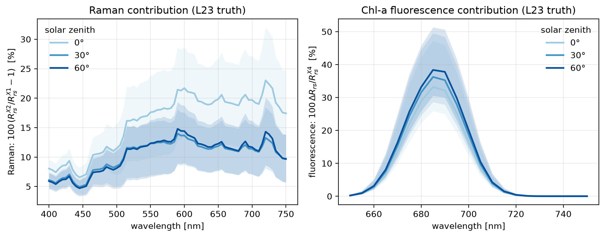
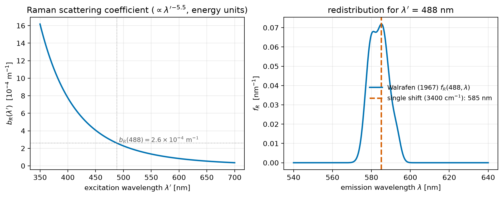
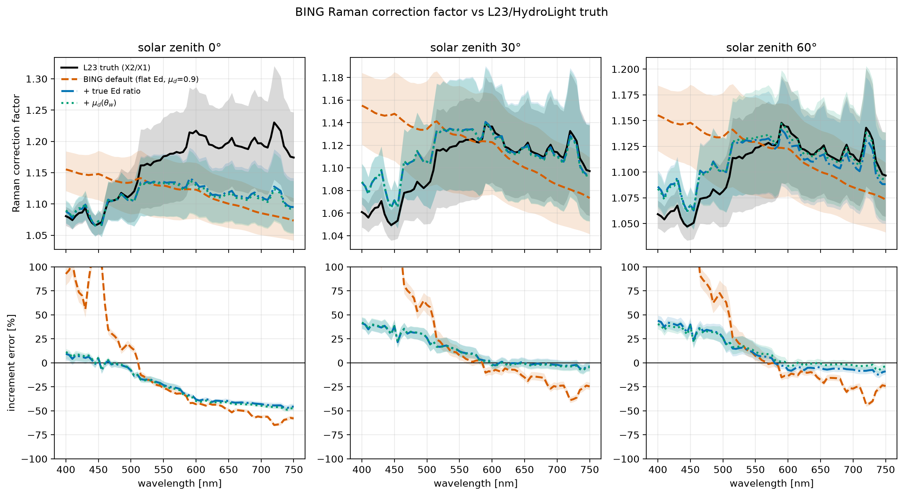
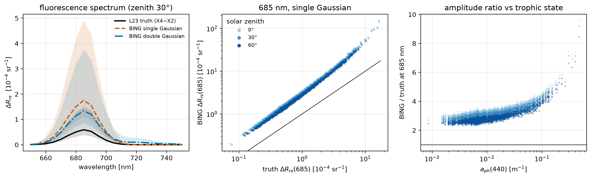

# Inelastic Radiative Transfer in BING — Summary and Critical Assessment

**Purpose.** This is the context document for the inelastic-RT effort in
retrieve-or-bust, playing the role `context/RT/rt_elastic_model.md` played for
the elastic effort: it reviews the incumbent implementation (JXP's work in the
BING repository), assesses each of its approximations quantitatively, and
frames the feasibility of adding inelastic processes to the new elastic
forward model. It feeds `design/rt_inelastic_model.md` (to be written).

**Provenance.** Written 2026-08-16 from a review of `bing/rt/{raman,chl_fl,rrs}.py`,
the fitting wiring in `bing/{evaluate,fitting/inference}.py`, the BING work
logs, and new quantitative comparisons against the Loisel et al. (2023, "L23")
HydroLight database. All figures are generated by
[`make_rt_inelastic_figures.py`](make_rt_inelastic_figures.py); the
numbers quoted below are in [`rt_inelastic_metrics.csv`](rt_inelastic_metrics.csv).
Scope decisions (from Q&A/Setup in `claude_prompts/RT/rt_inelastic_prompts.md`):
critical assessment, not just documentation; formulation and implementation
only (no science results from BING fits); final-state algorithms only.

---

## 1. Why inelastic processes matter — and how big they are

Elastic scattering returns photons at the wavelength they arrived with. Two
inelastic processes move solar photons *across* wavelengths before they leave
the ocean:

- **Raman scattering by water molecules.** A photon absorbed into the O–H
  stretch vibration is re-emitted red-shifted by ≈ 3400 cm⁻¹ (e.g. 488 → 584 nm).
  Because water itself does the scattering, the effect is largest where
  particulate scattering is smallest — clear, oligotrophic water — and at
  longer wavelengths, which are fed by the strong blue solar flux.
- **Chlorophyll-a fluorescence.** A fraction φ_C of photons absorbed by
  phytoplankton pigments (370–690 nm) is re-emitted in a narrow band centered
  at 685 nm (the PS II line; a weaker PS I shoulder sits near 730 nm).

The L23 database quantifies both exactly, because it provides paired
HydroLight runs over the same 3320 IOP scenes: X1 (elastic only), X2
(+ Raman), X4 (+ Raman + Chl fluorescence), each at solar zeniths 0°, 30°,
60°. The scenario differences are the truth signals:



- **Raman** contributes a median **5–15 % of Rrs** across 520–750 nm at
  zeniths 30–60°, and up to **~20 %** at zenith 0°; the 84th-percentile scene
  exceeds 25 %. It is a *broadband, spectrally structured* multiplicative
  effect, minimal in the blue (where elastic Rrs is large) and maximal in the
  green-red.
- **Fluorescence** contributes a median **~35 % of Rrs at the 685 nm peak**
  (16–84 % range roughly 25–50 %), confined to ~660–715 nm.

Both are far above the ~0.3 % rRMS accuracy of the new elastic forward model.
**An elastic-only forward model fit to real (or X≠1) spectra will alias these
signals into biased IOPs**; this is why the inelastic effort exists.

A key experimental-design fact: L23's inelastic runs used **HydroLight
defaults** — the Mobley (2012) Raman settings and quantum yield **φ_C = 0.02**
— which are *also BING's defaults*. Every comparison below therefore isolates
the error of BING's **formulation** (two-flow RT, single wavenumber shift,
flat-Ed assumption, grafting conventions) with the physical constants held
equal.

## 2. The physics and the source literature

### 2.1 Raman

- **Bartlett et al. (1998)** measured the Raman scattering coefficient of pure
  water and seawater: b_R(488) = (2.7 ± 0.2) × 10⁻⁴ m⁻¹, with no significant
  fresh/seawater difference, and established the excitation-wavelength scaling
  b_R ∝ λ′⁻⁵·⁵ in energy units (λ′⁻⁵·³ in photon units).
- **Desiderio (2000)** clarified how to apply the coefficient in marine-optics
  calculations (his preferred value 2.4 × 10⁻⁴ m⁻¹; HydroLight adopts
  2.6 × 10⁻⁴ m⁻¹, which BING uses as its default).
- **Walrafen (1967)** provides the emission redistribution: the ~3400 cm⁻¹
  O–H band is a sum of four Gaussians spanning roughly 3250–3625 cm⁻¹, i.e.
  the re-emitted light is spread over a ~20–30 nm band, not a line.
- The phase function is Rayleigh-like, (1 + δ cos²ψ) with depolarization
  ρ ≈ 0.17, giving a backscatter fraction of exactly ½ by symmetry.



### 2.2 Chlorophyll fluorescence

- **Gordon (1979)** built the theory: treat fluorescence as inelastic
  scattering in the RTE, solve in the quasi-single-scattering approximation
  for a homogeneous ocean, with a wavelength-independent quantum efficiency
  and a Gaussian emission line at 685 nm. He showed observed reflectance
  enhancements near 685 nm are fully explained by in-vivo fluorescence with
  plausible efficiencies.
- **Maritorena et al. (2000)** measured the in-situ quantum yield: **φ ≈ 1 %
  near the surface** (solar noon, NPQ-quenched) rising to **5–6 % at depth** —
  a ~five-fold natural range around the HydroLight/BING default of 2 %.
- **Behrenfeld et al. (2009)** used satellite nFLH to show φ varies globally
  with phytoplankton physiology (iron stress, NPQ): the fluorescence signal
  carries physiological information *beyond* Chl — a warning against ever
  treating φ_C as a universal constant, and an opportunity if it can be
  retrieved.

## 3. What BING implements

### 3.1 Raman: an S&P98 two-flow correction factor on Gordon Rrs

`bing/rt/raman.py` implements the full physics toolkit (b_R(λ′) with both
unit conventions, the Walrafen redistribution f_R(λ′, λ), the phase function
and its exact backscatter ratio) plus the **Sathyendranath & Platt (1998)**
two-flow reflectance terms:

- first-order Raman reflectance R^R (their Eq. 11),
- second-order Raman-then-elastic R^RE (Eq. 18) and elastic-then-Raman R^ER
  (Eq. 23), each ~10 % of first order,

with fixed mean cosines **μ_d = 0.9, μ_u = μ_R = 0.5** and downwelling
irradiance ratio **Ed(λ′)/Ed(λ) = 1** by default.

In the production path (`evaluate.calc_Rrs_from_models` → `rrs.calc_Rrs`),
Raman enters as a **multiplicative correction factor**

```
Rrs = Rrs_Gordon(a, bb) × [R^E + R^R + R^RE + R^ER] / R^E
```

where R^E is S&P98's *own* elastic two-flow reflectance — i.e. the S&P98
model supplies only the *ratio*, and the Gordon polynomial supplies the
absolute elastic Rrs. Model objects precompute the excitation grid with a
**single 3400 cm⁻¹ shift** (`wave_ex = emission_to_excitation(wave)`; the
Walrafen machinery is *not* integrated over in the fitting path) and evaluate
a(λ′), bb(λ′) by re-evaluating the parametrized IOP models on that grid.
Everything is toggled by `rt_dict['include_Raman']`.

### 3.2 Fluorescence: an additive Gordon-style emission term

`bing/rt/chl_fl.py` + `rrs.calc_Rrs_fluorescence` implement an **additive**
term. The source is b_F(λ′) = φ_C · a_ph(λ′) (isotropic emission, so
b_bF = ½ b_F); the excitation integral runs over 370–690 nm:

```
R_F(λ) = h_C(λ) · ∫ Ed(λ′) (λ′/λ) [b_bF(λ′)/μ_d] / [K(λ′) + κ_F(λ)] dλ′ / Ed(λ)
Rrs_fl = A · R_F / (1 − B · R_F),      Rrs = Rrs_elastic(+Raman) + Rrs_fl
```

with K(λ′) = (a+b_b)(λ′)/μ_d, κ_F(λ) = (a+b_b)(λ)/μ_f, μ_d = 0.9, μ_f = 0.5,
and (A, B) = (0.52, 1.7) the standard subsurface-rrs → Rrs conversion. The
emission line h_C is a normalized Gaussian at 685 nm (σ = 10.6 nm), optionally
a double Gaussian adding a 730 nm PS I peak (weights 0.75/0.25). κ_F and the
λ′/λ energy-conversion ratio are evaluated per emission wavelength (a
correctness fix documented in the BING logs). Ed spectra come from the
`correct_atmosphere` package. Toggles: `rt_dict['include_Chl_fl']`,
`'phi_C'` (fixed per fit, **not** a retrieved parameter), `'double_gaussian'`.

The module also carries irradiance- and depth-dependent quantum-yield models
(Morrison-style NPQ) and FLH/nFLH utilities, none of which are used in the
fitting path.

## 4. Critical assessment against L23 truth

> **Update (2026-08-18).** The two fixable errors identified below were
> confirmed and fixed in the BING repository (branch `inelastic-fixes`; see
> `bing/prompts/inelastic_fixes.md` there). (i) The fluorescence ×2.5–3
> amplitude error is exactly the suspected normalization: inserting the
> isotropic-emission conversion L_u = E_u/π moves the median model/truth
> ratio at 685 nm from 3.18/3.00/2.73 to **1.00/0.95/0.86** (zenith
> 0°/30°/60°). (ii) The production Raman path now uses the true
> Ed(λ′)/Ed(λ) ratio when available (`set_raman_Ed`), warning on the
> flat-Ed fallback; the median increment error over 550–700 nm is
> **+1 %/−4 %** at zenith 30°/60° (−39 % at 0° — the two-flow high-sun
> limitation, unchanged by design). L23-anchored regression tests were
> added to BING. The figures and numbers *below* document the pre-fix
> state and are retained as the record that motivated the fixes; the
> formulation-level limits (§4.1 items 2, §4.2 items 3–5, §4.3) remain
> open for the retrieve-or-bust design.

Method: feed L23's own input IOPs (identical across X scenarios by
construction) through BING's production functions and compare with the
scenario differences, per wavelength, zenith, and scene. For Raman the truth
is the above-surface ratio Rrs^X2/Rrs^X1 — exactly how BING applies its
factor; for fluorescence it is Rrs^X4 − Rrs^X2. The solar spectrum Ed(0⁺) is
taken from L23 itself (it is scene-independent), so "true-Ed" variants use
the same sky HydroLight saw.

### 4.1 Raman



Median error on the Raman *increment* (factor − 1), from
`rt_inelastic_metrics.csv`:

| zenith | λ | truth increment | BING default | + true Ed | + true Ed & μ_d(θ_w) |
|---|---|---|---|---|---|
| 0° | 490 nm | 11.4 % | +17 % | −3 % | −2 % |
| 0° | 550 nm | 17.6 % | −26 % | −23 % | −24 % |
| 0° | 660 nm | 19.4 % | −49 % | −42 % | −43 % |
| 30° | 490 nm | 8.5 % | +58 % | +30 % | +30 % |
| 30° | 660 nm | 11.5 % | −14 % | −2 % | −3 % |
| 60° | 490 nm | 8.1 % | +66 % | +31 % | +30 % |
| 60° | 660 nm | 11.7 % | −16 % | −7 % | −3 % |

Findings, approximation by approximation:

1. **The flat-Ed assumption is the single largest error source.** With
   Ed(λ′)/Ed(λ) = 1, the correction factor has the wrong *spectral shape*:
   +58–66 % too much increment at 490 nm, −15–50 % too little in the red.
   Simply supplying the true Ed ratio (one vector per geometry — cheap)
   removes most of the shape error at zeniths 30–60°, where the corrected
   model tracks the truth closely for λ > 550 nm, including the spectral
   fine structure (which enters through Ed, not the water). **This is the
   cheapest, highest-value fix and should be considered mandatory in any
   re-implementation.**
2. **The fixed-μ two-flow stream geometry fails at high sun.** At zenith 0°
   the truth increment is systematically *larger* (up to ~20 %) than at
   30–60° (~12 %), and no variant reproduces it: even with true Ed the model
   sits −25 to −45 % low in the red. Adjusting μ_d = cos θ_w helps only
   marginally. The two-flow form with a universal μ set evidently cannot
   capture the sun-angle dependence of the Raman source integral; a proper
   treatment needs geometry entering the way the elastic ZTT backbone
   handles it (or a learned correction).
3. **The single-shift approximation is benign at 5 nm resolution.** The
   Walrafen band is ~20–30 nm wide (figure in §2.1); collapsing it to a
   3400 cm⁻¹ delta shifts the effective excitation grid by a few nm.
   The true-Ed variant's success at 30–60° shows the residual error from
   this is small compared to (1) and (2); it will matter more if the
   forward model must reproduce Fraunhofer-scale structure (hyperspectral
   PACE at native resolution).
4. **The multiplicative grafting is self-normalizing — a real virtue.**
   Because S&P98 supplies only the ratio (R^E + R^Raman)/R^E, any error in
   the two-flow *absolute* reflectance largely cancels. This is why Raman
   errors are tens of percent *of a ~10 % effect* (≲ 1–2 % of total Rrs
   after the true-Ed fix, except at high sun in the red) — and it is the
   crucial structural contrast with the fluorescence term below.
5. **Second-order terms and coefficient choices are not the issue.** The
   S&P98 second-order terms are included; the b_R reference value (2.6e-4,
   HydroLight's) matches truth by construction. Excitation-grid coverage is
   a real constraint, though: emission at λ < 400 nm needs a(λ′ < 352 nm),
   off the L23 grid — UV validation requires extrapolated IOPs.

### 4.2 Fluorescence



Findings:

1. **The amplitude is wrong by ×2.5–3, everywhere.** With identical φ_C,
   emission shape, and solar spectrum, BING's single-Gaussian term
   overestimates the median 685 nm truth by **+214 % (zenith 0°), +196 %
   (30°), +169 % (60°)**. The scatter panel shows this is a *tight,
   systematic* offset — the term tracks the truth scene-by-scene over two
   decades (i.e. the *dependence* on IOPs is broadly right) but sits a
   near-constant factor high, growing worse with trophic state (from ~×2.5
   at a_ph(440) ≈ 3×10⁻³ m⁻¹ to ×5–9 in the most eutrophic scenes).
2. **Likely root cause: an irradiance-reflectance / rrs grafting
   inconsistency.** R_F as computed is a two-flow *irradiance* reflectance
   (E_u/E_d-like), but it is pushed through the A·rrs/(1−B·rrs) conversion
   as if it were a *remote-sensing* reflectance (L_u/E_d, sr⁻¹). For
   isotropic emission E_u = π L_u, so treating R_F as rrs inflates the term
   by ≈ π ≈ 3.1 — strikingly close to the observed ×2.5–3 offset in clear
   water. (The Raman term contains the same two-flow machinery but escapes
   the problem because it only ever uses the *ratio*; the additive
   fluorescence term has no such cancellation.) This attribution is a
   hypothesis to be verified analytically in the design phase, but the
   empirical offset itself is unambiguous.
3. **The trophic-dependent growth is a second, distinct error.** A constant
   ×π would not explain the rise to ×5–9 at high a_ph(440). In absorbing
   waters the two-flow attenuation treatment (fixed μ_d = 0.9 down, μ_f =
   0.5 up) increasingly underestimates the true attenuation of both the
   exciting and emitted streams, so BING loses signal too slowly. Any
   re-implementation needs either a proper stream treatment or a learned
   correction with a_ph in its inputs.
4. **The emission shape is right; the "double Gaussian is closer" is a
   trap.** The spectral *shape* (peak at 685, ~25 nm FWHM) matches truth
   well. The double-Gaussian variant lands nearer the truth amplitude
   (+106–139 %) only because it exports 25 % of the energy to 730 nm —
   L23/HydroLight used a single Gaussian, so this is error cancellation,
   not physics. Against *nature* the PS I shoulder is real; against L23 it
   must be switched off.
5. **φ_C = 0.02 is right for L23 by construction — and wrong in nature.**
   Maritorena et al. (2000) and Behrenfeld et al. (2009) put the natural
   range at ~0.5–6 %, physiologically driven (NPQ, iron stress, light
   history). BING treats φ_C as a fixed configuration constant, not a
   retrievable parameter. For retrieve-or-bust the design question is the
   opposite: the 685 nm band is only usable if φ_C (or the product
   φ_C·a_ph) is a *free or prior-constrained parameter* — otherwise the
   model will alias physiological variability into Chl/a_ph. The g_C = 1
   absorption-efficiency assumption is untested by L23 (HydroLight makes
   the same one) and is a smaller, second-order concern.

### 4.3 What BING does not treat at all

- **CDOM fluorescence** — the third inelastic process. It matters in the
  blue-green in CDOM-rich waters. Note that **L23 omits it too**, so *no
  truth data exist in-hand for it*; any future treatment needs a different
  source (e.g. dedicated HydroLight runs with the Hawes et al. quantum
  functions). Flagged as a design-phase gap.
- **Vertical structure.** Both BING and L23 assume homogeneous water. In
  nature φ_C and Chl are strongly depth-structured (Maritorena's φ profiles
  vary five-fold over the top 60 m), and the 685 nm signal originates
  shallower than the blue-green signal. Out of scope for the current truth
  data, but worth recording.
- **Polarization, and Raman emission at λ_em < 400 nm** (excitation off the
  L23 grid) — minor, noted in §4.1.

## 5. Feasibility of adding inelastic terms to the new elastic model

The target is the retrieve-or-bust elastic forward model
(`design/rt_elastic_model.md`): a JAX hybrid `Rrs = Rrs_ZTT + ΔRrs` (analytic
backbone + trained residual MLP), 0.30 % held-out rRMS, trained on the
**elastic-only X1 release**. Constraint from Q&A: **end-to-end
differentiability is a hard requirement**. Verdict up front: **feasible, with
ready-made training/validation truth, but BING's code transplants as a
starting point, not as-is.**

Structural observations:

- **Neither BING grafting convention survives contact with the new model.**
  The Raman correction factor multiplies a *Gordon* elastic Rrs by an
  *S&P98* ratio; the hybrid has no Gordon inside it. The additive
  fluorescence term carries the ×2.5–3 normalization problem. What *does*
  transplant cleanly is the physics toolkit: b_R(λ′), the redistribution,
  the phase function, b_F = φ_C·a_ph, the emission line shapes, and the
  structure of the source integrals — all closed-form algebra and fixed-grid
  quadratures, trivially expressible in JAX and exactly differentiable.
- **Inelastic terms add two new ingredients to the forward interface.**
  (i) The solar spectrum: both processes depend on Ed(λ′)/Ed(λ). §4.1 shows
  this dependence is *first-order*, not optional. Under the L23 fixed
  atmosphere Ed is a function of zenith only, so it can ride along with the
  existing `Geometry`; real-sky generality would eventually need an Ed-shape
  input. (ii) IOPs at excitation wavelengths: the model must evaluate
  a, b_b (and a_ph) on a shifted grid — natural for parametric IOP models,
  and differentiable.
- **Training/validation truth is already in hand.** 3 zeniths × 3320 scenes
  of paired X1/X2/X4 runs give exact per-scene targets for each process
  separately (X2−X1, X4−X2) — precisely the data regime in which the elastic
  effort's residual emulator reached 0.30 % rRMS. The targets are smooth,
  low-dimensional signals (a broadband ratio; a single emission band).

Three integration options (per Q&A/A11, laid out without a recommendation —
the design doc decides):

| | (a) physics port | (b) pure residual emulator on X-differences | (c) physics + learned correction (elastic-style hybrid) |
|---|---|---|---|
| **What it is** | S&P98-style Raman term + Gordon-style fluorescence integral in JAX, with the §4 fixes (true Ed mandatory; fluorescence renormalization) | train a second MLP head on X2−X1 and X4−X2; no new physics | analytic terms from (a) as the backbone; small MLP corrects their residuals |
| **Accuracy ceiling** | Raman: good at 30–60° after true-Ed fix, −25…−45 % red errors remain at high sun; fluorescence needs renormalization + trophic correction (§4.2) | in principle the 0.3 %-class fit the elastic emulator achieved | emulator only has to learn the (small, structured) physics residuals |
| **φ_C as a retrievable parameter** | native — appears analytically, gradient flows through it | **lost** — φ_C = 0.02 is baked into the training targets | native, via the physics term |
| **Extrapolation** | physics extrapolates (UV, other atmospheres, φ_C ranges) | bounded by L23: fixed sky, 3 zeniths, φ_C = 0.02; the elastic effort's own geometry-extrapolation caveat applies with more force | physics carries extrapolation; correction should be bounded (as the elastic ΔRrs is) |
| **Cost/complexity** | lowest; no training | one more training pipeline; simplest math | both; mirrors the proven elastic architecture |

Decision criteria to settle in the design phase: whether φ_C must be
retrievable (§4.2.5 argues yes — this alone disqualifies (b) as the sole
mechanism for fluorescence); whether the forward model must work off the L23
atmosphere; whether the high-sun red-band Raman error matters at the
project's accuracy target; and whether Raman and fluorescence should get
*different* treatments ((b) is far more defensible for Raman — no free
physical parameter — than for fluorescence).

## 6. Summary of recommendations carried to the design doc

1. Treat the **Ed(λ′)/Ed(λ) spectral ratio as a required input** of any
   Raman/fluorescence term; the flat-Ed default is the dominant, and
   cheapest-to-fix, Raman error.
2. **Do not transplant BING's fluorescence normalization.** Re-derive the
   emission term with consistent radiometric bookkeeping (the ×2.5–3 offset,
   its suspected ≈π origin, and the trophic-state growth are documented in
   §4.2); validate against X4−X2 before use.
3. Keep BING's **physics toolkit** (coefficients, redistribution, phase
   function, line shapes) — it is correct, well-tested, and JAX-friendly —
   while discarding both grafting conventions.
4. Make **φ_C a model parameter**, not a constant; single-Gaussian emission
   when validating against L23 (double-Gaussian is an extension beyond
   HydroLight, not testable with the in-hand truth).
5. Expect the fixed-μ two-flow geometry to fail at high sun; plan for either
   proper geometry coupling (ZTT-style) or a learned correction.
6. Record **CDOM fluorescence** as a known gap with *no in-hand truth data*
   (absent from both BING and L23).

## 7. References

- Bartlett, J. S., Voss, K. J., Sathyendranath, S., Vodacek, A. (1998).
  Raman scattering by pure water and seawater. *Appl. Opt.* 37, 3324–3332.
- Behrenfeld, M. J., et al. (2009). Satellite-detected fluorescence reveals
  global physiology of ocean phytoplankton. *Biogeosciences* 6, 779–794.
- Desiderio, R. A. (2000). Application of the Raman scattering coefficient of
  water to calculations in marine optics. *Appl. Opt.* 39, 1893–1894.
- Gordon, H. R. (1979). Diffuse reflectance of the ocean: the theory of its
  augmentation by chlorophyll a fluorescence at 685 nm. *Appl. Opt.* 18,
  1161–1166.
- Loisel, H., Jorge, D. S. F., Reynolds, R. A., Stramski, D. (2023). A
  synthetic optical database generated by radiative transfer simulations …
  *Earth Syst. Sci. Data* 15, 3711–3731. (The "L23" database; X1/X2/X4
  inelastic scenarios at zeniths 0/30/60°.)
- Maritorena, S., Morel, A., Gentili, B. (2000). Determination of the
  fluorescence quantum yield by oceanic phytoplankton in their natural
  habitat. *Appl. Opt.* 39, 6725–6737.
- Mobley, C. D. (2012). HydroLight technical documentation (default Raman and
  fluorescence settings used by L23). See also the Ocean Optics Web Book
  chapters on Raman scattering and chlorophyll fluorescence:
  https://www.oceanopticsbook.info/view/scattering/level-2/raman-scattering
- Sathyendranath, S., Platt, T. (1998). Ocean-color model incorporating
  transspectral processes. *Appl. Opt.* 37, 2216–2227. (The two-flow Raman
  formulation BING implements.)
- Walrafen, G. E. (1967). Raman spectral studies of the effects of temperature
  on water structure. *J. Chem. Phys.* 47, 114–126.

**Reproduction.** `conda run -n ocean14 python context/RT/make_rt_inelastic_figures.py`
(reads L23 from `$OS_COLOR_DATA/Loisel2023`, falling back to
`/mnt/tank/Oceanography/data/Color/Loisel2023`; writes the four figures and
`rt_inelastic_metrics.csv` into `context/RT/`).
