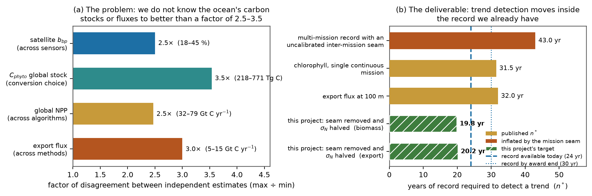

# From Radiance to Carbon: An Uncertainty-Quantified Ocean Carbon Record Coupled to Ocean State Estimation

**Primary theme:** Theme 1 (accuracy of the global carbon budget), with a strong Theme 2 component
(natural-versus-anthropogenic attribution, near-real-time monitoring) and a Theme 3 element (early
detection of regime shifts).

## 1. The problem

The ocean fixes roughly half of global net primary production, yet we do not know its carbon stocks
or fluxes to better than a factor of two to three. Independent estimates of the *same* quantity
disagree by 2.5–3.5× (Fig. 1a): the global phytoplankton carbon stock spans 218–771 Tg C depending
only on which published backscatter-to-carbon conversion is adopted [3]; net primary production spans
32–79 Gt C yr⁻¹ across algorithms [4,5]; export at 100 m is still quoted as 5–15 Gt C yr⁻¹, the range
of the 1980s [1]. The two most recent global export estimates have **non-overlapping 95% intervals**
[6,7] — method disagreement, not sampling error, dominates.

This uncertainty is *inherited, not intrinsic*. The retrieval underpinning every global ocean-carbon
product is ill-posed: reflectance constrains essentially the ratio bb/(a+bb), so ~90% of measured
spectra admit multiple distinct optical solutions [8], and multispectral radiances support no more
than about three independent parameters [9]. Satellite backscatter itself differs by 18–45% across
sensors, all biased low [1,2], and atmospheric correction adds up to ~50% of retrieval error [10].
The field has answered with over a hundred empirical algorithms, almost none reporting calibrated
uncertainty. We hold a 25-year record that certainly contains a carbon signal but cannot yet tell us
its size.

**Scope, stated precisely.** The biological quantities we target are not the dominant term in the
*anthropogenic* carbon inventory — that is set by circulation, ventilation and carbonate buffering,
and the largest reductions in its uncertainty have come from physical predictors [11,12]. They do
control the natural-carbon residual that anthropogenic reconstructions discard as steady-state
(10–20% of the decadal sink, undetectable today [11,13]) and the future response of the pump. That is
where this project aims, and why it couples to a physical state estimate rather than assuming the
physics away.

## 2. Hypotheses and targets

The degeneracy is **information-limited, not algorithm-limited**: it is broken by supplying external
information — in-situ, environmental and time-series priors — not by fitting better (H1). The
non-universal optics-to-carbon conversion, not radiometric noise, dominates carbon-stock error, and
particle *composition* information constrains it (H2) [14–17]. One physically consistent retrieval
across missions removes the inter-mission discontinuity that inflates trend-detection time (H3).

| ID | Quantity | Baseline | Target |
|---|---|---|---|
| **T-A** | Per-pixel phytoplankton carbon, median absolute error | 32% [3] | ≤16% |
| **T-B** | Global stock spread from conversion choice | 3.5× (218–771 Tg C) [3] | <1.8× |
| **T-C** | Years of record needed to detect a trend, n\* | 31.5 yr; 43 yr with an uncalibrated seam [19,20] | ≈20 yr |

For particulate organic carbon the honest baseline is 28%, already achieved with backscatter plus
chlorophyll — not the 47% backscatter-only figure [14]; we will not claim published gains as ours.

**Why T-C follows.** Since n\* = [3.3 σ_N/|ω₀| · √((1+φ)/(1−φ))]^(2/3) [21], n\* ∝ σ_N^(2/3), so
halving residual noise shortens detection by 2^(2/3) ≈ 1.6×. Three levers reduce σ_N, two of them
structural: reporting *carbon* rather than chlorophyll removes a real variance source, since >55% of
interannual chlorophyll anomalies over >75% of the ocean are photoacclimation, not biomass [18];
removing the mission seam alone moves the published figure from 43 to 27 yr [20]; T-A supplies the
rest. Together these move detection of a biomass or export trend *inside the record already in hand*
(Fig. 1b) — the difference between an archive that hints at change and one that demonstrates it.

## 3. Research plan

**WP1 — Bayesian retrieval with calibrated uncertainty.** One radiative-transfer forward model and
Bayesian inversion returning posteriors, covariances and per-pixel uncertainty, replacing per-mission
empirical algorithms and extending a published framework that established the three-parameter limit
[9]. Machine learning enters where it earns its place: learned priors over the joint (a_ph, a_dg,
b_bp) shape space, and differentiable radiative-transfer surrogates that make global posterior
inference tractable — not an end-to-end black box.

**WP2 — Priors that break the degeneracy.** Priors from in-situ bio-optics, BGC-Argo profiles and
environmental and time-series context [24,27]. The proof of concept exists: seeding an operational
inversion with ancillary backscatter cut seasonal absorption bias by >50% [22]. We will test and
*report* when the prior rather than the data is doing the work, since a prior that silently supplies
the answer is not a retrieval.

**WP3 — Atmospheric correction and cross-mission harmonisation.** Reprocess PACE/OCI [25] and MODIS
onto a common radiometric and atmospheric-correction basis, with SeaWiFS as an independent check.
This package owns the **ultraviolet (350–400 nm)**, where atmospheric correction is hardest but
separating coloured dissolved organic matter and detritus from phytoplankton absorption is most
tractable [10]. Because the UV exists only on PACE, T-A and T-B are demonstrated in the PACE era and
then *transferred onto the multispectral heritage record* by the harmonised retrieval: PACE becomes
the calibration anchor for two decades of MODIS. Polarimetry, which constrains the particle phase
function and hence the living/non-living backscatter split [28], is a stretch goal.

**WP4 — Coupling to ocean state estimation.** Couple the retrieval to a data-assimilative global
ocean biogeochemistry state estimate [23], informed by higher-resolution regional simulations. The
coupling is **iterative**: the state estimate supplies physically consistent priors to WP2, and the
uncertainty-quantified retrievals constrain the model's biological fields in return; adjoint
assimilation of optical constraints is a stretch goal. This carries the physical terms explicitly, so
no carbon flux is quoted as if the circulation were known exactly [11,12,30].

**WP5 — Products, depth, propagation.** Propagate posterior uncertainty from radiance through
phytoplankton carbon and POC to production and export, so every carbon number ships with a defensible
interval. Extend to depth by fusing BGC-Argo — and lidar where available — with the surface
retrieval, necessary because ~85% of phytoplankton carbon lies below the first optical depth [3].

**Figure 1.** *(a)* Independent estimates of the same quantity disagree by 2.5–3.5×; these empirical
spreads, not single-study error bars, are the honest measure of current uncertainty [1–7]. *(b)* Years
of record needed to detect a trend, n\* [19,20]: an uncalibrated seam inflates n\* to 43 yr, while
removing it and halving residual noise moves detection to ≈20 yr. Targets follow from n\* ∝ σ_N^(2/3)
[21] and are a projection, not a measurement.

## 4. Data, tools, and portfolio fit

PACE/OCI (~1 TB day⁻¹) as the hyperspectral and UV anchor [25]; MODIS for the long record; SeaWiFS
for consistency; BGC-Argo for depth and priors [24]; in-situ bio-optical compilations [27]; and
synthetic radiative-transfer databases for controlled tests where truth is known by construction [26].
Reprocessing runs on commercial cloud, GPU-accelerated where the surrogates allow; all code is
open-source and all products FAIR, released with their per-pixel uncertainty layers.

The work is deliberately complementary to the existing portfolio. COCO2 constrains Southern Ocean
air–sea CO₂ flux from uncrewed vehicles, whereas we constrain the *biological* stocks and fluxes
globally, and would use its observations as validation. InMOS integrates models and observations
across scales but must take the upstream optical retrieval and its unstated uncertainty on trust —
precisely what we supply. SUBSEA targets subsurface export in situ, complementing our global surface
constraint and float-based depth extension. CLARiTy is the land precedent for Earth observation plus
AI collapsing a flux uncertainty; this is its ocean counterpart, and we would align uncertainty
conventions so land and ocean budgets become comparable.

**Decision relevance.** Moving trend detection inside the existing record responds directly to the
need for verifiable, timely change detection on Global Stocktake timescales, and calibrated
uncertainty is what lets an ocean-carbon product enter a policy setting at all: an unquantified number
cannot support a decision or survive challenge [29].

## 5. Team composition and partnerships

The team spans several institutions, including non-US partners, with work packages led by early-career
researchers. Committed expertise covers hyperspectral radiative transfer and Bayesian inversion of
ocean-colour reflectance, including the prior work that quantified the degeneracy limit itself [9];
satellite radiometry and atmospheric correction, with sustained ocean-colour algorithm development;
global ocean state estimation and adjoint assimilation, with direct experience of the state estimate
WP4 builds on [23]; regional ocean modelling; autonomous float and BGC-Argo optics; in-situ and
laboratory bio-optics and phytoplankton biogeochemistry; and statistical and machine-learning methods
for large spectroscopic datasets. Project-management experience includes leading multi-institution
collaborations that delivered widely adopted open-source scientific software.

## 6. Preliminary budget

*[To be completed by the PI.]* Requested at approximately USD 10M over five years (1 October 2027 –
30 September 2032), personnel-dominated: postdoctoral researchers, graduate students and research
software engineers across the five work packages, with partial-FTE senior investigators and part-time
project management. Non-personnel lines: cloud compute and storage for the multi-mission reprocessing
(the dominant non-salary cost, but well within the envelope); open publication and hosting of the
derived products; travel, including the five-day annual VICC Science Team meeting from October 2027;
and indirect costs, not exceeding 10% of total project cost.

## 7. Statement on generative-AI use

Generative AI (Anthropic's Claude) was used substantially in preparing this proposal: to synthesise the
literature on ocean-carbon measurement uncertainty, to draft and revise this document, and to generate
the figure from published values. All scientific claims, values and citations were checked against
primary sources by the investigators; the scientific direction, hypotheses and targets are the team's
own.
