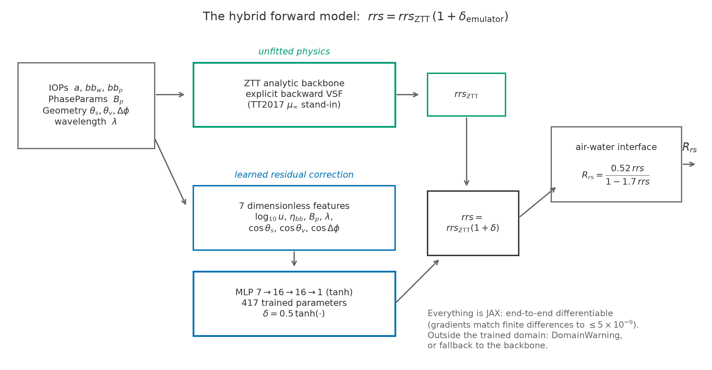
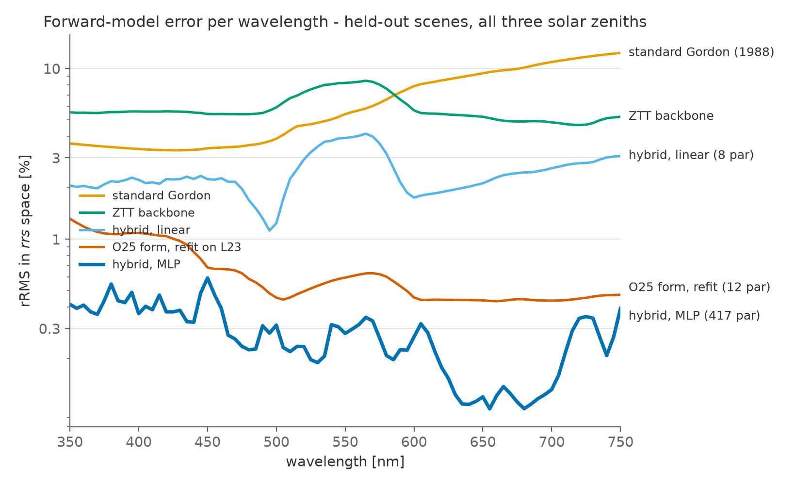
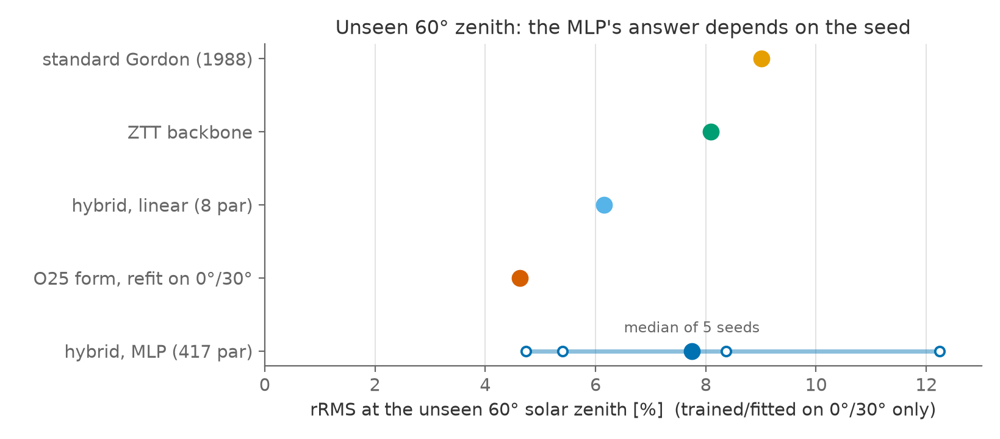

# A differentiable elastic radiative-transfer forward model for ocean color

**Version:** 1.0
**Date:** 2026-08-15
**Authors:** J. Xavier Prochaska and Claude (Fable 5)
**Status:** team report; intended to evolve into a public (non-refereed) write-up.

**Code:** the `robust.rt` subpackage of
[retrieve-or-bust](https://github.com/ocean-colour/retrieve-or-bust), branch
`rt-elastic-prototype` (milestones M0–M4).
**Figures:** generated by [`make_report_figures.py`](make_report_figures.py) from the
committed validation artefacts in [`design/validation/`](../design/validation/).

---

## Executive summary

We built a **differentiable forward model for elastic remote-sensing reflectance**,

> *rrs* = *rrs*<sub>ZTT</sub> · (1 + δ<sub>emulator</sub>),

an analytic radiative-transfer backbone with an explicit particle phase function
(Twardowski & Tonizzo 2018, "ZTT") plus a small learned residual correction (a
417-parameter MLP), implemented end-to-end in JAX. Trained and scored on the
Loisel et al. (2023) HydroLight ensemble (L23; 3,320 water bodies × 3 solar
zeniths × 81 wavelengths, elastic scattering only), the hybrid reaches

- **0.30% rRMS on held-out water bodies**, uniform across 350–750 nm and across
  the three solar zeniths (0°/30°/60°);
- **2.3× better than the modern semi-analytical benchmark** (the O25 bivariate
  form of Pitarch et al. 2025, refit on the same data: 0.69%), and 24× better
  than standard Gordon (1988);
- **exact gradients in every input** (`jax.grad` agrees with finite differences
  to ≤ 5×10⁻⁹), at ~5× the compute cost of the analytic backbone alone
  (~17 ms for the full 9,960 × 81 batch on CPU).

Held-out error equals training error to two decimals, so the gain is
generalization, not fit. The prototype passes its acceptance gate — beat the O25
benchmark on held-out scenes and pass the gradient gate — and the Week-1
milestone is complete.

The result comes with honest limits, stated in §5 before the number above should
be quoted anywhere: the margin over the state of the art is 2.3× (not 24×); O25's
own figure is its best case; **extrapolation to an unseen solar-zenith angle is
unresolved** (seed-dependent, 4.7–12.2%); phase-function generalization is
untested on L23's narrow range; and the sensor is nadir-only so the BRDF axes are
unexercised.

## 1. Motivation and background

Retrieving inherent optical properties (IOPs) from ocean color is gated by the
forward model: any bias in the map from IOPs to *R*<sub>rs</sub> propagates
directly into the retrieved absorption and backscattering. The community-standard
Gordon (1988) approximation writes *rrs* as a polynomial in the single variable
*u* = *b*<sub>b</sub>/(*a* + *b*<sub>b</sub>) — but *rrs* is **not** univocal in
*u*. Water returns ~0.23 sr⁻¹ of its backscatter toward the sensor at 180° while
particles return ~0.12–0.16 sr⁻¹, so the water/particle composition of
*b*<sub>b</sub> matters independently of *u*; our earlier BING work found the
same fact empirically as wavelength-dependent Gordon coefficients with extra
offset (G0) and *b*<sub>bp</sub>-slope (Gb) terms. The full synthesis of that
lineage — Gordon → Park & Ruddick (2005) → Lee (2011)/O25 — is in
[`context/RT/rt_elastic_model.md`](../context/RT/rt_elastic_model.md).

The deeper axis, emphasized by R. Frouin in his advisory comments, is the
**particle phase function**: almost every analytical model buries it in
coefficients or LUTs derived from RT runs with a *prescribed* phase function, so
none can represent independent variability in its shape — a first-order driver of
the angular distribution of water-leaving radiance. The exception is **ZTT**
(Twardowski & Tonizzo 2018), which carries the backward VSF explicitly. His
recommended architecture — a full-RT reference, a fast differentiable emulator,
and a hybrid with ZTT as the physically interpretable backbone — is what the
design document ([`design/rt_elastic_model.md`](../design/rt_elastic_model.md))
adopted and this prototype implements. Scope is strictly **elastic** (no Raman,
no fluorescence), forward-model only, with the API kept inversion-ready.

## 2. The model



The public API is one call,
`robust.rt.forward(iops, phase_params, geometry, wave, mode)`, with three modes
(`ztt`, `emulator`, `hybrid`) sharing one signature. Everything on the forward
path is pure JAX: `jit`- and `vmap`-safe, and differentiable end-to-end.

**The analytic backbone** (`robust/rt/ztt.py`) is a transcription of the ZTT
forward relation, every function naming the equation it implements: the shape
factor Ψ<sub>KLu</sub>, the backward phase functions of water (derived
analytically from the Zhang et al. 2009 form; 0.234 sr⁻¹ at 180°) and particles
(the Sullivan & Twardowski 2009 measured average, with a corrected typo in their
published polynomial's *a₃* coefficient), the *f*<sub>L</sub> spectral factor,
and the downwelling-average cosine µ<sub>d</sub>. Two independent checks anchor
the transcription: the paper's own worked example (θ<sub>s</sub>′ = 60° → 40.3°
in-water, ψ = 139.7°) reproduces to 0.04°, and µ<sub>d</sub> reproduces the
paper's quoted 0.79–0.94 range. One term could not be transcribed: the 2018
paper's Equation (8) coefficients for µ<sub>∞</sub> are not published, so the
antecedent **Twardowski & Tonizzo (2017)** Table 1 stands in (§6). All results
here are therefore *"ZTT with the TT2017 µ<sub>∞</sub>"*. The phase function
enters explicitly through *B*<sub>p</sub> = *b*<sub>bp</sub>/*b*<sub>p</sub>, the
particulate backscattering ratio.

**The learned half** (`robust/rt/emulator.py`) is deliberately small and
bounded: a 7→16→16→1 tanh MLP (417 parameters) over seven dimensionless features
that provably capture the backbone's complete state (the backbone is
scale-invariant in the IOPs, verified to 9×10⁻¹⁵). It emits a **relative**
correction δ, bounded to ±0.5 by construction, with a zero-initialized output
layer so the untrained hybrid *is* the backbone and every reported gain is a
gain. It is pointwise in wavelength, so it is defined on any spectral grid. The
trained weights (6.5 kB) are committed, so `forward()` works out of the box.

**Guard rails.** The emulator carries its own training domain; evaluating a
learned mode outside it raises a `DomainWarning`, or, under
`on_out_of_domain="ztt"`, falls back to the pure backbone — a policy built on a
traceable mask so it survives `jit`.

## 3. Data and validation protocol

**Reference data.** The L23 elastic set: 3,320 water bodies × 81 wavelengths
(350–750 nm) at three solar zeniths (0°/30°/60°), nadir viewing, one fixed
Fournier–Forand phase function per scene (*B*<sub>p</sub> ∈ [0.0103, 0.0180]).
Pure water contributes the *majority* of total backscatter over much of the
spectrum (~72% at 400 nm for the median scene), which is the quantitative reason
the water/particle split is carried explicitly.

**Splits.** Two held-out sets, fixed and seeded: a random **20% of scenes**
(split by water body, never by sample, so the same IOPs cannot appear on both
sides at different sun angles), and **one solar zenith** (train on 0°/30°, test
on 60°).

**Metric.** rRMS in *rrs* space (the sub-surface quantity; the air–water
interface is non-linear, so relative error in *R*<sub>rs</sub> is not the same
number). One shared implementation scores every model.

**Fairness to the benchmark.** O25's published coefficients are not printed in
its paper, so its form was **refit on our training split with our metric as the
objective** — worth 4× to O25 versus the paper's unweighted least squares. Every
table therefore says "O25 form, refit on L23", and its numbers are its best case.
Standard Gordon (fixed 1988 coefficients) and the unfitted ZTT backbone complete
the ladder; PR05 is absent because its 4-D coefficient LUT is unpublished and
nadir-only L23 could not populate its sensor-geometry axes.

## 4. Results

rRMS (%) in *rrs* space, full 9,960-sample batch
([`design/validation/metrics.md`](../design/validation/metrics.md)):

| model | train | held-out scenes | held-out @60° |
|---|---|---|---|
| standard Gordon (1988) | 7.21 | 7.21 | 9.01 |
| ZTT backbone alone | 5.95 | 5.93 | 8.11 |
| **O25 form, refit on L23** (12 fitted numbers) | 0.70 | **0.69** | 0.71 |
| hybrid, linear emulator (8 parameters) | 2.57 | 2.54 | 2.48 |
| **hybrid, MLP emulator** (417 parameters) | **0.30** | **0.30** | **0.32** |



Three features of the ladder are worth words. **The unfitted ZTT backbone already
beats Gordon overall** — flat at 4–6% where Gordon degrades toward the red
(12% at 750 nm) — which is the physics of an explicit VSF paying off before any
learning. **The gap that matters is to O25**, not to Gordon: the O25 bivariate
form, twelve fitted numbers with geometry-only coefficients, reaches 0.69% on
held-out scenes; the hybrid's margin over it is 2.3×. **The linear-emulator
baseline (2.54%) is the honest yardstick for the MLP**: the nonlinearity earns
~8×, not the ~20× a baseline-free comparison would suggest. Accuracy is uniform
where it should be: per solar zenith the hybrid reads 0.29/0.30/0.32% on held-out
scenes (the backbone alone degrades, 4.26 → 8.11%), and per *B*<sub>p</sub> bin
it is flat at 0.27–0.33%.

**The unseen-zenith split is the failure mode**, and it is reported rather than
gated:



Trained on 0°/30° only and asked for 60°, the MLP hybrid scores 4.74–12.24%
across five random seeds (median 7.75%): cos θ<sub>s</sub> spans [0.866, 1.0] in
that training set while 60° needs 0.5, so every tanh unit runs outside its fitted
range and the initialization decides the answer. The **refit O25 wins outright
there — 4.63%, deterministically** — and even the linear emulator (6.16%) beats
the MLP's median. At an unseen geometry, the benchmark beats us and is more
reproducible; this is the main open problem (§6).

**Speed** (jitted, CPU, full batch): Gordon 0.28 ms, O25 0.46 ms, ZTT backbone
3.76 ms, hybrid ~17 ms (4.5–6× the backbone across runs). The hybrid does not
collapse the analytic model's speed advantage over calling an RT solver.

**Gradients.** `jax.grad` versus central finite differences (float64,
per-variable steps), for *a*, *b*<sub>bp</sub>, *B*<sub>p</sub> and
θ<sub>s</sub>, every model: agreement ≤ 5×10⁻⁹. Two traps the protocol pins:
a model that genuinely ignores a variable (O25 has no phase-function input)
reports 0.0 = agreement, not infinity; and O25 is non-differentiable at its own
coefficient-table nodes, so gradients are certified at 45°, between nodes.

**Verification.** 279 tests pass (256 + 23 skips without the dataset — what CI
sees, on Python 3.12 and 3.14); the suite includes golden-value checks against
the raw L23 netCDF and the ZTT paper's worked example, the gradient gates, and
regression tests for every defect found in four review passes (PRs #9–#12 plus a
self-review). Five executed notebooks (`notebooks/RT/`) walk through each
milestone.

## 5. What the prototype may claim — and what it may not

**It may claim:** on held-out water bodies from the reference ensemble, a
differentiable elastic forward model with an explicit phase-function input that
reaches 0.30% rRMS, uniform across the spectrum and the three solar zeniths, with
machine-precision gradients, at ~5× the cost of its analytic backbone.

**It may not claim:**

1. **A 24× advance.** That is the margin over a 1988 model. Over the modern
   benchmark (O25) it is **2.3×**.
2. **Victory over O25 as published.** O25's 0.69% comes from coefficients refit
   on *our* training split with *our* objective; the published paper prints only
   plots. It is labeled "O25 form, refit on L23" everywhere for this reason.
3. **Geometry generalization.** At the unseen 60° the answer depends on the seed
   (4.7–12.2%) and the benchmark wins deterministically. The acceptance gate was
   deliberately written on the scene split.
4. **Phase-function generalization.** L23 spans a factor 1.7 in *B*<sub>p</sub>
   against the design's ~7× nominal band, with one fixed Fournier–Forand shape.
   Flat per-bin accuracy on that slice is not evidence of generalization.
5. **Any off-nadir capability.** L23 fixes the sensor at nadir and the azimuth at
   zero; the BRDF axes are untested, and the domain check correctly flags any
   off-nadir view.
6. **The published 2018 ZTT model.** Its Equation (8) µ<sub>∞</sub> coefficients
   are not in the paper; the TT2017 surface stands in. Results are "ZTT with the
   TT2017 µ<sub>∞</sub>".

## 6. Open items

For JXP to dispatch; none block the conclusions above.

1. **ZTT Equation (8) coefficients.** JXP has emailed the authors. When the
   sixteen *m* coefficients arrive, `mu_inf_coeffs=` restores the published 2018
   model in one line, and the backbone numbers should be regenerated.
2. **Geometry extrapolation** (§5, item 3). The structural options — geometry-
   aware features or architecture, training data at more angles (PB24 or new
   HydroLight runs), or leaning on the deterministic analytic path off-grid — are
   M5 design decisions, not patches.
3. **M3 task 5** (the hand-off edit to `rt_elastic_coding_prompt_5.md`) was
   overtaken by M4 actually completing and can be closed as such.
4. **`rt_elastic_coding_prompt_6.md` (M5) is a deliberate placeholder**, to be
   detailed from this report's priorities (§7).
5. **Merge status.** The prototype lives on `rt-elastic-prototype` (PR #12);
   merging to `main`/`RT` is JXP's call, as is archiving
   [`design/prototype_summary.md`](../design/prototype_summary.md) if this
   report supersedes it as the reviewer-facing summary.

## 7. Recommended priorities (M5)

In order of leverage, from the design's beyond-week-1 track plus what M4
actually taught us:

1. **Vary the phase function in the reference data.** New HydroLight runs with
   the particle phase-function shape explicitly varied (Frouin's central
   recommendation), with PB24 (5,000 IOPs × 1,300 geometries, the set O25 was
   calibrated on) in parallel for the geometry axes. This attacks the two
   untested axes — phase-function shape and BRDF — at once, and is the only way
   to make claims 4 and 5 of §5 testable.
2. **Retrieval impact.** The decisive metric for this project is not forward
   rRMS but component-retrieval error (*a*<sub>ph</sub>, *a*<sub>dg</sub>,
   *b*<sub>bp</sub> MAPE) through an inversion. The forward model is
   differentiable precisely so this study is cheap; it should come before more
   forward-model polish.
3. **Fix geometry extrapolation** with data (more angles) rather than
   architecture — M3's seed sweep showed architectural patches (a linear skip
   path) were initialization luck.
4. **Promote the phase function in the API**: add the ZTT backward-VSF
   descriptors (*P*<sub>bb</sub>(ψ) and shape terms) as optional
   `PhaseParams` fields — the design's planned generalization beyond the scalar
   *B*<sub>p</sub>, which changes no call sites.
5. **Close the ZTT transcription** with the Equation (8) coefficients when they
   arrive (§6, item 1).

## 8. Reproducibility

```bash
# environment: conda ocean14 (JAX CPU); data: $OS_COLOR/Loisel2023/
pytest -q                              # 279 tests; 23 skip without the data
python design/py/train_emulator.py    # ~1 min; bit-identical committed weights
python design/py/run_validation.py    # ~8 min; regenerates design/validation/
python report/make_report_figures.py  # the three figures in this report
```

Every number in this report traces to `design/validation/metrics.{md,csv}` or to
pinned tests; CI runs the suite and lint on every branch.

## 9. Document map

| document | role |
|---|---|
| [`context/RT/rt_elastic_model.md`](../context/RT/rt_elastic_model.md) | literature synthesis and roadmap |
| [`design/rt_elastic_model.md`](../design/rt_elastic_model.md) | the design (what/why) |
| [`design/rt_elastic_model_coding_plan.md`](../design/rt_elastic_model_coding_plan.md) | milestones M0–M5 (how/when) |
| [`design/rt_elastic_implementation.md`](../design/rt_elastic_implementation.md) | what was actually built, per milestone |
| [`design/prototype_summary.md`](../design/prototype_summary.md) | the short reviewer-facing summary |
| `claude_prompts/RT/rt_elastic_coding_prompt_{1..6}.md` | the execution prompts and their dated logs |
| **this report** | the top-level synthesis, for the team and eventual public release |

## References

- Gordon, H. R., et al. (1988), *J. Geophys. Res.* 93, 10909 — the canonical
  *rrs*(*u*) polynomial.
- Lee, Z.-P., et al. (2002) — the *R*<sub>rs</sub> ↔ *rrs* interface conversion
  (A = 0.52, B = 1.7).
- Loisel, H., et al. (2023) — the L23 HydroLight synthetic ensemble (via `ocpy`).
- Park, Y.-J., & Ruddick, K. (2005), *Appl. Opt.* 44, 1236 — the 4th-order
  bidirectional polynomial.
- Pitarch, J., et al. (2025) — the O25 bivariate (ω<sub>bw</sub>, ω<sub>bp</sub>)
  BRDF model; the modern benchmark.
- Sullivan, J. M., & Twardowski, M. S. (2009), *Appl. Opt.* 48, 6811 — the
  measured particulate backward phase function.
- Twardowski, M., & Tonizzo, A. (2017), *Opt. Express* 25, 18122 — the
  µ<sub>∞</sub>(b<sub>b</sub>/a, η<sub>bb</sub>) surface used here.
- Twardowski, M., & Tonizzo, A. (2018), *Appl. Sci.* 8, 2684 — the ZTT analytic
  model with the explicit backward VSF.
