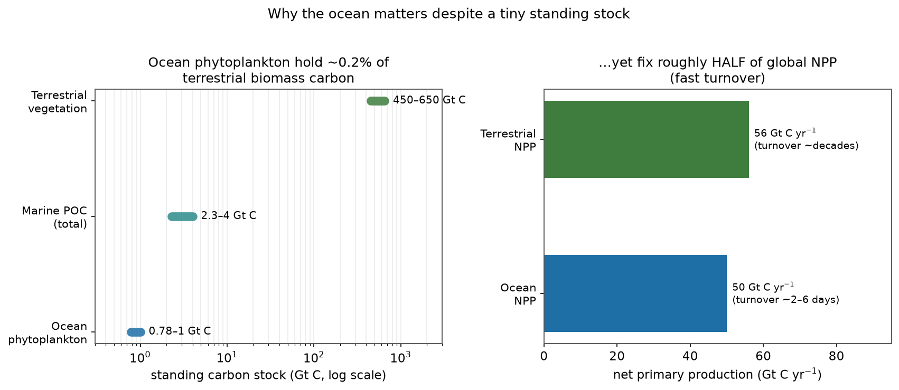
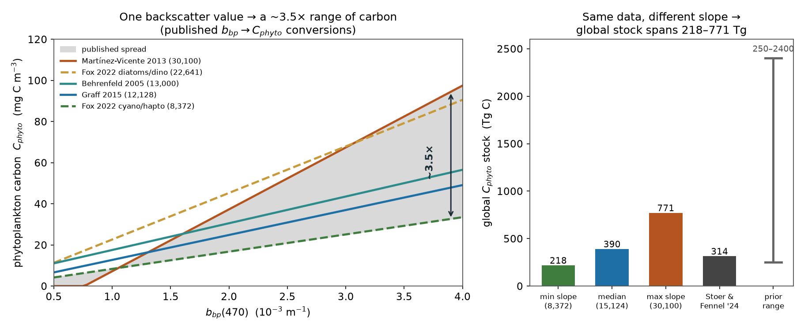
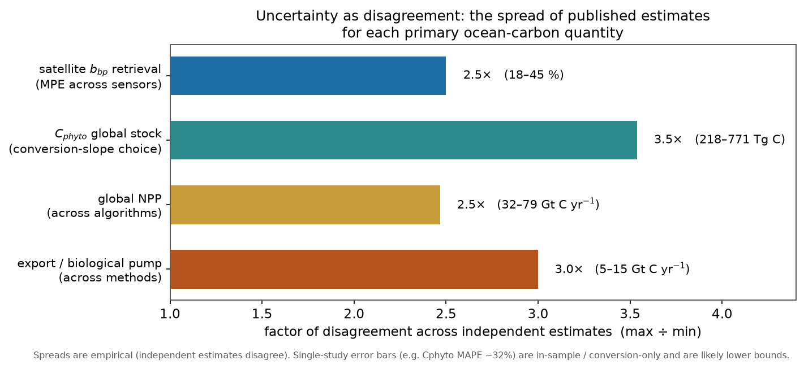
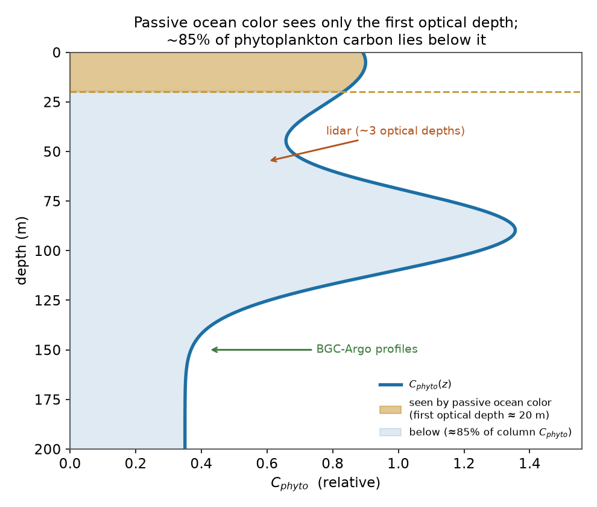

# Ocean Biomass & Carbon from Optics — Literature Summary

*Focus: the uncertainty in the **primary carbon measurements** (particulate organic
carbon, phytoplankton carbon, net primary production, and export) derived from ocean
optics. Prepared to inform the retrieve-or-bust / VICC effort.*

Scope (per Q&A): **ocean** phytoplankton/particulate carbon, placed in context against
terrestrial biomass (§1). All four quantities — Cphyto, POC, NPP, export — are in
scope, and so is the **subsurface** (§2.6). The stance on numbers (§3) is deliberately
skeptical: **we do not take the literature's own error estimates at face value**; the
most honest measure of uncertainty here is the *disagreement among independent
estimates*, which is what the figures show.

Sources: the 14 papers in `context/papers/Biomass`, read in full, plus a 2024–2026
literature scan and the additional works requested in Q&A. Citations are numbered
(Vancouver style); see **References**. Figures are generated by
`reports/py/biomass_figs.py`.

---

## 1. Orientation: ocean carbon is a small, fast pool

The ocean's phytoplankton hold a **tiny standing stock** — global phytoplankton carbon
is only **~0.78–1.0 Gt C** [1,2], and total marine POC **~2.3–4.0 Gt C** [1] — against
**~450–650 Gt C** of terrestrial vegetation biomass [3]. Yet that ~0.2% of the land
biomass fixes **roughly half of global net primary production** (ocean NPP ~50 Gt C
yr⁻¹ vs terrestrial ~56 Gt C yr⁻¹) [1,4], because it **turns over in days, not
decades**. Small stock, enormous flux: that is exactly why *precise* knowledge of the
ocean stock and its turnover matters for the carbon cycle, and why measurement
uncertainty there propagates strongly into flux and budget estimates.



*Fig. 2. Ocean phytoplankton hold ~0.2% of terrestrial biomass carbon yet fix ~half
of global NPP — a small, fast-turnover pool. Values compiled from refs [1–4].*

---

## 2. The measurement chain and its uncertainties

Ocean carbon quantities form a chain, and **each link adds uncertainty**:

```
   Rrs(λ)  →  IOPs (bbp, aph)  →  POC / phytoplankton carbon (Cphyto)  →  NPP  →  export (biological pump)
             [the inversion]      [the conversion]                       [the model]   [attenuation]
```

The headline: the largest, most quantifiable uncertainties sit in the two empirical
middle steps — the **ill-posed IOP inversion** and the **non-universal optics→carbon
conversion**. A symptom of the whole chain's difficulty: the global biological carbon
pump (export) is still quoted at **5–15 Gt C yr⁻¹ — the same range as in the 1980s**
[5].

### 2.1 Phytoplankton carbon (Cphyto) from backscatter — the conversion-slope problem

Cphyto is retrieved from the particulate backscattering coefficient `bbp` via a
near-linear scaling, and **the slope is not universal — it is the single largest
uncertainty source.**

- Foundational field regression (Graff 2015) [6]: **Cphyto = 12,128·bbp(470) + 0.59**
  (R² = 0.69, RMSE = 4.6 µg C L⁻¹) — ~31% of variance unexplained even in-sample.
- Published fixed slopes disagree ~2–4×: **13,000** (Behrenfeld 2005, bbp 440 nm) [7],
  **12,128** (Graff 2015, 470 nm) [6], **30,100** (Martínez-Vicente 2013, cell-volume
  based) [8]. Taxonomy drives the spread: Fox 2022 [9] finds the true scalar ranges
  **3,770–27,697** with community — **~8,372** (cyanobacteria/haptophytes), **~13,832**
  (green algae), **~22,641** (diatoms/dinoflagellates). A single fixed slope is
  **25–30% too high** in picoplankton gyres and **~100% too low** in diatom blooms; a
  composition-adaptive scalar lifted Cphyto vs flow-cytometry from R² = 0.46 to 0.79.
- Propagated to the **global stock**, the conversion choice alone spans **~3.5×**:
  min/median/max slopes give **218 / 390 / 771 Tg C** [10]. Stoer & Fennel [10] report
  **314 Tg C_phy** from 99,341 BGC-Argo profiles; prior global estimates span
  **250–2,400 Tg C** [10].
- **Size-class / PSD approaches** (Kostadinov et al.) [11] retrieve carbon by
  phytoplankton size class from ocean color, an alternative to a single bulk slope —
  but they inherit their own particle-size-distribution assumptions.



*Fig. 1. One backscatter value maps to a ~3.5× range of phytoplankton carbon depending
on the published conversion adopted (left); the same ambiguity spreads the global
stock estimate from 218 to 771 Tg C (right). Lines/values from refs [6–10].*

### 2.2 Particulate organic carbon (POC) from optics

- The NASA global POC product is an empirical **blue-to-green Rrs band ratio** (Stramski
  et al. 2008) [12]; refined sensor-specific algorithms extend it to very low/high POC
  (Stramski et al. 2022) [13]. Backscatter- and Kd-based algorithms are alternatives [5].
- A **single** POC–bbp relationship "is subject to high uncertainties because of the
  variable nature of particulate assemblages." Adding chlorophyll as a second predictor
  (Koestner et al. 2024, multivariable) cut POC uncertainty from **~47% (bbp-only) to
  ~28%** — direct evidence that particle *composition* is the missing information [14].
- Cael and colleagues have stressed that POC↔optics relationships and export statistics
  carry heavy-tailed, non-Gaussian variability that simple RMSE understates [15].

### 2.3 Non-algal particles (NAP) — the confounding backscatter

`bbp` integrates *all* particles; detritus, bacteria, minerals and coccoliths (PIC)
contribute to bbp but not to Cphyto. Bellacicco et al. [16] mapped the NAP contribution
to bbp globally and showed it is large, seasonally variable, and systematically biases
Cphyto in oligotrophic waters. Per-profile "background-bbp" subtraction is imperfect,
and the background offsets used across studies themselves range **0.00027–0.00067 m⁻¹**
[9,10]. Separating living from non-living backscatter is repeatedly named the central
Cphyto retrieval challenge [5,16].

### 2.4 Chlorophyll is a weak carbon proxy

Field Cphyto:Chl spans **31–408 (median ~100)** — an order of magnitude — so a single
C:Chl gives up to **3× errors** [6]; C:Chl variability exceeds **1.5 orders of
magnitude** [7,17]. Photoacclimation, not biomass, drives **>55% of interannual
chlorophyll anomalies over >75% of the ocean** [17] — chlorophyll and carbon are
physiologically decoupled. In-situ autotrophic-carbon census gives C:Chl varying
**~170→20 (factor ~8–9)** across trophic gradients (AC = 52.9·Chl^0.64) [18].

### 2.5 Net primary production and export

- **Global NPP estimates span ~32–79 Gt C yr⁻¹** across algorithms [19]; depth/
  wavelength-resolved Chl models cluster at **48.7–52.5 Gt C yr⁻¹** [20], the CbPM
  gives ~67 vs the VGPM's ~60, differing **regionally by −21% to +49%** [7].
- **The biomass/carbon term is the dominant lever** — in the CbPM, NPP = Cphyto·μ, so
  all of §2.1's conversion uncertainty enters directly; "satellite-derived biomass
  estimates can at times be the largest contributor to uncertainties in NPP" [19].
  Physiology is comparable: ±1 SD in the P–I parameters swings global NPP by **−46% to
  +45%** [20]; in absorption-based models the quantum-yield term dominates the
  sensitivity (**S_T = 0.79**) [19].
- **Algorithms disagree even on the sign of the trend.** Across six satellite NPP
  algorithms the 1998–2023 global trend runs from slightly positive (VGPMs, unreliable)
  to **−0.27 to −1.45% yr⁻¹** [21]; absorption-based models (Lee-AbPM, Silsbe-CAFE)
  have the lowest RMSE vs in-situ ¹⁴C. CMIP6 projected ΔNPP to 2100 is **−0.76 ± 3.44
  Gt C yr⁻¹** (SD >4× the mean — no consensus on sign), and this projection uncertainty
  has **grown >50% since the previous IPCC cycle** [21].
- **Export** at 100 m: model ensemble **6.08 ± 1.17 Gt C yr⁻¹** vs a hydrographic-data
  estimate of **10.64 ± 0.80 Gt C yr⁻¹** [22,23] — a ~1.7× disagreement on top of the
  **5–15 Gt C yr⁻¹** literature spread [5]. Satellite export algorithms (Siegel et al.;
  DeVries & Weber; Nowicki et al.) [22,23,24] differ in both magnitude and spatial
  pattern; uncertainty in export dominates above ~900 m, transfer efficiency below [22].



*Fig. 3. The honest uncertainty: the factor by which independent estimates of each
primary quantity disagree (max ÷ min). Single-study error bars are smaller but, as §3
argues, are not comparable measures. Ranges from refs [6–24].*

### 2.6 The subsurface — in scope, but the hardest part

Passive ocean color sees ~90% of its signal from one optical depth (1/Kd), yet
**~85% of global Cphyto and ~88% of Chl lie below it**, and the Chl-max is offset >10 m
from the Cphyto-max over ~84% of the ocean [10]. Reaching the subsurface — which the
project treats as **in scope** — requires synergy beyond passive color:
**BGC-Argo** profiles (bbp/Chl to 1000 m) and **ocean lidar** (bbp to ~3 optical
depths) [10,25], fused with the surface retrieval. This is the largest *physical*
(as opposed to algorithmic) uncertainty, and the one that most needs an
observation-fusion approach rather than a better inversion alone.



*Fig. 4. Passive ocean color constrains only the first optical depth (~85% of Cphyto
lies below it); BGC-Argo and lidar are the in-scope path to the water column [10,25].*

### 2.7 Upstream: the satellite bbp retrieval itself

The input to every Cphyto/POC product carries its own error: median percentage error
vs BGC-Argo is **~18% (CALIOP lidar), 24% (MODIS-GIOP), 31% (VIIRS), 45% (OLCI)**, all
biased low [26]; this propagates to **±50% basin-scale disagreement in satellite
phytoplankton carbon** between MODIS and CALIOP [26]. Viewing-angle/phase-function
effects move Rrs by up to **65%** [26]; seeding inversions with an external bbp shifts
retrieved absorption by **>50%** regionally [27]. This is the ill-posed IOP inversion —
retrieve-or-bust's home ground.

---

## 3. A caution on the uncertainty numbers themselves

Per the project's stance, **the reported error statistics should not be taken at face
value**, for three structural reasons:

1. **In-sample and self-referential.** Regression R²/RMSE (e.g. Graff 2015 R² = 0.69)
   describe fit to the calibration set, not out-of-sample or global performance.
2. **Conversion-only.** The often-quoted "Cphyto MAPE ~32%" [10] is derived from the
   bbp→C conversion scatter *assuming sensor drift, biofouling and calibration error
   are negligible* — i.e. it excludes most of the real error budget.
3. **No ground truth.** There is **no certified reference material for POC**, and
   Cphyto "has no standard method" with "high uncertainties" [5]; GF/F filtration loses
   **3–6× (sometimes >50%)** of cells [28], and Cphyto:POC itself ranges **12–97%** [6].
   The "truth" against which everything is validated is itself uncertain and biased.

The defensible, unbiased measure is therefore the **spread across independent
estimates** (Fig. 3): where methods that should agree differ by 2.5–3.5×, that
disagreement is a lower bound on the true uncertainty — and it is *larger* than any
single study's stated error bar. Reported single-study errors are best read as
**optimistic lower bounds.**

---

## 4. Synthesis — ranking the uncertainties (my assessment)

Ordering the dominant uncertainties in the primary carbon measurements by how large and
how *addressable* they are:

1. **Non-universal optics→carbon conversion** (bbp→Cphyto slope; taxonomy/composition):
   the biggest single lever (~3.5× on the global stock), and directly addressable with
   composition information (hyperspectral, polarimetry, priors).
2. **NAP vs living-particle separation** in bbp: pervasive, biases gyres, addressable
   with the same spectral/polarimetric information.
3. **The ill-posed IOP inversion** (satellite bbp/aph error, 18–45% MPE; ±50% basin
   Cphyto): retrieve-or-bust's core competence.
4. **The in-situ validation / CRM gap**: the ground truth is uncertain; not fixable by
   better satellites, but it caps how well any product can be *validated* and must be
   confronted honestly.
5. **Subsurface / first-optical-depth**: the largest physical gap; requires BGC-Argo /
   lidar fusion (§2.6), not a better surface inversion.
6. **NPP model structure & physiology** (P–I, μ, ϕ_m) and **atmospheric correction**:
   real, but downstream of / parallel to the above.

**Mapping to the VICC pitch.** Uncertainties (1)–(3) — conversion, NAP, and inversion —
are exactly what an **AI + priors + honest-uncertainty engine on PACE-class
hyperspectral** is built to reduce and *characterize*: composition-aware conversions
that break the single-slope assumption, better-conditioned inversions, and calibrated
per-pixel error. (4) sets an honest limit and motivates coordinated calibration
campaigns; (5) defines where observation *fusion* (BGC-Argo/lidar), not inversion
alone, is required. Encouragingly, **PACE OCI L2 BGC v3.1 (2025)** already ships
phytoplankton carbon *with* a per-pixel uncertainty product [29] — the community is
moving toward carbon-centric, composition-aware, uncertainty-quantified retrievals,
which is precisely this project's lane.

---

## References

1. Brewin RJW, Sathyendranath S, Kulk G, et al. Ocean carbon from space: current status and priorities for the next decade. *Earth-Sci Rev.* 2023;240:104386.
2. Falkowski PG, Barber RT, Smetacek V. Biogeochemical controls and feedbacks on ocean primary production. *Science.* 1998;281:200–206.
3. Bar-On YM, Phillips R, Milo R. The biomass distribution on Earth. *PNAS.* 2018;115(25):6506–6511.
4. Field CB, Behrenfeld MJ, Randerson JT, Falkowski P. Primary production of the biosphere: integrating terrestrial and oceanic components. *Science.* 1998;281:237–240.
5. Brewin RJW, et al. (as ref. 1) — global magnitudes and measurement-uncertainty statements.
6. Graff JR, Westberry TK, Milligan AJ, et al. Analytical phytoplankton carbon measurements spanning diverse ecosystems. *Deep-Sea Res I.* 2015;102:16–25.
7. Behrenfeld MJ, Boss E, Siegel DA, Shea DM. Carbon-based ocean productivity and phytoplankton physiology from space. *Global Biogeochem Cycles.* 2005;19:GB1006.
8. Martínez-Vicente V, Dall'Olmo G, Tarran G, et al. Optical backscattering of marine phytoplankton carbon in the Atlantic. *Geophys Res Lett.* 2013;40:1154–1158.
9. Fox J, Kramer SJ, Graff JR, et al. An absorption-based approach to improved estimates of phytoplankton biomass and net primary production. *Limnol Oceanogr Lett.* 2022;7:419–426.
10. Stoer AC, Fennel K. Carbon-centric dynamics of Earth's marine phytoplankton. *PNAS.* 2024;121(45):e2405354121.
11. Kostadinov TS, Cabré A, Vedantham H, et al. Carbon-based phytoplankton size classes retrieved via ocean color. *Prog Oceanogr / Ocean Sci.* 2016; and updates 2022/2023.
12. Stramski D, Reynolds RA, Babin M, et al. Relationships between the surface concentration of POC and optical properties in the eastern South Pacific and eastern Atlantic. *Biogeosciences.* 2008;5:171–201.
13. Stramski D, Joshi I, Reynolds RA, et al. New algorithms for estimating POC from ocean color across trophic regimes. *Remote Sens Environ.* 2022/2023.
14. Koestner D, Stramski D, Reynolds RA. A multivariable empirical algorithm for estimating POC from optical backscattering and chlorophyll-a. *Front Mar Sci.* 2024.
15. Cael BB, et al. On the variability and statistics of oceanic particulate carbon and export. *(POC/export statistics; e.g. Global Biogeochem Cycles / L&O, 2018–2023.)*
16. Bellacicco M, Cornec M, Organelli E, et al. Global variability of the non-algal contribution to particulate backscattering. *Geophys Res Lett.* 2019/2020.
17. Behrenfeld MJ, O'Malley RT, Boss ES, et al. Revaluating ocean warming impacts on global phytoplankton. *Nat Clim Change.* 2016;6:323–330.
18. Taylor AG, Landry MR. Phytoplankton biomass and size structure across trophic gradients in the southern California Current and adjacent ecosystems. *Mar Ecol Prog Ser.* 2018;592:1–17.
19. Wu J, Goes JI, Gomes H do R, Lee Z, et al. Estimates of diurnal and daily net primary productivity using GOCI data. *Remote Sens Environ.* 2022;280:113183.
20. Kulk G, Platt T, Dingle J, et al. Primary production, an index of climate change in the ocean: satellite-based estimates over two decades. *Remote Sens.* 2020;12:826.
21. Ryan-Keogh TJ, Tagliabue A, Thomalla SJ. Global decline in net primary production underestimated by climate models. *Commun Earth Environ.* 2025;6:75.
22. Doney SC, et al. Observational and numerical modeling constraints on the global ocean biological carbon pump. *Global Biogeochem Cycles.* 2024;38:e2024GB008156.
23. Nowicki M, DeVries T, Siegel DA. Quantifying the carbon export and sequestration pathways of the ocean's biological carbon pump. *Global Biogeochem Cycles.* 2022;36:e2021GB007083.
24. Siegel DA, Buesseler KO, Behrenfeld MJ, et al. Prediction of the export and fate of global ocean net primary production: the EXPORTS science plan. *Front Mar Sci.* 2016;3:22.
25. Bisson KM, Werdell PJ, Chase AP, et al. Informing ocean color inversion products by seeding with ancillary observations. *Opt Express.* 2023;31(24):40557–40572. (ICESat-2 / CALIOP lidar bbp.)
26. Bisson KM, Boss E, Werdell PJ, Ibrahim A, Behrenfeld MJ. Particulate backscattering in the global ocean: a comparison of independent assessments. *Geophys Res Lett.* 2021;48:e2020GL090909.
27. Bisson KM, et al. (as ref. 25).
28. Graff JR, Milligan AJ, Behrenfeld MJ. The measurement of phytoplankton biomass using flow-cytometric sorting and elemental analysis of carbon. *Limnol Oceanogr Methods.* 2012;10:910–920.
29. NASA OB.DAAC. PACE OCI Level-2 Regional Ocean Biogeochemical Properties, v3.1 (incl. carbon_phyto, carbon_phyto_unc, POC). 2025.

**Additional 2024–2026 works consulted (web scan; verify author/volume before formal use):**
Refining marine NPP uncertainty via probability-prediction models, *Biogeosciences* 22:5463 (2025); Global declines in NPP in the ocean-color era, *Nat Commun* (2025); Sensitivity of a carbon-based PP model to satellite ocean-color products, *Remote Sens Environ* (2024); Phytoplankton-carbon proxies in oligotrophic waters, *Biogeosciences* 23:2641 (2026); BGC-Argo + satellite bbp water-column reconstruction, *Ocean Sci* 21:1677 (2025); multi-model global NPP data product, *ESSD* 15:4829 (2023); Li Z, et al. Ocean-scale drivers of phytoplankton biomass, *Sci Adv* 10:eadm7556 (2024).

*Provenance:* refs 6–10, 17–20, 26, 28 were read in full from `context/papers/Biomass`;
refs 1–4, 11–16, 21–25, 29 and the additional list are from the requested literature
and the 2024–26 web scan and should have author/volume details confirmed before use in
a formal Vancouver reference list. Figures: `reports/py/biomass_figs.py`.
