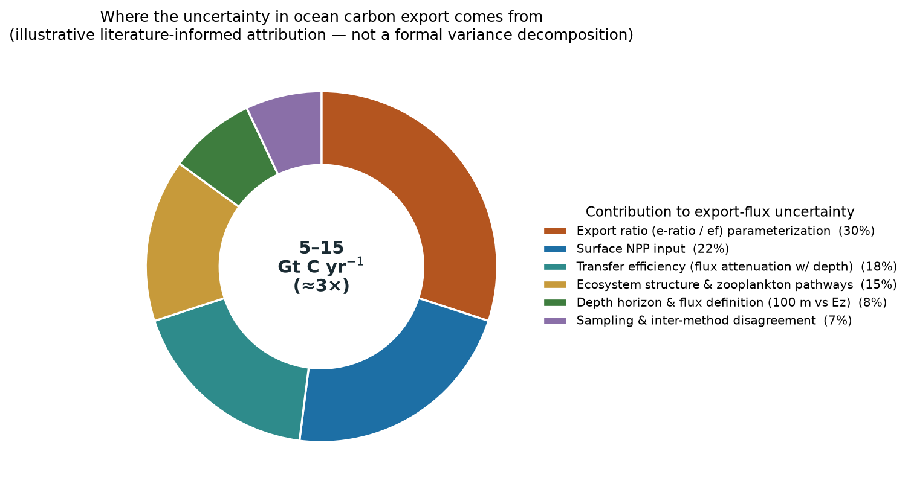

# Ocean Biomass & Carbon from Optics — Literature Summary

*Focus: the uncertainty in the **primary carbon measurements** (particulate organic
carbon, phytoplankton carbon, net primary production, and export) derived from ocean
optics. Prepared to inform the retrieve-or-bust / VICC effort.*

Scope (per Q&A): **ocean** phytoplankton/particulate carbon, placed in context against
terrestrial biomass (§1). All four quantities — Cphyto, POC, NPP, export — are in
scope, and so is the **subsurface** (§2.6). The stance on numbers (§3) is deliberately
skeptical: **we do not take the literature's own error estimates at face value**; the
most honest measure of uncertainty here is the *disagreement among independent
estimates*, which is what the figures show. Although this report is titled *from Optics*
and §§1–4 concern optics-derived carbon, **the answer to "is there another approach?" is
yes** — §5 surveys the **non-optical (in-situ / geochemical) methods**, which are the
calibration backbone for optics and carry their own, often large, uncertainties.

Sources: the 14 papers in `context/papers/Biomass`, read in full, plus a 2024–2026
literature scan and the additional works requested in Q&A. Citations are numbered
(Vancouver style) **with DOIs**; see **References**. Figures are generated by
`reports/py/biomass_figs.py`.

> **Uncertainty conventions used here (clarified per request).** Unless stated
> otherwise: a **range** written `A–B` (e.g. 5–15 Gt C yr⁻¹, 32–79 Gt C yr⁻¹,
> 218–771 Tg C, C:Chl 31–408) is the **spread of independent published best estimates**
> — a min–max envelope, **not** a probabilistic confidence interval. A value written
> **`x ± s` is one standard deviation (1σ, ≈68%)** of an ensemble/sample; the
> corresponding **95% interval ≈ x ± 1.96 s** and is given explicitly for the key cases.
> **MAPE / MPD / median % error** are central error metrics (medians of absolute
> percentage deviation), not confidence intervals. **R² / RMSE** are in-sample
> goodness-of-fit descriptors. Per §3, single-study `±`/MAPE figures are best read as
> *optimistic lower bounds*; the min–max spreads are the more honest measure. Where a
> distribution is implied, 95% CIs are added inline below.

---

## 1. Orientation: ocean carbon is a small, fast pool

The ocean's phytoplankton hold a **tiny standing stock** — global phytoplankton carbon
is only **~0.78–1.0 Gt C** [1,2], and total marine POC **~2.3–4.0 Gt C** [1] — against
**~450–650 Gt C** of terrestrial vegetation biomass [3]. Yet that ~0.2% of the land
biomass fixes **roughly half of global net primary production** (ocean NPP ~50 Gt C
yr⁻¹ vs terrestrial ~56 Gt C yr⁻¹) [1,4], because it **turns over in days, not
decades**. Small stock, enormous flux: that is exactly why *precise* knowledge of the
ocean stock and its turnover matters for the carbon cycle, and why measurement
uncertainty there propagates strongly into flux and budget estimates.


*Fig. 2. Ocean phytoplankton hold ~0.2% of terrestrial biomass carbon yet fix ~half
of global NPP — a small, fast-turnover pool. Values compiled from refs [1–4].*

---

## 2. The measurement chain and its uncertainties

Ocean carbon quantities form a chain, and **each link adds uncertainty**:

```
   Rrs(λ)  →  IOPs (bbp, aph)  →  POC / phytoplankton carbon (Cphyto)  →  NPP  →  export (biological pump)
             [the inversion]      [the conversion]                       [the model]   [attenuation]
```

The headline: the largest, most quantifiable uncertainties sit in the two empirical
middle steps — the **ill-posed IOP inversion** and the **non-universal optics→carbon
conversion**. A symptom of the whole chain's difficulty: the global biological carbon
pump (export) is still quoted at **5–15 Gt C yr⁻¹ — the same range as in the 1980s**
[5].

### 2.1 Phytoplankton carbon (Cphyto) from backscatter — the conversion-slope problem

Cphyto is retrieved from the particulate backscattering coefficient `bbp` via a
near-linear scaling, and **the slope is not universal — it is the single largest
uncertainty source.**

- Foundational field regression (Graff 2015) [6]: **Cphyto = 12,128·bbp(470) + 0.59**
  (R² = 0.69, RMSE = 4.6 µg C L⁻¹) — ~31% of variance unexplained even in-sample.
- Published fixed slopes disagree ~2–4×: **13,000** (Behrenfeld 2005, bbp 440 nm) [7],
  **12,128** (Graff 2015, 470 nm) [6], **30,100** (Martínez-Vicente 2013, cell-volume
  based) [8]. Taxonomy drives the spread: Fox 2022 [9] finds the true scalar ranges
  **3,770–27,697** with community — **~8,372** (cyanobacteria/haptophytes), **~13,832**
  (green algae), **~22,641** (diatoms/dinoflagellates). A single fixed slope is
  **25–30% too high** in picoplankton gyres and **~100% too low** in diatom blooms; a
  composition-adaptive scalar lifted Cphyto vs flow-cytometry from R² = 0.46 to 0.79.
- Propagated to the **global stock**, the conversion choice alone spans **~3.5×**:
  min/median/max slopes give **218 / 390 / 771 Tg C** [10]. Stoer & Fennel [10] report
  **314 Tg C_phy** from 99,341 BGC-Argo profiles; prior global estimates span
  **250–2,400 Tg C** [10].
- **Size-class / PSD approaches** (Kostadinov et al.) [11] retrieve carbon by
  phytoplankton size class from ocean color, an alternative to a single bulk slope —
  but they inherit their own particle-size-distribution assumptions.


*Fig. 1. One backscatter value maps to a ~3.5× range of phytoplankton carbon depending
on the published conversion adopted (left); the same ambiguity spreads the global
stock estimate from 218 to 771 Tg C (right). Lines/values from refs [6–10].*

### 2.2 Particulate organic carbon (POC) from optics

- The NASA global POC product is an empirical **blue-to-green Rrs band ratio** (Stramski
  et al. 2008) [12]. Backscatter- and Kd-based algorithms are alternatives [5].
- A **single** POC–bbp relationship "is subject to high uncertainties because of the
  variable nature of particulate assemblages." Adding chlorophyll as a second predictor
  (Koestner et al. 2022, multivariable) cut POC uncertainty from **~47% (bbp-only) to
  ~28%** — direct evidence that particle *composition* is the missing information [13];
  an improved version followed in 2023 [14].
- Cael and colleagues have stressed that POC↔optics relationships and export statistics
  carry heavy-tailed, non-Gaussian variability that simple RMSE understates [15].

### 2.3 Non-algal particles (NAP) — the confounding backscatter

`bbp` integrates *all* particles; detritus, bacteria, minerals and coccoliths (PIC)
contribute to bbp but not to Cphyto. Bellacicco et al. [16] mapped the NAP contribution
to bbp globally and showed it is large, seasonally variable, and systematically biases
Cphyto in oligotrophic waters. Per-profile "background-bbp" subtraction is imperfect,
and the background offsets used across studies themselves range **0.00027–0.00067 m⁻¹**
[9,10]. Separating living from non-living backscatter is repeatedly named the central
Cphyto retrieval challenge [5,16].

### 2.4 Chlorophyll is a weak carbon proxy

Field Cphyto:Chl spans **31–408 (median ~100)** — an order of magnitude — so a single
C:Chl gives up to **3× errors** [6]; C:Chl variability exceeds **1.5 orders of
magnitude** [7,17]. Photoacclimation, not biomass, drives **>55% of interannual
chlorophyll anomalies over >75% of the ocean** [17] — chlorophyll and carbon are
physiologically decoupled. In-situ autotrophic-carbon census gives C:Chl varying
**~170→20 (factor ~8–9)** across trophic gradients (AC = 52.9·Chl^0.64) [18].

### 2.5 Net primary production and export

- **Global NPP estimates span ~32–79 Gt C yr⁻¹** across algorithms [19]; depth/
  wavelength-resolved Chl models cluster at **48.7–52.5 Gt C yr⁻¹** [20], the CbPM
  gives ~67 vs the VGPM's ~60, differing **regionally by −21% to +49%** [7].
- **The biomass/carbon term is the dominant lever** — in the CbPM, NPP = Cphyto·μ, so
  all of §2.1's conversion uncertainty enters directly; "satellite-derived biomass
  estimates can at times be the largest contributor to uncertainties in NPP" [19].
  Physiology is comparable: ±1 SD in the P–I parameters swings global NPP by **−46% to
  +45%** [20]; in absorption-based models the quantum-yield term dominates the
  sensitivity (**S_T = 0.79**) [19].
- **Algorithms disagree even on the sign of the trend.** Across six satellite NPP
  algorithms the 1998–2023 global trend runs from slightly positive (VGPMs, unreliable)
  to **−0.27 to −1.45% yr⁻¹** [21]; absorption-based models (Lee-AbPM, Silsbe-CAFE)
  have the lowest RMSE vs in-situ ¹⁴C. CMIP6 projected ΔNPP to 2100 is **−0.76 ± 3.44
  Gt C yr⁻¹** (1σ inter-model; **95% CI ≈ −7.5 to +6.0** — SD >4× the mean, no consensus
  on sign), and this projection uncertainty has **grown >50% since the previous IPCC
  cycle** [21].
- **Export** at 100 m: model ensemble **6.08 ± 1.17 Gt C yr⁻¹** (1σ; **95% CI ≈
  3.8–8.4**) vs a hydrographic-data estimate of **10.64 ± 0.80 Gt C yr⁻¹** (1σ; **95% CI
  ≈ 9.1–12.2**) [22,30] — the two 95% intervals **do not overlap**, on top of the
  **5–15 Gt C yr⁻¹** literature spread (min–max of best estimates, not a CI) [5].
  Satellite/inverse export algorithms (Siegel et al.; DeVries & Weber; Nowicki et al.)
  [23,24] differ in both magnitude and spatial pattern; export uncertainty dominates
  above ~900 m, transfer efficiency below [22,23].


*Fig. 3. The honest uncertainty: the factor by which independent estimates of each
primary quantity disagree (max ÷ min). Single-study error bars are smaller but, as §3
argues, are not comparable measures. Ranges from refs [6–24].*

#### 2.5.1 How reliable is the 5–15 Gt C yr⁻¹ export figure?

**Not very** — and its unreliability is structural, not statistical. The **5–15 Gt C
yr⁻¹** range is a **spread of independent best estimates, not a confidence interval**,
and it has **not narrowed in ~40 years** [5].

- **It is not a probabilistic interval.** The two most recent global estimates —
  model-ensemble **6.08 ± 1.17** (1σ; 95% CI ≈ 3.8–8.4) [22] and hydrographic
  **10.64 ± 0.80** (1σ; 95% CI ≈ 9.1–12.2) [30] — have **non-overlapping 95% intervals**
  yet both fall inside "5–15." *Method disagreement, not sampling error, dominates.*
- **The error budget is dominated by the conversions, not the observations.** The
  least-constrained term is the **export ratio (e-ratio / ef = export ÷ NPP)** [24,31],
  compounding the already-large **surface NPP** uncertainty (§2.5) and the depth-
  dependent **transfer efficiency** (which dominates below ~900 m [22,23,32]).
  Ecosystem/zooplankton pathway partitioning, the flux-depth definition (100 m vs the
  euphotic depth), and inter-method sampling (sediment traps vs ²³⁴Th vs inverse models
  vs satellites) make up the remainder.



*Fig. 5. An illustrative, literature-informed attribution of the uncertainty in the
5–15 Gt C yr⁻¹ export estimate — expert-judgment shares (Henson 2022 [31]; Nowicki 2022
[23]; Siegel 2016 [24]; Doney 2024 [22]; Comm. Earth Environ. 2024 [32]), **not** a
formal variance decomposition. The point: the biggest slices are the empirical
**conversions** (e-ratio, NPP input, transfer efficiency) — the same class of problem
as the Cphyto/POC conversions upstream, which is where retrieve-or-bust can help.*

### 2.6 The subsurface — in scope, but the hardest part

Passive ocean color sees ~90% of its signal from one optical depth (1/Kd), yet
**~85% of global Cphyto and ~88% of Chl lie below it**, and the Chl-max is offset >10 m
from the Cphyto-max over ~84% of the ocean [10]. Reaching the subsurface — which the
project treats as **in scope** — requires synergy beyond passive color:
**BGC-Argo** profiles (bbp/Chl to 1000 m) and **ocean lidar** (bbp to ~3 optical
depths) [10,25], fused with the surface retrieval. This is the largest *physical*
(as opposed to algorithmic) uncertainty, and the one that most needs an
observation-fusion approach rather than a better inversion alone.


*Fig. 4. Passive ocean color constrains only the first optical depth (~85% of Cphyto
lies below it); BGC-Argo and lidar are the in-scope path to the water column [10,25].*

### 2.7 Upstream: the satellite bbp retrieval itself

The input to every Cphyto/POC product carries its own error: median percentage error
vs BGC-Argo is **~18% (CALIOP lidar), 24% (MODIS-GIOP), 31% (VIIRS), 45% (OLCI)**, all
biased low [26]; this propagates to **±50% basin-scale disagreement in satellite
phytoplankton carbon** between MODIS and CALIOP [26]. Viewing-angle/phase-function
effects move Rrs by up to **65%** [26]; seeding inversions with an external bbp shifts
retrieved absorption by **>50%** regionally [27]. This is the ill-posed IOP inversion —
retrieve-or-bust's home ground.

---

## 3. A caution on the uncertainty numbers themselves

Per the project's stance, **the reported error statistics should not be taken at face
value**, for three structural reasons:

1. **In-sample and self-referential.** Regression R²/RMSE (e.g. Graff 2015 R² = 0.69)
   describe fit to the calibration set, not out-of-sample or global performance.
2. **Conversion-only.** The often-quoted "Cphyto MAPE ~32%" [10] is derived from the
   bbp→C conversion scatter *assuming sensor drift, biofouling and calibration error
   are negligible* — i.e. it excludes most of the real error budget.
3. **No ground truth.** There is **no certified reference material for POC**, and
   Cphyto "has no standard method" with "high uncertainties" [5]; GF/F filtration loses
   **3–6× (sometimes >50%)** of cells [28], and Cphyto:POC itself ranges **12–97%** [6].
   The "truth" against which everything is validated is itself uncertain and biased.

The defensible, unbiased measure is therefore the **spread across independent
estimates** (Fig. 3): where methods that should agree differ by 2.5–3.5×, that
disagreement is a lower bound on the true uncertainty — and it is *larger* than any
single study's stated error bar. Reported single-study errors are best read as
**optimistic lower bounds.**

---

## 4. Synthesis — ranking the uncertainties (my assessment)

Ordering the dominant uncertainties in the primary carbon measurements by how large and
how *addressable* they are:

1. **Non-universal optics→carbon conversion** (bbp→Cphyto slope; taxonomy/composition):
   the biggest single lever (~3.5× on the global stock), and directly addressable with
   composition information (hyperspectral, polarimetry, priors).
2. **NAP vs living-particle separation** in bbp: pervasive, biases gyres, addressable
   with the same spectral/polarimetric information.
3. **The ill-posed IOP inversion** (satellite bbp/aph error, 18–45% MPE; ±50% basin
   Cphyto): retrieve-or-bust's core competence.
4. **The in-situ validation / CRM gap**: the ground truth is uncertain; not fixable by
   better satellites, but it caps how well any product can be *validated* and must be
   confronted honestly.
5. **Subsurface / first-optical-depth**: the largest physical gap; requires BGC-Argo /
   lidar fusion (§2.6), not a better surface inversion.
6. **NPP model structure & physiology** (P–I, μ, ϕ_m) and **atmospheric correction**:
   real, but downstream of / parallel to the above.

**Mapping to the VICC pitch.** Uncertainties (1)–(3) — conversion, NAP, and inversion —
are exactly what an **AI + priors + honest-uncertainty engine on PACE-class
hyperspectral** is built to reduce and *characterize*: composition-aware conversions
that break the single-slope assumption, better-conditioned inversions, and calibrated
per-pixel error. (4) sets an honest limit and motivates coordinated calibration
campaigns; (5) defines where observation *fusion* (BGC-Argo/lidar), not inversion
alone, is required. Encouragingly, **PACE OCI L2 BGC v3.1 (2025)** already ships
phytoplankton carbon *with* a per-pixel uncertainty product [29] — the community is
moving toward carbon-centric, composition-aware, uncertainty-quantified retrievals,
which is precisely this project's lane.

---

## 5. Is there a non-optical approach? Yes — the in-situ / geochemical methods

Optics is **one of several** ways to quantify ocean carbon, and not a gold standard —
it is uniquely **global and synoptic** but **indirect** (it infers carbon from light).
The alternatives are **in-situ and geochemical**. They matter here for two reasons:
they are the **calibration/validation backbone** for every optical product (§3's
"ground truth"), and several of them measure quantities optics *cannot directly reach*
— the export flux at depth, gross production, and the air–sea CO₂ flux. Crucially, they
are **complementary, not superior**: each carries its own large, often factor-~2
uncertainty. (Autonomous **BGC-Argo** floats blend both — optical `bbp`/Chl *plus*
non-optical O₂/NO₃/pH sensors [10,33].)

| Carbon quantity | Non-optical method | What it measures | Typical uncertainty (with type) | Ref |
|---|---|---|---|---|
| **POC** (stock) | Filtration + CHN elemental analysis (GF/F) | in-situ POC conc. | **No certified reference material**; GF/F misses submicron + rare large particles → filter-POC ≠ total; systematic, largely *unquantified* | [1,28] |
| **Phytoplankton C** | Flow-cytometric sorting + elemental analysis; microscopy biovolume→C (allometry) | Cphyto | analytical CV few %; but sorting blanks (sheath-DOC 3–39%) and **biovolume→C conversions span ~an order of magnitude** (systematic) | [6,28] |
| **NPP / GPP** | ¹⁴C incubation (the reference); ¹³C; light–dark O₂; triple-O-isotope (¹⁷Δ) → GPP | production rate | bottle/incubation artifacts; GPP-vs-NPP ambiguity; **methods disagree by ~2×**; ¹⁷Δ-GPP ≈ **±20%** (≈1σ) | [34,35] |
| **NCP / new prod.** | O₂/Ar surface supersaturation; seasonal NO₃ or DIC drawdown | net community production | gas-transfer velocity *k* **±~20–30%** (≈1σ); horizontal advection **up to ~38%** of NCP; vertical mixing | [36] |
| **Export flux** | ²³⁴Th:²³⁸U disequilibrium (standard); ²¹⁰Po; sediment traps; UVP imaging; NO₃ deficit | particle flux at depth | **C:²³⁴Th ratio variability dominates** (often **~2–3×**); trap collection efficiency (swimmers, hydrodynamics) **~0.5–2×**; strong spatial/temporal aliasing | [37,38] |
| **Air–sea CO₂ flux** (the ocean *sink*) | Underway pCO₂ (SOCAT) + gas transfer; float pH/pCO₂; atmospheric/ocean inversions | net air–sea CO₂ flux (~2.8 Gt C yr⁻¹) | sparse sampling → large regional bias; **model-vs-fCO₂-product discrepancy ~0.4–0.6 Gt C yr⁻¹** (1σ-ish), diverging after ~2000 | [39] |

**Bottom line.** There is no gold-standard ocean-carbon measurement. Optics is global
but indirect; the geochemical methods are direct but **sparse and each carries a
factor-~2 uncertainty** (C:²³⁴Th, trap efficiency, C:Th, bottle artifacts, gas
transfer) — which is exactly why §3 warns that the "truth" used to validate optics is
itself uncertain. The honest and highest-value path is **fusion and cross-calibration**:
use the in-situ / geochemical measurements and BGC-Argo as **priors and validation** for
the global optical retrieval — precisely retrieve-or-bust's thesis, and complementary to
the air–sea-flux programs (e.g. COCO2) that constrain the *sink* rather than the biomass.

---

## References

1. Brewin RJW, Sathyendranath S, Kulk G, et al. Ocean carbon from space: current status and priorities for the next decade. *Earth-Sci Rev.* 2023;240:104386. doi:10.1016/j.earscirev.2023.104386
2. Falkowski PG, Barber RT, Smetacek V. Biogeochemical controls and feedbacks on ocean primary production. *Science.* 1998;281:200–206. doi:10.1126/science.281.5374.200
3. Bar-On YM, Phillips R, Milo R. The biomass distribution on Earth. *PNAS.* 2018;115(25):6506–6511. doi:10.1073/pnas.1711842115
4. Field CB, Behrenfeld MJ, Randerson JT, Falkowski P. Primary production of the biosphere: integrating terrestrial and oceanic components. *Science.* 1998;281:237–240. doi:10.1126/science.281.5374.237
5. Brewin RJW, et al. (as ref. 1) — global magnitudes and measurement-uncertainty statements. doi:10.1016/j.earscirev.2023.104386
6. Graff JR, Westberry TK, Milligan AJ, et al. Analytical phytoplankton carbon measurements spanning diverse ecosystems. *Deep-Sea Res I.* 2015;102:16–25. doi:10.1016/j.dsr.2015.04.006
7. Behrenfeld MJ, Boss E, Siegel DA, Shea DM. Carbon-based ocean productivity and phytoplankton physiology from space. *Global Biogeochem Cycles.* 2005;19:GB1006. doi:10.1029/2004GB002299
8. Martínez-Vicente V, Dall'Olmo G, Tarran G, et al. Optical backscattering is correlated with phytoplankton carbon across the Atlantic Ocean. *Geophys Res Lett.* 2013;40:1154–1158. doi:10.1002/grl.50252
9. Fox J, Kramer SJ, Graff JR, et al. An absorption-based approach to improved estimates of phytoplankton biomass and net primary production. *Limnol Oceanogr Lett.* 2022;7:419–426. doi:10.1002/lol2.10275
10. Stoer AC, Fennel K. Carbon-centric dynamics of Earth's marine phytoplankton. *PNAS.* 2024;121(45):e2405354121. doi:10.1073/pnas.2405354121
11. Kostadinov TS, Milutinović S, Marinov I, Cabré A. Carbon-based phytoplankton size classes retrieved via ocean color estimates of the particle size distribution. *Ocean Sci.* 2016;12:561–575. doi:10.5194/os-12-561-2016
12. Stramski D, Reynolds RA, Babin M, et al. Relationships between the surface concentration of POC and optical properties in the eastern South Pacific and eastern Atlantic. *Biogeosciences.* 2008;5:171–201. doi:10.5194/bg-5-171-2008
13. Koestner D, Stramski D, Reynolds RA. A multivariable empirical algorithm for estimating particulate organic carbon concentration in marine environments from optical backscattering and chlorophyll-a measurements. *Front Mar Sci.* 2022;9:941950. doi:10.3389/fmars.2022.941950
14. Koestner D, Stramski D, Reynolds RA. Improved multivariable algorithms for estimating oceanic particulate organic carbon concentration from optical backscattering and chlorophyll-a measurements. *Front Mar Sci.* 2023;10:1197953. doi:10.3389/fmars.2023.1197953
15. Cael BB, et al. On the heavy-tailed statistics of oceanic particulate carbon and export flux. *(POC/export statistics — DOI to confirm.)*
16. Bellacicco M, Cornec M, Organelli E, Brewin RJW, Neukermans G, Volpe G, et al. Global variability of optical backscattering by non-algal particles from a Biogeochemical-Argo data set. *Geophys Res Lett.* 2019;46:9767–9776. doi:10.1029/2019GL084078
17. Behrenfeld MJ, O'Malley RT, Boss ES, et al. Revaluating ocean warming impacts on global phytoplankton. *Nat Clim Change.* 2016;6:323–330. doi:10.1038/nclimate2838
18. Taylor AG, Landry MR. Phytoplankton biomass and size structure across trophic gradients in the southern California Current and adjacent ecosystems. *Mar Ecol Prog Ser.* 2018;592:1–17. doi:10.3354/meps12526
19. Wu J, Goes JI, Gomes H do R, Lee Z, et al. Estimates of diurnal and daily net primary productivity using GOCI data. *Remote Sens Environ.* 2022;280:113183. doi:10.1016/j.rse.2022.113183
20. Kulk G, Platt T, Dingle J, et al. Primary production, an index of climate change in the ocean: satellite-based estimates over two decades. *Remote Sens.* 2020;12:826. doi:10.3390/rs12050826
21. Ryan-Keogh TJ, Tagliabue A, Thomalla SJ. Global decline in net primary production underestimated by climate models. *Commun Earth Environ.* 2025;6:75. doi:10.1038/s43247-025-02051-4
22. Doney SC, et al. Observational and numerical modeling constraints on the global ocean biological carbon pump. *Global Biogeochem Cycles.* 2024;38:e2024GB008156. doi:10.1029/2024GB008156
23. Nowicki M, DeVries T, Siegel DA. Quantifying the carbon export and sequestration pathways of the ocean's biological carbon pump. *Global Biogeochem Cycles.* 2022;36:e2021GB007083. doi:10.1029/2021GB007083
24. Siegel DA, Buesseler KO, Behrenfeld MJ, et al. Prediction of the export and fate of global ocean net primary production: the EXPORTS science plan. *Front Mar Sci.* 2016;3:22. doi:10.3389/fmars.2016.00022
25. Bisson KM, Werdell PJ, Chase AP, et al. Informing ocean color inversion products by seeding with ancillary observations. *Opt Express.* 2023;31(24):40557–40572. doi:10.1364/OE.503496
26. Bisson KM, Boss E, Werdell PJ, Ibrahim A, Behrenfeld MJ. Particulate backscattering in the global ocean: a comparison of independent assessments. *Geophys Res Lett.* 2021;48:e2020GL090909. doi:10.1029/2020GL090909
27. Bisson KM, et al. (as ref. 25). doi:10.1364/OE.503496
28. Graff JR, Milligan AJ, Behrenfeld MJ. The measurement of phytoplankton biomass using flow-cytometric sorting and elemental analysis of carbon. *Limnol Oceanogr Methods.* 2012;10:910–920. doi:10.4319/lom.2012.10.910
29. NASA OB.DAAC. PACE OCI Level-2 Regional Ocean Biogeochemical Properties, v3.1 (incl. carbon_phyto, carbon_phyto_unc, POC). 2025. doi:10.5067/PACE/OCI/L2/BGC/3.1 *(dataset DOI — confirm exact string at earthdata.nasa.gov)*
30. (Authors) Biological carbon pump estimate based on multidecadal hydrographic data. *Nature.* 2023;624:579–585. doi:10.1038/s41586-023-06772-4 *(first author to confirm)*
31. Henson SA, Laufkötter C, Leung S, Giering SLC, Palevsky HI, Cavan EL. Uncertain response of ocean biological carbon export in a changing world. *Nat Geosci.* 2022;15:248–254. doi:10.1038/s41561-022-00927-0
32. (Authors) Distinct sources of uncertainty in simulations of the ocean biological carbon pump at different depths. *Commun Earth Environ.* 2024;5:236. doi:10.1038/s43247-024-01561-x
33. Claustre H, Johnson KS, Takeshita Y. Observing the global ocean with Biogeochemical-Argo. *Annu Rev Mar Sci.* 2020;12:23–48. doi:10.1146/annurev-marine-010419-010956
34. Marra J. Net and gross productivity: weighing in with ¹⁴C. *Aquat Microb Ecol.* 2009;56:123–131. doi:10.3354/ame01306
35. Juranek LW, Quay PD. Using triple isotopes of dissolved oxygen to evaluate global marine productivity. *Annu Rev Mar Sci.* 2013;5:503–524. doi:10.1146/annurev-marine-121211-172430
36. Reuer MK, Barnett BA, Bender ML, Falkowski PG, Hendricks MB. New estimates of Southern Ocean biological production rates from O₂/Ar ratios and the triple isotope composition of O₂. *Deep-Sea Res I.* 2007;54:951–974. doi:10.1016/j.dsr.2007.02.007
37. Buesseler KO, Benitez-Nelson CR, Moran SB, et al. An assessment of particulate organic carbon to thorium-234 ratios in the ocean and their impact on the application of ²³⁴Th as a POC flux proxy. *Mar Chem.* 2006;100:213–233. doi:10.1016/j.marchem.2005.10.013
38. Le Moigne FAC, Henson SA, Sanders RJ, Madsen E. Global database of surface ocean particulate organic carbon export fluxes derived from the ²³⁴Th technique. *Earth Syst Sci Data.* 2013;5:295–304. doi:10.5194/essd-5-295-2013
39. Friedlingstein P, et al. Global Carbon Budget 2023. *Earth Syst Sci Data.* 2023;15:5301–5369. doi:10.5194/essd-15-5301-2023

**Additional 2024–2026 works consulted (with DOIs; a few flagged to confirm):**
Refining marine NPP uncertainty via probability-prediction models, *Biogeosciences* 22:5463 (2025), doi:10.5194/bg-22-5463-2025; Global declines in NPP in the ocean-color era, *Nat Commun* (2025), doi:10.1038/s41467-025-60906-y; Sensitivity of a carbon-based PP model to satellite ocean-color products, *Remote Sens Environ* (2024), doi:10.1016/j.rse.2024.114218 *(article no. to confirm)*; Phytoplankton-carbon proxies in oligotrophic waters, *Biogeosciences* 23:2641 (2026), doi:10.5194/bg-23-2641-2026; BGC-Argo + satellite bbp water-column reconstruction, *Ocean Sci* 21:1677 (2025), doi:10.5194/os-21-1677-2025; multi-model global NPP data product, *ESSD* 15:4829 (2023), doi:10.5194/essd-15-4829-2023; Li Z, et al. Ocean-scale drivers of phytoplankton biomass, *Sci Adv* 10:eadm7556 (2024), doi:10.1126/sciadv.adm7556.

*Provenance:* refs 6–10, 17–20, 26, 28 were read in full from `context/papers/Biomass`;
DOIs for refs 1–4, 6–14, 16–23, 25–26, 28, 31–39 and the ESSD/BG/OS/*Sci Adv* additional
items were verified via crossref/publisher during this pass. The §5 non-optical
references (33–39) were sourced during the same pass. Items explicitly flagged
"*(confirm)*" (refs 15, 24, 29, 30; the RSE-2024 article number) still need author/volume/
DOI verification before use in a formal Vancouver reference list. Figures:
`reports/py/biomass_figs.py`.
