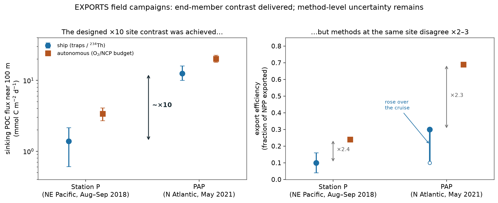
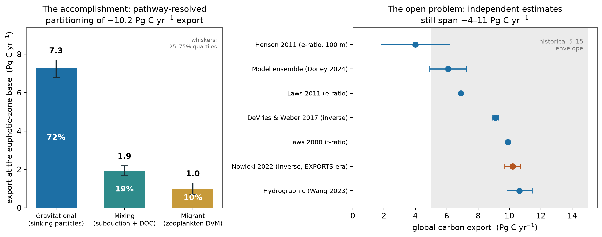
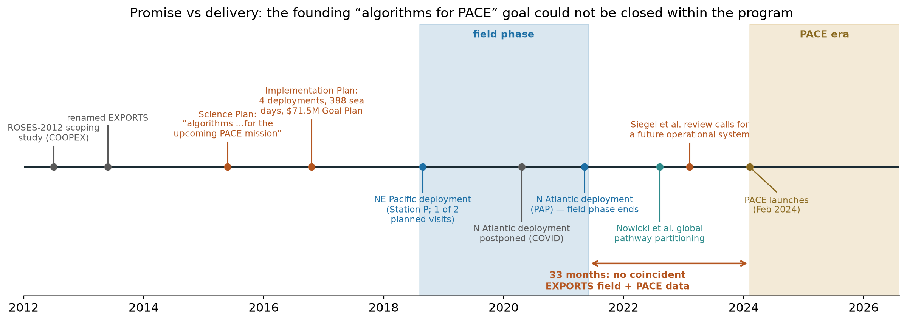

# NASA EXPORTS — What It Was Funded to Do, and What It Delivered

*A review of the EXport Processes in the Ocean from RemoTe Sensing (EXPORTS) program
(https://oceanexports.org), prepared to inform the retrieve-or-bust / VICC effort. The
mandate (per Q&A): describe what the program was funded to do and what it actually
accomplished; make the critical points through the program's own words wherever it
reported its shortcomings itself; and discuss separately the shortcomings it did not
report. §6 maps the findings to the VICC pitch and is fenced as advocacy; §§1–5 are
review.*

Sources: the 2015 Science Plan, the 2016 published science plan and Implementation
Plan, the two campaign operational overviews, the 2022–2023 global syntheses, and the
campaign papers — the load-bearing ones (refs [4,6,15,19,20]) read in full text, the
rest from verified abstracts and full-text excerpts. Citations are numbered (Vancouver
style) **with DOIs**, all verified against Crossref metadata on 2026-08-08; see
**References** and the provenance note at the end. Figures are generated by
`reports/py/exports_figs.py`.

> **Uncertainty conventions (as in `biomass_summary.md`).** A **range** `A–B` is a
> spread of independent published best estimates (min–max envelope), **not** a
> confidence interval. **`x ± s`** is one standard deviation (1σ ≈ 68%) unless the
> source states otherwise; ranges labelled **qrt** are 25–75% quartiles of a model
> ensemble, as reported by the cited paper. Values are quoted exactly as published;
> where the source does not define its `±`, that is noted rather than guessed.

---

## 1. What EXPORTS was funded to do

### 1.1 Origin, goal, and the three science questions

EXPORTS grew out of a NASA Ocean Biology and Biogeochemistry (OBB) ROSES-2012
scoping award (as "COOPEX"; renamed EXPORTS at a June 2013 experts meeting), through
a community Science Plan (May 2015) [2], the published science plan (Siegel et
al. 2016) [1], and an Implementation Plan written by a NASA-competed Science
Definition Team (final October 2016) [3]. The stated goal, identical across all
three documents:

> "to develop a **predictive understanding of the export and fate of global ocean
> net primary production** and its implications for the Earth's carbon cycle in
> present and future climates." [1,2]

The overarching hypothesis makes the satellite connection explicit: carbon export
and its fate "can be predicted knowing characteristics of the surface ocean
ecosystem" — characteristics **assessable remotely from satellite ocean color**
[1,4]. Three science questions organize the program [1,4]:

- **SQ1 (pathways):** How do upper-ocean ecosystem characteristics determine the
  vertical transfer of organic matter out of the well-lit surface ocean?
- **SQ2 (fate):** What controls the efficiency of vertical transfer below the
  well-lit surface ocean?
- **SQ3 (prediction):** How can this knowledge **reduce uncertainties in
  contemporary and future estimates** of the export and fate of upper-ocean NPP?

SQ3 is the remote-sensing promise, and it was funded rationale, not decoration: the
2015 Science Plan's executive summary commits EXPORTS to "the next generation of
ocean carbon cycle and ecological **satellite algorithms to be used on the upcoming
PACE mission**," and the 2016 Implementation Plan repeats that EXPORTS field data
will provide "invaluable data for algorithm development for NASA's upcoming PACE
mission," with the program timeline designed so that algorithms "developed and
tested using EXPORTS observations [can] be used by PACE" [2,3].

### 1.2 The design

Three elements defined the measurement concept [1,3,4]:

1. **All three export pathways quantified simultaneously** — the gravitational pump
   (sinking particles), the migrant pump (vertically migrating zooplankton), and the
   mixing pump (physical transport of suspended/dissolved organic carbon) — a first
   at this scale [1,4,7].
2. **Two ships per deployment**: a *Process Ship* sampling in quasi-Lagrangian mode
   (following an instrumented Lagrangian float; rates, food-web structure, neutrally
   buoyant sediment traps, a full optical program) and a *Survey Ship* mapping the
   surrounding 1–100 km (²³⁴Th, O₂/Ar, optics, particle size spectra), plus a fleet
   of autonomous vehicles extending coverage months beyond the cruises [3,4].
3. **Contrasting "ecosystem/carbon-cycling states."** Deployments were placed to
   bracket the export-regime space (export ratio × flux-transmission efficiency):
   the iron-limited, recycling-dominated subarctic NE Pacific (Ocean Station Papa)
   as the low-export end-member, and the North Atlantic spring bloom (Porcupine
   Abyssal Plain, PAP) as the high-export, gravity-dominated end-member — so that
   algorithms and models calibrated on EXPORTS data would be valid across the global
   range of ecosystem states [1,3,4].

The program was structured in three phases: "pre-EXPORTS" modeling/data-mining
projects (ROSES-2015), the two-deployment field phase, and a competed synthesis and
modeling phase [3,4]. The pre-EXPORTS projects were not decorative: the data-mining
and Observing System Simulation Experiment (OSSE) work was used to choose the
deployment sites and to design the sampling arrays — an unusually deliberate use of
modeling to de-risk a field program [4,9].

### 1.3 Scale, funding, and cost

The field phase engaged **>100 scientists and crew from >20 institutions** [8]. The
program's project list names 18 Phase-1 science-team projects (13 NASA-funded, 5
NSF-funded); at the 2018 selection announcement the count was 11 NASA projects plus
3 NSF "Biology of the Biological Pump" projects, 41 PIs and co-Is in total [9].
Leadership: David Siegel (UCSB) as science lead, Ivona Cetinić (NASA GSFC/USRA) as
project scientist, with NSF as co-funder and WHOI's privately funded Ocean Twilight
Zone project as a partner in the North Atlantic [8,10].

**Cost.** The Science Definition Team's proposed "Goal Plan" was **$71.5M over 7
years** — four deployments (two visits per basin), two ships each, 388 sea days —
with costed descope options at $62M, $57M, $58M, $39M, $30M, and $22M [3]. NASA has
published **no as-executed cost figure**; the only public number is "**the $40
million NASA- and NSF-funded EXPORTS program**" on WHOI's Ocean Twilight Zone site
[10]. That figure is single-sourced and should be treated as *reported, not
official*: order $40M, against a proposed $71.5M Goal Plan.

---

## 2. The two field campaigns and their headline numbers

### 2.1 Northeast Pacific — Ocean Station Papa, Aug–Sep 2018 (the low end-member)

R/V *Roger Revelle* (Process Ship) followed an instrumented Lagrangian float while
R/V *Sally Ride* (Survey Ship) mapped around it; a Seaglider (profiling the upper
1,000 m from late July to December 2018), a Wirewalker wave-powered profiler, two
burst-sampling BGC-Argo floats (one of which continued operating for a year after
the ships left), neutrally buoyant and surface-tethered sediment traps, MOCNESS net
systems, and the Canadian Line P / NOAA PMEL / NSF-OOI Station Papa infrastructure
completed the array [4]. Sampling was organized into three "epochs" (Aug 14–23,
Aug 23–31, Aug 31–Sep 9), and three distinct surface water types were identified
from T/S properties — the machinery that let the team separate spatial from
temporal change inside a nominally Lagrangian survey [4]. Conditions were classic
late-summer iron-limited HNLC: elevated macronutrients, low biomass dominated by
<5 µm cells under tight microzooplankton grazing control; mixed-layer chlorophyll
ran *below* climatology, deepening the euphotic zone [4]. The full bioelement
budget (C, N, P, Si concentrations, ratios, and sinking fluxes) is assembled in
[40]. The headline numbers:

- **Low export, low efficiency.** Sediment-trap POC flux near 100 m of
  **1.38 ± 0.77 mmol C m⁻² d⁻¹** (± as reported, the spread across trap
  deployments) and an **Ez-ratio (fraction of NPP exported below the euphotic zone)
  of 0.10 ± 0.06** [11].
- **A ×3 method discrepancy, self-reported.** Trap-collected ²³⁴Th fluxes were
  **~3× smaller** than water-column-derived ²³⁴Th fluxes — attributed to trap
  undersampling of small and rare large particles plus active-migrant flux [11];
  the high-resolution ²³⁴Th survey around the site is [12]. Estapa et al. also
  introduced a new swimmer-contamination correction — measurement-method work the
  program did on itself [11].
- **Episodic stochasticity matters.** A salp bloom raised export efficiency
  **1.5×** at the euphotic-zone base and **2.6×** at 100 m below it — a single
  taxon, episodically present, moving the site's headline quantity by more than a
  factor of two [13].
- **The steady-state assumption failed.** An upper-mesopelagic (100–500 m) carbon
  budget found organic-carbon supply of **3.0 ± 1.7 mmol C m⁻² d⁻¹** (roughly half
  sinking particles, half migrant transport) against a metabolic demand of
  **5.7 ± 0.4** — a deficit reconcilable only if spring-accumulated, slowly sinking
  or suspended organic matter subsidizes summer demand [14]. Particle-cycling rates
  at the site were formally reconciled with an inverse model of the size-resolved
  POC budget [39].
- Roughly **70% of the sinking POC flux is attenuated within the first 100 m** below
  the euphotic zone at this site [6].

### 2.2 North Atlantic — Porcupine Abyssal Plain, May 2021 (the high end-member)

Postponed a year by COVID-19, the North Atlantic deployment used RRS *James Cook*
(Process) and RRS *Discovery* (Survey) with partner vessel R/V *Sarmiento de Gamboa*
(WHOI Ocean Twilight Zone), **>40 autonomous assets**, and the UK National
Oceanography Centre's PAP Sustained Observatory — sampling inside a retentive
anticyclonic mode-water eddy ("A2," ~170 km east of the PAP mooring) used as the
quasi-Lagrangian frame. The eddy did its job: waters below ~100 m were stable in
the core, and 86% of casts within a 15 km radius showed a consistent T/S regime
[5]. The month spanned the demise of the diatom spring bloom under severe silicon
limitation (initial silicic acid 0.1–0.3 µM) and four storms (maximum winds
37–50 kt) that deepened the mixed layer 25–40 m, drove surface-layer flushing
times of 5–8 days, and exchanged 20–75% of the surface water — a high-energy,
rapidly evolving system that would have been unsamplable without the autonomous
fleet [5,16,17]. The headline numbers:

- **High export, rising through the bloom's decline.** Non-steady-state ²³⁴Th
  export at 110 m rose from **~2,800 ± 300 to ~4,500 ± 700 dpm m⁻² d⁻¹** (±1 SD)
  across the cruise's three epochs, translating to sinking POC flux rising
  **~11 ± 1 → 14 ± 2 mmol C m⁻² d⁻¹** and bSi flux ~3 ± 1 → 6 ± 1 mmol Si m⁻² d⁻¹;
  the **fraction of NPP reaching 100 m below the euphotic zone rose from ~10% to
  ~30%** [15]. The POC flux is roughly **10× the Station P trap flux** — the
  designed end-member contrast was achieved.
- **Storms restructure the flux.** Fast-sinking particle velocities above 200 m
  increased from ~17 to ~100 m d⁻¹ as aggregates grew; the small (<100 µm) sinking
  particles were decoupled from the large-aggregate flux event rather than produced
  by mesopelagic disaggregation [17]. Post-bloom silica production continued only
  where storm mixing resupplied silicic acid [16]. Marine-snow dynamics during the
  bloom demise are quantified from in-situ particle imagery in [18].
- **Fragmentation context.** The motivating result that fragmentation accounts for
  **49 ± 22% of observed mesopelagic flux loss** comes from BGC-Argo floats in the
  North Atlantic and Southern Ocean (34 high-flux events) — Briggs et al. 2020
  [20]. It is frequently associated with EXPORTS and motivates the EXPORTS-NA
  fragmentation work [17,18], but it is **not an EXPORTS field product**.

### 2.3 What the pair delivered — and the method-level lesson

The cross-site autonomous synthesis [19] confirms the design worked: the North
Atlantic site showed **~5× the gross primary productivity** and **~13× the
euphotic-zone net community production** of Station P; ef-ratio 0.33 vs 0.73;
autonomous ez-ratio 0.24 vs 0.69; mean daily organic-carbon export potential
**3.4 ± 0.7 vs 20.3 ± 2.3 mmol C m⁻² d⁻¹** (± as reported). At Station P the small
NCP was routed almost entirely to sinking POC; at PAP roughly equal shares went to
sinking POC and DOC production [19].

But the same table carries the sobering message (Fig. 1): **independent methods for
"export efficiency" at the same site, in the same month, disagree by ×2–3** — trap
Ez-ratio 0.10 ± 0.06 vs autonomous 0.24 at Station P; ²³⁴Th-based efficiency
reaching ~0.30 vs autonomous 0.69 at PAP [11,15,19]. Part of this is definitional
(different depth horizons, different integration windows, export *potential* vs
realized sinking flux), part is genuine method disagreement — the same class of
problem as the trap-vs-²³⁴Th ×3 gap [11] and, upstream, as the finding that
100-m-fixed flux normalization systematically distorts export-efficiency patterns
(Buesseler et al.'s "metrics that matter") [21]. EXPORTS did not resolve the
measurement problem; it documented it with unprecedented care.

*Fig. 1. Left: sinking POC flux near 100 m at the two sites, by method class — the
designed ×10 end-member contrast was achieved (Station P trap 1.38 ± 0.77 [11];
autonomous 3.4 ± 0.7 [19]; PAP ²³⁴Th 11 → 14 [15]; autonomous 20.3 ± 2.3 [19]).
Right: export efficiency (fraction of NPP) at the same sites — independent methods
disagree ×2–3 (0.10 ± 0.06 vs 0.24 at Station P [11,19]; ~0.10 → 0.30 over the
cruise vs 0.69 at PAP [15,19]). Values as published; the PAP ship-based efficiency
rose through the bloom decline.*

---

## 3. The global synthesis — did the numbers move?

The program's biggest quantitative product is the satellite-data-driven inverse
model of Nowicki, DeVries & Siegel (2022) [7], which for the first time diagnosed
all three export pathways in one framework, and the companion review (Siegel,
DeVries, Cetinić & Bisson 2023) [6]. The EXPORTS-era numbers:

- **Global export ~10.2 Pg C yr⁻¹** (9.7–10.7 qrt) at the euphotic-zone base,
  partitioned **gravitational 7.3 (6.8–7.7 qrt) / mixing 1.9 (1.7–2.2 qrt) /
  migrant 1.0 (0.7–1.3 qrt)** — i.e. **72% / 19% / 10%** [7].
- **Total biological-pump sequestration ~1,300 Pg C** (Nowicki: 1,293, 1,281–1,302
  qrt), with pathway-resolved inventories and residence times: gravitational
  1,040 Pg C (~142 yr), migrant 150 Pg C (~150 yr), mixing 102 Pg C (~54 yr) [6,7].
  Sediment burial is only 0.02–0.2 Pg C yr⁻¹ — nearly all exported carbon returns
  to DIC on months-to-millennia timescales [6].
- **The sequestration decomposes mechanistically** — the review's synthesis
  attributes, of the ~1,300 Pg C inventory, roughly 850 Pg C to fecal pellets,
  200 Pg C to phytodetrital aggregates, 150 Pg C to migrant metabolism at depth,
  and 100 Pg C to physical subduction [6,7] — i.e. the gravitational pump itself is
  mostly *zooplankton repackaging*, not direct phytoplankton sinking. This is the
  kind of process attribution that simply did not exist before this framework.
- Fish may add a further **1.5 ± 1.2 Pg C yr⁻¹** [23]; the framework of
  "multi-faceted particle pumps" beyond gravity is [22].

**What did not move: the cross-method spread.** Siegel et al.'s own Table 1 [6]
still spans **4.0 ± 2.2** (e-ratio scaling [24]) through 6.9 [26] and 6.08 ± 1.17
(model ensemble [28]) to 9.1 ± 0.2 [27], 9.9 [25], 10.2 [7], and **10.64 ± 0.80**
(hydrographic [29]) — and the two most recent independent estimates (ensemble vs
hydrographic) have non-overlapping 95% intervals, exactly as documented in
`biomass_summary.md` §2.5.1. The historical 5–15 Pg C yr⁻¹ envelope was not
collapsed (Fig. 2). What changed is the *character* of the estimate: a defensible
central value with pathway resolution and sequestration timescales, rather than a
narrower range. The predicted *response* of export to climate change remains >40%
uncertain [30].

One caveat worth stating plainly (my assessment, from the papers' own inputs): the
global inverse model is constrained by **satellite NPP products and climatologies,
not by the 2018/2021 EXPORTS field data themselves** [6,7] — the field campaigns
validate and inform the framework's process assumptions rather than entering it as
constraints. The loop from field program to global number is, so far, indirect.

*Fig. 2. Left: the EXPORTS-era accomplishment — pathway-resolved partitioning of
~10.2 Pg C yr⁻¹ global export (72/19/10%, whiskers 25–75% quartiles) [7]. Right:
the open problem — independent global export estimates still span ~4–11 Pg C yr⁻¹
[6,7,24–29], within the historical 5–15 envelope. The EXPORTS-era inverse estimate
(rust) is one point in a spread that has not collapsed.*

---

## 4. The remote-sensing deliverable, honestly assessed

### 4.1 What was promised

The program's name, hypothesis, and funding rationale all center on remote sensing:
predict export from satellite-assessable ecosystem state (SQ3), and deliver "the
next generation of… satellite algorithms to be used on the upcoming PACE mission"
[1,2,3].

### 4.2 What was delivered

- **A satellite-driven diagnostic framework, not a mechanistic Rrs→export
  algorithm.** The Nowicki et al. inverse model [7] is genuinely satellite-*driven*
  (satellite NPP and particle-size fields among its inputs) and is the program's
  satellite-facing product to date; Siegel et al.'s Table 1 is titled "satellite
  data–driven global export flux and sequestration estimates" [6]. There is no
  published algorithm that takes ocean-color radiance and returns export with
  characterized uncertainty.
- **PACE-relevant algorithm groundwork.** Hyperspectral Rrs→pigment modeling on
  global scales (Kramer et al. 2022) [32]; the requirements/roadmap paper for
  phytoplankton composition from PACE (Cetinić et al. 2024) [33]; inversion
  products improved by seeding with ancillary observations (Bisson et al. 2023)
  [35]; and the satellite-lidar detection of diel vertical migration — the migrant
  pump seen from space (Behrenfeld et al. 2019) [34].
- **The archive itself** (§5): the paired hyperspectral-optics + BGC field dataset
  is precisely what pre-launch algorithm development and post-launch validation for
  PACE-class missions require, and PACE lists EXPORTS among its supporting
  campaigns [2,3,38].

### 4.3 The gaps the program reported itself

Stated through the program's own publications, as the mandate requires:

- **The optics were not mutually consistent.** The EXPORTS-NP intercalibration of
  particulate backscattering across platforms found that many bbp instruments'
  calibrations were **mutually inconsistent at 95% confidence** [31] — a
  foundational problem for any bbp-based carbon or flux algorithm, documented by
  the program on its own data.
- **The synthesis concedes the prediction gap.** Siegel et al. 2023's "future
  research directions" state that satellite NPP and Cphyto products "disagree
  substantially," that available products are empirical, and that what is needed is
  a *future* "operational system" merging satellite, in-situ, and model data [6].
- **The community sequel asks for the system, not the campaign.** The 2023 Eos
  assessment by EXPORTS-affiliated authors argues for an operational biological-
  carbon-pump monitoring system built on PACE + BGC-Argo [36]; the mesopelagic
  budget imbalance is framed explicitly as a caution for marine-CDR monitoring and
  verification [14,37].

### 4.4 Program-level shortcomings not reported by the program

Three structural observations that, to my knowledge, appear nowhere in the EXPORTS
literature (each stated factually; none diminishes the science that was done):

1. **The descope was never reconciled with the design logic.** The Implementation
   Plan's Goal Plan — 4 deployments, two visits per basin, 388 sea days — existed
   precisely because the satellite-algorithm goal requires sampling the
   ecosystem-state space, including its seasonal axis [3]. The executed program was
   **one snapshot per basin**, one of them (Station P) in the lowest-signal late-
   summer season. No published assessment asks what two point-samples of the state
   space mean for the SQ3 promise of globally valid prediction.
2. **No Southern Ocean deployment.** The original OBB scoping trio included an
   ice/Southern Ocean campaign concept (ICESOCC) that was never executed; EXPORTS
   sampled neither the Southern Ocean nor any low-latitude regime. The global
   pathway partitioning [7] therefore rests on model extrapolation into ocean
   regimes — including a disproportionately important export region — where the
   program collected no data.
3. **The PACE timing mismatch is structural.** The field phase ended in May 2021;
   PACE launched in February 2024 — **33 months later** (Fig. 3). Zero coincident
   EXPORTS-field + PACE-overpass data exist, so the founding promise — algorithms
   *developed and tested* on EXPORTS observations and *used by PACE* [3] — could
   not have been closed end-to-end within the program regardless of scientific
   execution. The 2015–2016 plans assumed a PACE launch readiness of ~2022; the
   slip was outside EXPORTS' control, but no program document revisits what the
   slip does to the SQ3 deliverable.

*Fig. 3. The EXPORTS timeline against its founding remote-sensing promise. Planning
documents (2015–2016) committed to algorithms for PACE; the descoped field phase
(2018, 2021) ended 33 months before PACE launched (Feb 2024), so no coincident
field + PACE data exist. Sources: [1–5,7]; PACE launch date is public record.*

---

## 5. Data legacy and program metrics

- **The archive is real, large, and open.** The EXPORTS collection at NASA's
  SeaBASS/OB.DAAC — DOI 10.5067/SeaBASS/EXPORTS/DATA001 [38] — holds **11,031
  files/granules** across the two campaigns, 15 data categories (sediment traps,
  pigments, casts, AUVs, marine-snow catcher, amplicons, floats, net tows, …),
  **>400 measured parameters from 43 PIs**, spanning 2018-08-06 to 2021-09-30,
  fully open under NASA's EOSDIS policy. NSF-funded datasets are additionally
  archived at BCO-DMO.
- **Publications.** The program's official publication list (its Google Scholar
  profile, linked from oceanexports.org) shows **~105 papers (2016–2025) with
  ~6,900 citations** at the time of writing. Caveats: the profile includes broader
  biological-pump papers not derived from EXPORTS data (its most-cited entry, Boyd
  et al. 2019 [22], predates the field data), and it appears under-maintained for
  2025–26 — so ~105 is a floor for campaign-associated output but an overcount of
  strictly-EXPORTS-data papers. Two dedicated collections exist: the *Elementa*
  special feature for the NE Pacific results and the North Atlantic results
  concentrated in *Prog. Oceanogr.*, *GBC*, *Mar. Chem.*, and *L&O*.
- **The synthesis phase is real but hard to trace.** The Implementation Plan's
  competed Phase-2 synthesis program [3] has no consolidated public selection
  record that I could find: NASA's 2023 technical memorandum preserving the
  pre-EXPORTS project reports confirms the planned second phase, but ROSES-2023's
  OBB element was explicitly *not solicited*, and no named "EXPORTS synthesis"
  call appears in the ROSES record. The synthesis work visible in the 2022–2025
  literature [6,7,14,18,19] appears to flow through general OBB awards and
  continuations — an inference from the funding acknowledgments, not a documented
  program decision.
- **An unplanned legacy: marine-CDR verification.** The mesopelagic budget
  imbalance [14] is framed by its authors as a direct caution for marine carbon
  dioxide removal (mCDR) monitoring — if a $40M-class observing system cannot
  close the 100–500 m carbon budget at a well-studied site, single-platform MRV
  claims should be treated skeptically — and the EXPORTS-adjacent analysis of CDR
  sequestration timescales [37] is now heavily cited in that literature. EXPORTS
  is becoming the reference case for how hard flux verification actually is.
- **What is missing.** No published PhD-thesis count or early-career metrics; the
  program News page has not been updated since 2019; and **no formal external
  retrospective of EXPORTS' impact on carbon-cycle uncertainty exists** — a genuine
  gap in the record, and the reason §4's assessment had to be assembled from the
  primary literature.

---

## 6. Mapping to the VICC pitch

> *This section is advocacy, fenced off from the review above.*
>
> **EXPORTS is the strongest possible motivation for our proposal, in five steps.**
>
> 1. **The process understanding and the training data now exist.** Two end-member
>    campaigns with paired hyperspectral optics and BGC measurements, 11,031 open
>    granules, >400 parameters [38] — this is the pre-launch algorithm-development
>    and validation dataset a physics-based retrieval system needs, and it is
>    sitting in an open archive.
> 2. **The field's own synthesis asks for our system.** Siegel et al. 2023 closes
>    by calling for an operational system merging satellite, in-situ, and model
>    data with honest uncertainties [6]; the Eos sequel asks for PACE + BGC-Argo
>    monitoring of the biological pump [36]. That is — nearly verbatim — the
>    architecture of this proposal (Bayesian retrieval + priors from in-situ and
>    model information + assimilative coupling).
> 3. **The wall EXPORTS hit is the wall we attack.** The program's own
>    intercalibration found bbp instruments mutually inconsistent at 95% confidence
>    [31]; its methods for the *same quantity at the same site* disagree ×2–3
>    (Fig. 1); and the global export spread did not collapse (Fig. 2). These are
>    retrieval/measurement-uncertainty problems — the exact class of problem
>    (`biomass_summary.md` §§2–4) that a physically consistent inversion with
>    calibrated per-pixel uncertainty is built for.
> 4. **We close the loop EXPORTS structurally could not.** No coincident EXPORTS
>    field + PACE data exist (§4.4, Fig. 3). A PACE-era retrieval system trained on
>    the EXPORTS archive and applied to actual PACE (and reprocessed MODIS) data is
>    the missing final step from that ~$40M investment to its founding goal — and
>    the multi-mission consistency it requires is the same lever as our
>    trend-detectability target.
> 5. **Differentiation is clean.** We propose no ships and no new field program; we
>    build the satellite prediction-and-uncertainty layer that EXPORTS' data enable
>    and its synthesis papers request. Complementary, not duplicative.
>
> **Cautions.** Do not overclaim against EXPORTS: its self-critique was candid, and
> its people are this proposal's natural reviewers and partners. And the conversion
> uncertainties (bbp→POC/Cphyto, NPP→export) remain the dominant error terms — our
> §2/Fig. 5 of `biomass_summary.md` still applies downstream of any retrieval
> improvement.

---

## Provenance

Read in full text: Siegel et al. 2021 [4], Siegel et al. 2023 [6] (via NASA NTRS),
the 2015 Science Plan [2], Clevenger et al. 2024 [15], Traylor et al. 2025 [19],
and Briggs et al. 2020 [20] (the latter three from `context/papers/EXPORTS`).
Johnson et al. 2024 [5] via its open EarthArXiv preprint, per Q&A. The
Implementation Plan [3] from its public PDF (sections, not cover-to-cover). All
other results from verified abstracts and full-text excerpts. **All DOIs verified
against Crossref metadata (first author, year, title, volume/pages) on
2026-08-08.** Known residual uncertainties: the as-executed program cost (single
source [10]); the complete contents of the *Elementa* special collection
(publisher blocks automated access); publication counts from an under-maintained
Scholar profile (§5).

## References

1. Siegel DA, Buesseler KO, Behrenfeld MJ, et al. Prediction of the export and fate of global ocean net primary production: the EXPORTS science plan. *Front Mar Sci.* 2016;3:22. doi:10.3389/fmars.2016.00022
2. EXPORTS Writing Team (Siegel DA, Buesseler KO, Behrenfeld MJ, et al.). *EXPORTS Science Plan.* NASA; May 18, 2015. https://cce.nasa.gov/cce/pdfs/EXPORTS_Science_Plan_May18_2015_final.pdf
3. EXPORTS Science Definition Team (Siegel DA, chair). *EXPORTS Implementation Plan.* NASA; October 17, 2016. https://oceanexports.org/documents/EXPORTS_Imp_Plan_Oct17_2016_FINAL.pdf
4. Siegel DA, Cetinić I, Graff JR, et al. An operational overview of the EXport Processes in the Ocean from RemoTe Sensing (EXPORTS) northeast Pacific field deployment. *Elem Sci Anth.* 2021;9(1):00107. doi:10.1525/elementa.2020.00107
5. Johnson L, Siegel DA, Thompson AF, et al. Assessment of oceanographic conditions during the North Atlantic EXport processes in the ocean from RemoTe sensing (EXPORTS) field campaign. *Prog Oceanogr.* 2024;220:103170. doi:10.1016/j.pocean.2023.103170 (open preprint: https://eartharxiv.org/repository/view/5482/)
6. Siegel DA, DeVries T, Cetinić I, Bisson KM. Quantifying the ocean's biological pump and its carbon cycle impacts on global scales. *Annu Rev Mar Sci.* 2023;15:329–356. doi:10.1146/annurev-marine-040722-115226 (open: https://ntrs.nasa.gov/api/citations/20220013898/downloads/Siegel_et_al_2023.pdf)
7. Nowicki M, DeVries T, Siegel DA. Quantifying the carbon export and sequestration pathways of the ocean's biological carbon pump. *Global Biogeochem Cycles.* 2022;36(3):e2021GB007083. doi:10.1029/2021GB007083
8. NASA. NASA, NSF plunge into ocean "twilight zone" to explore ecosystem carbon flow. Press release 18-052; June 18, 2018. https://www.nasa.gov/news-release/nasa-nsf-plunge-into-ocean-twilight-zone-to-explore-ecosystem-carbon-flow/
9. Ocean Carbon & Biogeochemistry (OCB). EXPORTS newsletter article; February 2018. https://www.us-ocb.org/wp-content/uploads/sites/43/2018/02/OCB_newsletter_EXPORTS-final.pdf
10. WHOI Ocean Twilight Zone project. R/V Revelle and R/V Ride, Aug–Sep 2018 (mission page; source of the "$40 million" figure). https://twilightzone.whoi.edu/missions/r-v-revelle-and-r-v-ride-aug-sep-2018/
11. Estapa ML, Buesseler KO, Durkin CA, et al. Biogenic sinking particle fluxes and sediment trap collection efficiency at Ocean Station Papa. *Elem Sci Anth.* 2021;9(1):00122. doi:10.1525/elementa.2020.00122
12. Buesseler KO, Benitez-Nelson CR, Roca-Martí M, et al. High-resolution spatial and temporal measurements of particulate organic carbon flux using thorium-234 in the northeast Pacific Ocean during the EXport Processes in the Ocean from RemoTe Sensing field campaign. *Elem Sci Anth.* 2020;8(1):030. doi:10.1525/elementa.2020.030
13. Steinberg DK, Stamieszkin K, Maas AE, et al. The outsized role of salps in carbon export in the subarctic northeast Pacific Ocean. *Global Biogeochem Cycles.* 2023;37(1):e2022GB007523. doi:10.1029/2022GB007523
14. Stephens BM, et al. An upper-mesopelagic-zone carbon budget for the subarctic North Pacific. *Biogeosciences.* 2025;22:3301–3328. doi:10.5194/bg-22-3301-2025
15. Clevenger SJ, Benitez-Nelson CR, Roca-Martí M, et al. Carbon and silica fluxes during a declining North Atlantic spring bloom as part of the EXPORTS program. *Mar Chem.* 2024;258:104346. doi:10.1016/j.marchem.2023.104346
16. Brzezinski MA, et al. Physical mechanisms sustaining silica production following the demise of the diatom phase of the North Atlantic spring phytoplankton bloom during EXPORTS. *Global Biogeochem Cycles.* 2024;38(7):e2023GB008048. doi:10.1029/2023GB008048
17. Romanelli E, et al. Can intense storms affect sinking particle dynamics after the North Atlantic spring bloom? *Limnol Oceanogr.* 2024;69(12):2963–2974. doi:10.1002/lno.12723
18. Siegel DA, et al. Assessing marine snow dynamics during the demise of the North Atlantic spring bloom using in situ particle imagery. *Global Biogeochem Cycles.* 2025;39(11):e2025GB008676. doi:10.1029/2025GB008676
19. Traylor S, Nicholson DP, Clevenger SJ, Buesseler KO, D'Asaro E, Lee CM. Autonomous observations enhance our ability to observe the biological carbon pump across diverse carbon export regimes. *Limnol Oceanogr.* 2025;70:S165–S178. doi:10.1002/lno.70002
20. Briggs N, Dall'Olmo G, Claustre H. Major role of particle fragmentation in regulating biological sequestration of CO₂ by the oceans. *Science.* 2020;367(6479):791–793. doi:10.1126/science.aay1790
21. Buesseler KO, Boyd PW, Black EE, Siegel DA. Metrics that matter for assessing the ocean biological carbon pump. *Proc Natl Acad Sci USA.* 2020;117(18):9679–9687. doi:10.1073/pnas.1918114117
22. Boyd PW, Claustre H, Levy M, Siegel DA, Weber T. Multi-faceted particle pumps drive carbon sequestration in the ocean. *Nature.* 2019;568(7752):327–335. doi:10.1038/s41586-019-1098-2
23. Saba GK, Burd AB, Dunne JP, et al. Toward a better understanding of fish-based contribution to ocean carbon flux. *Limnol Oceanogr.* 2021;66(5):1639–1664. doi:10.1002/lno.11709
24. Henson SA, Sanders R, Madsen E, Morris PJ, Le Moigne F, Quartly GD. A reduced estimate of the strength of the ocean's biological carbon pump. *Geophys Res Lett.* 2011;38(4):L04606. doi:10.1029/2011GL046735
25. Laws EA, Falkowski PG, Smith WO, Ducklow H, McCarthy JJ. Temperature effects on export production in the open ocean. *Global Biogeochem Cycles.* 2000;14(4):1231–1246. doi:10.1029/1999GB001229
26. Laws EA, D'Sa E, Naik P. Simple equations to estimate ratios of new or export production to total production from satellite-derived estimates of sea surface temperature and primary production. *Limnol Oceanogr Methods.* 2011;9(12):593–601. doi:10.4319/lom.2011.9.593
27. DeVries T, Weber T. The export and fate of organic matter in the ocean: new constraints from combining satellite and oceanographic tracer observations. *Global Biogeochem Cycles.* 2017;31(3):535–555. doi:10.1002/2016GB005551
28. Doney SC, et al. Observational and numerical modeling constraints on the global ocean biological carbon pump. *Global Biogeochem Cycles.* 2024;38:e2024GB008156. doi:10.1029/2024GB008156
29. Wang W-L, Fu W, Le Moigne FAC, et al. Biological carbon pump estimate based on multidecadal hydrographic data. *Nature.* 2023;624:579–585. doi:10.1038/s41586-023-06772-4
30. Henson SA, Laufkötter C, Leung S, Giering SLC, Palevsky HI, Cavan EL. Uncertain response of ocean biological carbon export in a changing world. *Nat Geosci.* 2022;15:248–254. doi:10.1038/s41561-022-00927-0
31. Erickson ZK, et al. Alignment of optical backscatter measurements from the EXPORTS northeast Pacific field deployment. *Elem Sci Anth.* 2022;10(1):00021. doi:10.1525/elementa.2021.00021
32. Kramer SJ, Siegel DA, Graff JR, et al. Modeling surface ocean phytoplankton pigments from hyperspectral remote sensing reflectance on global scales. *Remote Sens Environ.* 2022;270:112879. doi:10.1016/j.rse.2021.112879
33. Cetinić I, et al. Phytoplankton composition from sPACE: requirements, opportunities, and challenges. *Remote Sens Environ.* 2024;302:113964. doi:10.1016/j.rse.2023.113964
34. Behrenfeld MJ, Gaube P, Della Penna A, et al. Global satellite-observed daily vertical migrations of ocean animals. *Nature.* 2019;576(7786):257–261. doi:10.1038/s41586-019-1796-9
35. Bisson KM, Werdell PJ, Chase AP, et al. Informing ocean color inversion products by seeding with ancillary observations. *Opt Express.* 2023;31(24):40557–40572. doi:10.1364/OE.503496
36. Osborne E, Luo JY, Cetinić I, Benway H, Menden-Deuer S. Our evolving understanding of biological carbon export. *Eos.* 2023;104. doi:10.1029/2023EO230346
37. Siegel DA, DeVries T, Doney SC, Bell T. Assessing the sequestration time scales of some ocean-based carbon dioxide reduction strategies. *Environ Res Lett.* 2021;16(10):104003. doi:10.1088/1748-9326/ac0be0
38. NASA SeaBASS. EXPORTS experiment data collection. doi:10.5067/SeaBASS/EXPORTS/DATA001. https://seabass.gsfc.nasa.gov/experiment/EXPORTS
39. Amaral VJ, et al. Particle cycling rates at Station P as estimated from the inversion of POC concentration data. *Elem Sci Anth.* 2022;10(1):00018. doi:10.1525/elementa.2021.00018
40. Roca-Martí M, Benitez-Nelson CR, Umhau BP, et al. Concentrations, ratios, and sinking fluxes of major bioelements at Ocean Station Papa. *Elem Sci Anth.* 2021;9(1):00166. doi:10.1525/elementa.2020.00166
