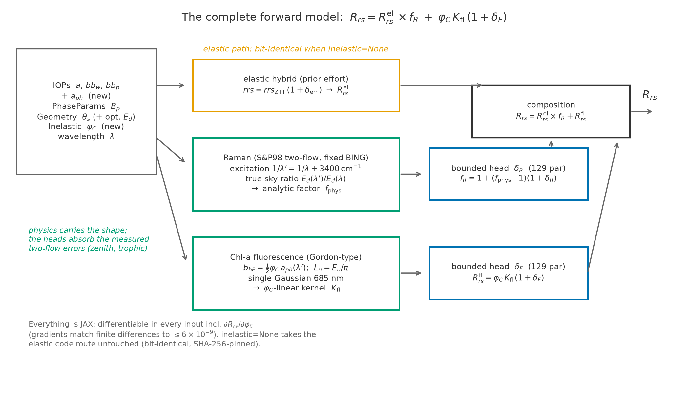
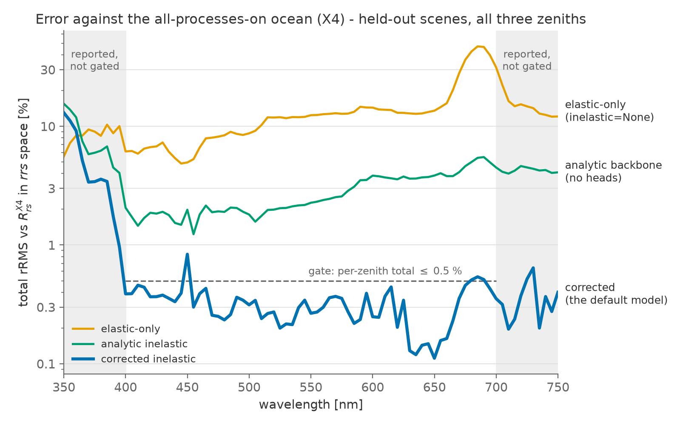
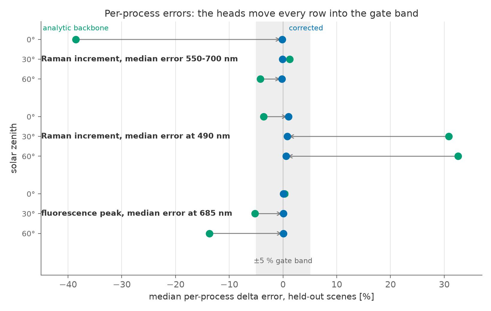
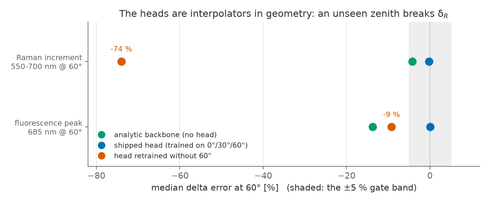

# Completing the differentiable forward model for ocean color: Raman scattering and chlorophyll-a fluorescence

**Version:** 1.0
**Date:** 2026-08-27
**Authors:** J. Xavier Prochaska and Claude (Fable 5)
**Status:** team report; intended to evolve into a public (non-refereed) write-up.

**Code:** the `robust.rt` subpackage of
[retrieve-or-bust](https://github.com/ocean-colour/retrieve-or-bust), `main`
(the inelastic milestones M0–M4, developed on `inelastic-rt`).
**Figures:** generated by
[`make_inelastic_report_figures.py`](make_inelastic_report_figures.py) from the
committed validation artefacts in [`design/validation/`](../design/validation/).
**Predecessor:** the elastic report,
[`report_rt_elastic_model.md`](report_rt_elastic_model.md), whose model this
effort extends and whose conventions this report inherits.

---

## Executive summary

We extended the elastic hybrid forward model with the two inelastic processes
the real ocean adds — **Raman scattering by water** and **chlorophyll-a
fluorescence** — as analytic physics terms plus small bounded learned
corrections,

> *R*<sub>rs</sub> = *R*<sub>rs</sub><sup>el</sup> · *f*<sub>R</sub> +
> φ<sub>C</sub> · *K*<sub>fl</sub> · (1 + δ<sub>F</sub>),

where *R*<sub>rs</sub><sup>el</sup> is the unmodified elastic hybrid,
*f*<sub>R</sub> = 1 + (*f*<sub>phys</sub> − 1)(1 + δ<sub>R</sub>) is the
corrected Raman factor, and *K*<sub>fl</sub> is a fluorescence kernel linear in
the quantum yield φ<sub>C</sub>. Scored against the Loisel et al. (2023)
HydroLight ensemble with **all processes on** (the "X4" release — the
realistic ocean, not an elastic idealization), the complete model reaches

- **0.34% rRMS on held-out water bodies** at every solar zenith (0°/30°/60°)
  over the 400–700 nm domain — the elastic-era accuracy (0.30%), now holding
  against the real thing. The elastic-only model scores **16–19%** against the
  same truth (48% at the 685 nm fluorescence peak); the analytic physics alone
  scores 2–4%.
- **Per-process fidelity ≤ 1.03% worst-case** (median error, held-out): the
  analytic two-flow Raman term's −38.6% failure at high sun closes to −0.14%,
  and its +31–33% error at 490 nm closes to ≤ 1.03%.
- **Exact gradients in every input including φ<sub>C</sub>** (`jax.grad` vs
  finite differences ≤ 5.9×10⁻⁹) at **1.59×** the elastic hybrid's runtime —
  and `inelastic=None` leaves the elastic model **bit-identical** (SHA-256
  pinned), so nothing the elastic report claims is disturbed.

The learned half is deliberately tiny: two 129-parameter heads (the elastic
emulator used 417) trained on the L23 scenario *differences*, because the
physics carries the spectral shape and the heads only absorb the measured
two-flow geometry and trophic errors. The prototype passes its acceptance gate
(§3) and the inelastic milestone is complete.

As with the elastic report, the honest limits come before the headline should
be quoted anywhere (§5): the correction heads are **interpolators in solar
zenith** — retrained without 60° they err by −74% there, far worse than the
physics they correct; φ<sub>C</sub> generalization is linear *by construction*
with truth at only φ<sub>C</sub> = 0.02; wavelengths below 400 nm are outside
the supported domain (13% error at 350 nm); and the 730 nm PS I emission
shoulder is implemented but unvalidatable against L23.

## 1. Motivation and background

Inelastic processes are not a refinement — they are first-order structure in
ocean-color spectra. In the L23 truth, Raman scattering contributes a median
5–15% of *R*<sub>rs</sub> over 520–750 nm at zeniths 30–60° (up to ~20% at 0°),
and chlorophyll fluorescence a median ~35% of *R*<sub>rs</sub> at its 685 nm
peak. An elastic model with 0.3% accuracy is therefore ~50× less accurate
against the real ocean than against elastic truth, and any inversion built on
it inherits that bias exactly where the biomass signals live (the green-red
Raman gain, the fluorescence line height). The full quantitative assessment —
BING's Sathyendranath & Platt (1998) two-flow Raman correction and Gordon
(1979)-style fluorescence term, scored process-by-process against L23 — is
[`context/RT/rt_inelastic_bing_summary.md`](../context/RT/rt_inelastic_bing_summary.md).

Three findings of that assessment shaped this design. First, two BING
implementation errors were identified and fixed upstream (in the BING repo)
before any porting: the fluorescence term passed a two-flow *irradiance*
reflectance through an *rrs*-to-*R*<sub>rs</sub> conversion — a missing
1/π for isotropic emission that inflated every fluorescence-enabled
*R*<sub>rs</sub> by ~×3, so published `include_Chl_fl` fits carry an effective
φ<sub>C</sub> roughly π× smaller than nominal — and the production Raman path
defaulted to a flat solar spectrum, though the true ratio
*E*<sub>d</sub>(λ′)/*E*<sub>d</sub>(λ) swings ×3.6 across the visible and is
the dominant term in the correction's spectral shape. Second, the errors that
*remain* after those fixes are formulation-level: the fixed-mean-cosine
two-flow underestimates the Raman increment by ~39% at overhead sun, and the
fluorescence amplitude drifts by ±11% across trophic state. No parameter fixes
these; they are exactly what a learned correction should absorb. Third, L23 is
a controlled experiment for this problem: its X = 1/2/4 scenario releases
(elastic-only / +Raman / +Raman+fluorescence) share identical IOPs and solar
constants (φ<sub>C</sub> = 0.02, HydroLight-default Raman), so the scenario
differences isolate each process as clean training and validation truth.

The design ([`design/rt_inelastic_model.md`](../design/rt_inelastic_model.md))
therefore locked the same architecture philosophy the elastic effort proved:
**analytic physics as the backbone, a small bounded learned correction for
what the physics measurably cannot do** — with separate heads for Raman and
fluorescence (different inputs, different failure modes), and the fluorescence
correction multiplying a φ<sub>C</sub>-linear kernel so the differentiable
quantum yield survives as an inversion handle rather than being baked into an
emulator at 0.02.

## 2. The model



The public API is unchanged except for one keyword:
`robust.rt.forward(iops, phase_params, geometry, wave, inelastic=None)`.
Passing `inelastic=None` (the default) takes the pre-existing elastic code
route — the output is **bit-identical** to the elastic prototype, enforced by
SHA-256 pins on the CI fixture, so the elastic gate remains valid by
construction rather than by arithmetic that happens to cancel. Passing
`Inelastic()` enables both processes at their L23-matched defaults. The
`Inelastic` pytree carries φ<sub>C</sub> (default 0.02) as a *differentiable
leaf* — `jax.grad` returns ∂*R*<sub>rs</sub>/∂φ<sub>C</sub> — with the process
switches and emission shape as static metadata, plus a reserved `cdom_fl` slot
(§6). Two further interface extensions: `IOPs` gains an optional `a_ph`
(phytoplankton absorption, the fluorescence source term), and `Geometry` gains
an optional `Ed` override for real skies.

**The Raman term** (`robust/rt/inelastic.py::raman_factor`) is the fixed
BING physics ported term-for-term to JAX: the Sathyendranath & Platt (1998)
two-flow reflectances (first- and second-order), the Bartlett et al. (1998)
Raman scattering coefficient with the HydroLight normalization
(2.6×10⁻⁴ m⁻¹ at 488 nm, λ′⁻⁵·⁵), excitation wavelengths from the single
3400 cm⁻¹ wavenumber shift (1/λ′ = 1/λ + 3400 cm⁻¹), IOPs interpolated onto
that excitation grid differentiably, and the **true solar ratio**
*E*<sub>d</sub>(λ′)/*E*<sub>d</sub>(λ) from a packaged sky (below). It enters
multiplicatively — the self-normalizing form the assessment validated — and
its increment is rescaled by the Raman head:
*f*<sub>R</sub> = 1 + (*f*<sub>phys</sub> − 1)(1 + δ<sub>R</sub>).

**The fluorescence term** (`::fluorescence_kernel`) is the fixed Gordon-style
emission integral per unit quantum yield: source
*b*<sub>bF</sub> = ½ φ<sub>C</sub> *a*<sub>ph</sub>(λ′) (isotropic emission),
a fixed 65-node excitation quadrature over 370–690 nm, the λ′/λ
quanta-to-energy factor, per-emission-wavelength attenuation, the
*L*<sub>u</sub> = *E*<sub>u</sub>/π conversion, and a single-Gaussian 685 nm
emission line (the shape L23's HydroLight used; a double-Gaussian 730 nm PS I
shoulder is implemented but off everywhere in v1 — L23 cannot validate it).
The kernel is **φ<sub>C</sub>-linear by construction**
(*K*<sub>fl</sub> = *R*<sub>rs</sub><sup>fl</sup>(0.02)/0.02), so the head
trained at the truth's φ<sub>C</sub> = 0.02 generalizes to nearby yields
exactly to the extent the RT is linear in φ<sub>C</sub> (measured: identical
error at 0.5–5× scales, §4).

**The sky** (`robust/rt/ed.py`): the three L23 *E*<sub>d</sub>(0⁺) spectra
ship as 2 kB package data, interpolated in zenith (clamped at 0–60°), with the
`Geometry.Ed` override as the seam for real skies. One caveat is recorded in
the design and belongs here too: v1 deliberately inherits **L23's solar
spectrum** for consistency with the truth data — the community's solar model
quality is a known concern (JXP, Q&A/Design DQ5), and the override is where a
TSIS-era or PACE sky plugs in later.

**The learned half** (`robust/rt/inelastic_corr.py`): two bounded tanh MLP
heads of **129 parameters each** (the elastic emulator needed 417 — the
physics carries the shape, the network pays only for the residual), each
emitting a relative correction δ bounded by construction, zero-initialized so
an untrained head *is* the analytic backbone. δ<sub>R</sub> sees the Raman
increment's state (IOP features, geometry, wavelength); δ<sub>F</sub> is
deliberately blind to φ<sub>C</sub> so it cannot break the kernel's linearity.
Both were trained on the L23 scenario differences (X2/X1 and X4−X2) on the
elastic training split, and the trained weights (4.2 + 4.3 kB) are committed,
so `forward()` works out of the box.

## 3. Data and validation protocol

**Reference data.** The L23 inelastic releases: the same 3,320 water bodies ×
81 wavelengths × three solar zeniths as the elastic effort, in three scenario
versions — X = 1 (elastic only), X = 2 (+ Raman), X = 4 (+ Raman + Chl-a
fluorescence at φ<sub>C</sub> = 0.02) — with IOPs verified bit-identical
across scenarios. Truth channels: *R*<sub>rs</sub><sup>X2</sup>/*R*<sub>rs</sub><sup>X1</sup>
(pure Raman factor), *R*<sub>rs</sub><sup>X4</sup> − *R*<sub>rs</sub><sup>X2</sup>
(pure fluorescence), and *R*<sub>rs</sub><sup>X4</sup> (the realistic total).

**Splits.** The elastic effort's held-out-by-scene splits, reused **verbatim**
(proved mask-for-mask by test, at fixture scale and on the full release), so
elastic and inelastic results compose: a model never sees a held-out water
body at any zenith or in any scenario.

**Metric and domain.** rRMS in *rrs* space, one shared implementation for
every model and gate. The gated domain is **400–700 nm**: below 400 nm the
Raman excitation wavelengths fall off the 350 nm edge of the L23 grid and the
term runs on clamped, extrapolated IOPs (JXP fixed this domain in Q&A —
"do not gate on the rms outside the 400–700 nm range"). The full 350–750 nm
grid is always reported, never gated.

**Port fidelity.** The JAX analytic terms are pinned against the fixed BING
implementation by a live cross-check (float64, every fixture sample, all
three zeniths): maximum relative difference **1.6×10⁻⁷** against a gate of
10⁻⁶. The test imports `bing` directly and carries a sentinel that fails
loudly if the checkout predates the upstream fixes.

**The acceptance gate** (design §6, fixed before implementation began; all
six lines pass):

| # | gate line | measured | bar |
|---|---|---|---|
| 1 | total held-out rRMS vs X4, per zenith, 400–700 nm | 0.343 / 0.341 / 0.340% | ≤ 0.5% |
| 2 | Raman increment error, incl. 0° (550–700 nm and 490 nm) | 1.03% worst | ≤ 5% |
| 3 | fluorescence 685 nm error, per zenith | 0.10% worst | ≤ 5% |
| 4 | `inelastic=None` bit-identical to the elastic model | True | bitwise |
| 5 | gradients, all six inputs incl. φ<sub>C</sub> | 5.9×10⁻⁹ worst | ≤ 10⁻⁶ |
| 6 | runtime vs the elastic hybrid, full batch | 1.59× median | ≤ 2× |

## 4. Results

Total rRMS (%) against the all-processes-on truth (X4), held-out scenes,
400–700 nm
([`design/validation/metrics_inelastic.md`](../design/validation/metrics_inelastic.md)):

| model | 0° | 30° | 60° |
|---|---|---|---|
| elastic-only (`inelastic=None`) | 18.71 | 15.80 | 16.34 |
| analytic inelastic (physics, no heads) | 4.29 | 1.94 | 2.18 |
| **corrected inelastic (the default model)** | **0.34** | **0.34** | **0.34** |



The ladder reads as three claims. **Ignoring inelastic physics costs a factor
~50** against the real ocean: the elastic-era 0.30% becomes 16–19% overall and
48% at the 685 nm fluorescence peak. **The analytic physics recovers most of
it** — 2–4% with no training at all, which is the assessment's fixed-BING
conclusion transplanted. **The heads close the rest**: 0.34% at every zenith,
i.e. the elastic accuracy standard now holds for the realistic ocean. Outside
the gate band the corrected model degrades honestly (13% at 350 nm — the
excitation clamp; §5), which is *why* the gate band exists.

**Per-process fidelity** — the design's sharper test, because a total can hide
compensating errors
(medians on held-out scenes; analytic → corrected):

| metric [%] | 0° | 30° | 60° |
|---|---|---|---|
| Raman increment, 550–700 nm | −38.6 → **−0.14** | +1.2 → **−0.10** | −4.2 → **−0.21** |
| Raman increment, 490 nm | −3.6 → **+1.03** | +30.8 → **+0.82** | +32.5 → **+0.58** |
| fluorescence peak, 685 nm | +0.3 → **+0.08** | −5.2 → **+0.07** | −13.7 → **+0.10** |



The headline row is Raman at 0°: the fixed-µ two-flow's structural −38.6%
high-sun failure — the error no BING parameter fix could touch — closes to
−0.14%. Two diagnostics probe how the corrections generalize *on the data
domain*. Across trophic state (deciles of *a*<sub>ph</sub>(440), spanning
0.0016–0.35 m⁻¹) the corrected fluorescence error is flat at ≤ 0.62% where the
analytic term drifts from −11% to +11%. And in φ<sub>C</sub>, the corrected
model's error is identical at 0.5×/1×/2×/5× the reference yield to < 10⁻⁴ —
linear by construction, as designed; truth exists only at 1× (§5).

**The unseen-zenith diagnostic is the failure mode**, reported exactly as the
elastic report reported its own:



Retrained on 0°/30° only and scored at 60°, δ<sub>R</sub> errs by **−74%** —
an order of magnitude worse than the −4.2% analytic backbone it corrects
(δ<sub>F</sub> degrades more gently, to −9.2%). The heads are interpolators in
cos θ<sub>s</sub> over three anchors; nothing about them extrapolates. The
shipped weights are trained on all three zeniths, so this failure is not in
the delivered model — but any future use at other geometries needs training
coverage or a domain guard first (§7).

**Speed** (jitted, CPU, full 9,960 × 81 batch): 52.7 ms vs the elastic
hybrid's 33.5 ms — **1.59×** (median of alternating-order trials), against a
2× budget. The first measurement was 6.3×; profiling attributed it to the
fluorescence quadrature and an XLA fusion pathology re-running a 52M-element
reduction per consumer, fixed by fusing the excitation integral and pinning
one materialization — bit-identical outputs, elastic path untouched.

**Gradients.** `jax.grad` versus central finite differences (float64,
per-variable steps), through the full corrected model — both tanh heads
included — for all six inputs *a*, *b*<sub>bp</sub>, *B*<sub>p</sub>,
*a*<sub>ph</sub>, φ<sub>C</sub>, θ<sub>s</sub>: worst agreement 5.9×10⁻⁹.
θ<sub>s</sub> is certified at 35°, off the packaged-sky anchors, where the
zenith interpolation is one-sided (§5).

**Verification.** 431 tests pass (1 deliberate skip): the elastic suite
unmodified (279), the strict + closeness bit-identity tiers, the live-BING
cross-check, golden pins against the raw L23 netCDFs, the held-out acceptance
gates, a weights-integrity regression that catches stale or corrupted head
files, and the 7-test §6 gate — every number in this report regenerable by
`run_validation.py --inelastic` and asserted, not transcribed, in the executed
milestone notebooks (`notebooks/RT/rt_inelastic_coding_{1..5}.ipynb`).

## 5. What the prototype may claim — and what it may not

**It may claim:** on held-out water bodies from the reference ensemble, a
complete differentiable forward model — elastic scattering, Raman, and
chlorophyll-a fluorescence with a retrievable quantum yield — that reproduces
the all-processes-on ocean to 0.34% rRMS on its 400–700 nm domain at all three
solar zeniths, with per-process errors ≤ 1%, machine-precision gradients
including ∂*R*<sub>rs</sub>/∂φ<sub>C</sub>, at 1.59× the elastic hybrid's
cost, while leaving elastic-only behavior bit-identical.

**It may not claim:**

1. **Geometry generalization.** The heads interpolate over three zenith
   anchors; trained without 60° the Raman head errs by **−74%** there — worse
   than no head at all. The elastic report's unseen-zenith warning applies in
   sharper form, and unlike the elastic emulator the heads carry **no domain
   guard** yet.
2. **φ<sub>C</sub> beyond 0.02.** The φ<sub>C</sub>-linearity of the corrected
   model is exact *by construction*; L23 provides truth at exactly one yield.
   Whether the real ocean's fluorescence is φ<sub>C</sub>-linear at the ±few-%
   level is untested (varied-φ<sub>C</sub> HydroLight runs would test it —
   §7).
3. **The 730 nm PS I shoulder.** `emission_shape='double'` is implemented but
   sits at −23.6% against the single-Gaussian truth at 685 nm — consistent
   with moving 25% of the emission into a shoulder L23 cannot see. Off
   everywhere; unvalidatable with data in hand.
4. **Wavelengths below 400 nm.** Raman excitation falls off the L23 grid edge
   (352 nm at λ = 400); the terms run on clamped IOPs and the heads never
   trained there. Measured: 13% at 350 nm. The domain is documented, not
   enforced by error.
5. **θ<sub>s</sub> derivatives at the sky anchors.** The packaged-*E*<sub>d</sub>
   zenith interpolation is piecewise-linear; at exactly 0°/30°/60° the
   derivative is one-sided. Differentiate off the anchors (the gradient gate
   does).
6. **Anything the elastic report already declined to claim.** Nadir-only
   viewing, L23-like water, the narrow *B*<sub>p</sub> slice, and the TT2017
   µ<sub>∞</sub> stand-in are inherited unchanged.

## 6. Open items

For JXP to dispatch; none block the conclusions above.

1. **Geometry coverage is now the binding limitation** — it caps both the
   elastic emulator and, more sharply, the inelastic heads. The design's
   HydroLight run wishlist
   ([`design/rt_inelastic_model.md`](../design/rt_inelastic_model.md) §8)
   prices the fix: denser zenith sampling first.
2. **CDOM fluorescence** — the third inelastic process — has a reserved,
   validated interface slot (`Inelastic.cdom_fl`) and no implementation: no
   truth data exist in L23 or anywhere in hand. CDOM-fluorescence on/off
   HydroLight pairs are the prerequisite (wishlist item 3).
3. **The solar spectrum.** v1 ships L23's sky by design; the community-model
   quality concern (DQ5) stands. Alternative-solar-spectrum runs (wishlist
   item 5) would turn it from a caveat into a measurement; the
   `Geometry.Ed` override is already the seam.
4. **Sub-400 nm support** requires reference IOPs below 350 nm (wishlist
   item 6); until then the clamp caveat stands.
5. **Minor, carried from the review passes:** two findings in the
   `context/RT` assessment scripts (an `$OS_COLOR_DATA` path convention and a
   reused CSV header) remain open until that material is next touched.

## 7. Recommended priorities

In order of leverage — and this time with a recommendation on what to do
first, since the two candidate directions (more forward-model coverage vs
inversion) pull in different directions:

1. **Do the inversion next.** The forward model is complete for L23-like
   oceans, differentiable in everything including φ<sub>C</sub>, and its
   caveats bind at *unseen geometries* — not on the L23 domain where an
   inversion study would run. The decisive metric for this project was never
   forward rRMS but retrieval error (*a*<sub>ph</sub>, *a*<sub>dg</sub>,
   *b*<sub>bp</sub> — and now φ<sub>C</sub>, the physiology handle that
   motivated keeping fluorescence out of a pure emulator). Gradient-based
   inversion on L23 X4 spectra, with the elastic-era degeneracy analysis
   extended by the two new signals (the Raman gain and the fluorescence
   line), is the experiment the whole architecture was built for. New
   HydroLight runs have month-scale lead time; the inversion needs nothing
   we don't have.
2. **Commission the geometry runs in parallel** (wishlist item 1: denser
   zeniths, plus off-nadir views shared with the elastic effort's needs).
   They retire this report's sharpest caveat and the elastic report's §5
   item 3 at once, and until they exist the heads should gain the emulator's
   domain-guard mechanism so an out-of-range θ<sub>s</sub> cannot fail
   silently.
3. **Varied-φ<sub>C</sub> runs** (wishlist item 2) to test
   φ<sub>C</sub>-linearity against truth rather than construction — cheap,
   and they directly de-risk the φ<sub>C</sub> retrieval of item 1.
4. **CDOM-fluorescence pairs** (wishlist item 3) to populate the reserved
   `cdom_fl` slot — the blue-green matters for CDOM-rich waters and it is
   the one HydroLight process the model still omits.
5. **Alternative solar spectra** (wishlist item 5) to bound the DQ5 concern
   with numbers.

## 8. Reproducibility

```bash
# environment: conda ocean14 (JAX CPU); data: $OS_COLOR/Loisel2023/;
# the live cross-check needs the fixed bing checkout on this machine
pytest -q                                        # 431 passed, 1 skipped
python design/py/train_inelastic_corr.py         # retrains the two heads (fixed seeds)
python design/py/run_validation.py --inelastic   # ~2 min; regenerates design/validation/*inelastic*
python reports/make_inelastic_report_figures.py  # the four figures in this report
```

Every number in this report traces to
`design/validation/metrics_inelastic.{md,csv}` or to pinned tests; the
acceptance gate is `robust/tests/test_inelastic_validation.py`, one test per
§3 gate line; CI runs the suite and lint on every branch.

## 9. Document map

| document | role |
|---|---|
| [`context/RT/rt_inelastic_bing_summary.md`](../context/RT/rt_inelastic_bing_summary.md) | the assessment: BING's inelastic RT quantified against L23 |
| [`design/rt_inelastic_model.md`](../design/rt_inelastic_model.md) | the design (what/why), incl. the HydroLight wishlist (§8) |
| [`design/rt_inelastic_model_coding_plan.md`](../design/rt_inelastic_model_coding_plan.md) | milestones M0–M4 (how/when) |
| [`design/rt_inelastic_implementation.md`](../design/rt_inelastic_implementation.md) | what was actually built, per milestone |
| `claude_prompts/RT/rt_inelastic_coding_prompt_{1..5}.md` | the execution prompts and their dated logs |
| [`report_rt_elastic_model.md`](report_rt_elastic_model.md) | the elastic predecessor this model extends |
| **this report** | the top-level synthesis, for the team and eventual public release |

## References

- Bartlett, J. S., et al. (1998), *Appl. Opt.* 37, 3324 — the Raman scattering
  coefficient of water and its spectral dependence.
- Behrenfeld, M. J., et al. (2009), *Biogeosciences* 6, 779 — satellite
  fluorescence and phytoplankton physiology (the case for retrieving
  φ<sub>C</sub>).
- Ge, Y., Gordon, H. R., & Voss, K. J. (1993), *Appl. Opt.* 32, 4028 — the
  3400 cm⁻¹ Raman wavenumber shift.
- Gordon, H. R. (1979), *Appl. Opt.* 18, 1161 — chlorophyll fluorescence in
  ocean color.
- Lee, Z.-P., et al. (2002) — the *R*<sub>rs</sub> ↔ *rrs* interface
  conversion (A = 0.52, B = 1.7).
- Loisel, H., et al. (2023), *Earth Syst. Sci. Data* — the L23 HydroLight
  ensemble, elastic and inelastic releases (via `ocpy`).
- Maritorena, S., et al. (2000), *Appl. Opt.* 39, 6725 — the fluorescence
  quantum yield of natural populations.
- Mobley, C. D. — *The Ocean Optics Web Book*, Raman scattering chapter; and
  the HydroLight default inelastic settings L23 used.
- Sathyendranath, S., & Platt, T. (1998), *Appl. Opt.* 37, 2216 — the
  two-flow Raman reflectance formulation (the analytic backbone).
- Walrafen, G. E. (1967), *J. Chem. Phys.* 47, 114 — the Raman wavenumber
  redistribution of water.
